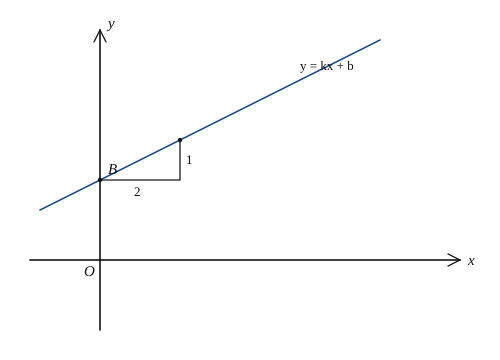

# 一次函数

## 1. 正比例函数与一次函数

### 1.1 定义

一般地：

- 形如 $y=kx$（$k\neq 0$）的函数叫做**正比例函数**，$k$ 叫做比例系数；
- 形如 $y=kx+b$（$k\neq 0$，$k,b$ 为常数）的函数叫做**一次函数**。

当 $b=0$ 时，一次函数 $y=kx+b$ 就是正比例函数 $y=kx$。因此，**正比例函数是特殊的一次函数**。

注意：$y=\dfrac{x}{3}$ 即 $y=\dfrac13 x$，是正比例函数；而 $y=\dfrac{3}{x}$、$y=3x^2$、$y=3x+1$ 都不是正比例函数。

### 1.2 待定系数法求解析式

已知一次函数图像上两个点，或一个点加斜率等信息，可用待定系数法：

1. **设：** $y=kx+b$（或正比例时设 $y=kx$）；
2. **列：** 把已知点坐标代入，列出关于 $k,b$ 的方程（组）；
3. **解：** 求出 $k,b$；
4. **写：** 写出函数解析式。

---

## 2. 图像与 $k$、$b$ 的几何意义

### 2.1 图像

一次函数 $y=kx+b$（$k\neq 0$）的图像是一条直线。

- 与 $y$ 轴交于点 $(0,b)$，因此 $b$ 叫做**纵截距**；
- 与 $x$ 轴交于点 $\left(-\dfrac{b}{k},\,0\right)$，该点横坐标是方程 $kx+b=0$ 的解。

正比例函数 $y=kx$ 的图像是经过原点 $(0,0)$ 的直线。

### 2.2 $k$ 的几何意义

在直线上任取一点，向右平移 $1$ 个单位（横轴方向），纵坐标的改变量等于 $k$。更一般地，若直线过 $A(x_1,y_1)$、$B(x_2,y_2)$，则

$$k=\frac{y_2-y_1}{x_2-x_1}\quad(x_1\neq x_2).$$

$k$ 反映直线的倾斜程度：$|k|$ 越大，直线越陡。

### 2.3 $b$ 的几何意义与平移

$b$ 表示直线与 $y$ 轴交点的纵坐标。

一次函数 $y=kx+b$ 可由正比例函数 $y=kx$ 平移得到：

- $b>0$：把 $y=kx$ 的图像**向上**平移 $|b|$ 个单位；
- $b<0$：把 $y=kx$ 的图像**向下**平移 $|b|$ 个单位。

### 2.4 两直线的位置关系

设 $l_1:y=k_1x+b_1$，$l_2:y=k_2x+b_2$。

- 若 $k_1=k_2$ 且 $b_1\neq b_2$，则 $l_1\parallel l_2$；
- 若 $k_1=k_2$ 且 $b_1=b_2$，则两直线重合；
- 若 $k_1\neq k_2$，则两直线相交；交点坐标是方程组 $\begin{cases}y=k_1x+b_1\\ y=k_2x+b_2\end{cases}$ 的解；
- 若 $k_1k_2=-1$，则两直线垂直。

---

## 3. 增减性与经过的象限

### 3.1 增减性

- 当 $k>0$ 时，直线从左向右上升，$y$ 随 $x$ 的增大而增大；
- 当 $k<0$ 时，直线从左向右下降，$y$ 随 $x$ 的增大而减小。

### 3.2 正比例函数经过的象限

| $k$ 的符号 | 经过象限 | 增减性 |
| --- | --- | --- |
| $k>0$ | 第一、三象限 | $y$ 随 $x$ 增大而增大 |
| $k<0$ | 第二、四象限 | $y$ 随 $x$ 增大而减小 |

### 3.3 一次函数经过的象限

由 $k$、$b$ 的符号共同决定（直线不经过某个象限，是因为被截距“挡住”）：

| $k$ | $b$ | 经过象限 |
| --- | --- | --- |
| $k>0$ | $b>0$ | 一、二、三 |
| $k>0$ | $b=0$ | 一、三 |
| $k>0$ | $b<0$ | 一、三、四 |
| $k<0$ | $b>0$ | 一、二、四 |
| $k<0$ | $b=0$ | 二、四 |
| $k<0$ | $b<0$ | 二、三、四 |

记忆要点：先看 $k$ 定升降与“主象限”，再看 $b$ 定与 $y$ 轴交点在正半轴还是负半轴，从而多出第二或第四象限。

---

## 4. 一次函数与方程、不等式

### 4.1 与一元一次方程

解方程 $kx+b=0$，等价于求直线 $y=kx+b$ 与 $x$ 轴交点的横坐标。

### 4.2 与二元一次方程组

二元一次方程组的解，就是两条一次函数图像交点的坐标。

### 4.3 与一元一次不等式

对一次函数 $y=kx+b$（$k\neq 0$）：

- $kx+b>0$ 的解集 $\Leftrightarrow$ 直线在 $x$ 轴**上方**部分对应的 $x$ 取值；
- $kx+b<0$ 的解集 $\Leftrightarrow$ 直线在 $x$ 轴**下方**部分对应的 $x$ 取值。

也可先求零点 $x=-\dfrac{b}{k}$，再结合 $k$ 的符号判断：

- $k>0$ 时，$kx+b>0\Leftrightarrow x>-\dfrac{b}{k}$；
- $k<0$ 时，$kx+b>0\Leftrightarrow x<-\dfrac{b}{k}$。

---

## 5. 典型例题

### 例 1：求解析式

一次函数图像经过点 $A(1,3)$、$B(2,5)$，求解析式。

解：设 $y=kx+b$。由

$$\begin{cases}k+b=3,\\ 2k+b=5,\end{cases}$$

得 $k=2$，$b=1$。故

$$y=2x+1.$$

### 例 2：由象限与增减性定系数

已知一次函数 $y=kx+b$ 经过第一、二、三象限，且 $y$ 随 $x$ 增大而增大，则

$$k>0,\qquad b>0.$$

（上升 $\Rightarrow k>0$；过一、二、三象限 $\Rightarrow$ 与 $y$ 轴正半轴相交 $\Rightarrow b>0$。）

### 例 3：与方程、不等式

直线 $y=-2x+4$ 与 $x$ 轴交于点 $A$，与 $y$ 轴交于点 $B$。

1. 令 $y=0$，得 $x=2$，故 $A(2,0)$；令 $x=0$，得 $y=4$，故 $B(0,4)$。
2. 方程 $-2x+4=0$ 的解为 $x=2$。
3. 不等式 $-2x+4>0$，即直线在 $x$ 轴上方：$x<2$。

**证明（不等式）：** 因为 $k=-2<0$，零点为 $x=2$，图像在 $x=2$ 左侧位于 $x$ 轴上方，故 $-2x+4>0\Leftrightarrow x<2$。

### 例 4：应用——费用最少

某校购买甲、乙两种器材。甲每件 $a$ 元，乙每件 $b$ 元。购买甲 $x$ 件、乙 $(n-x)$ 件，总费用

$$y=ax+b(n-x)=(a-b)x+bn.$$

这是关于 $x$ 的一次函数。

- 若 $a>b$，则 $y$ 随 $x$ 增大而增大，要使费用最少，应尽量少买甲；
- 若 $a<b$，则 $y$ 随 $x$ 增大而减小，要使费用最少，应尽量多买甲。

再结合题目中的整数限制与不等式约束，取端点或边界上的整数解即可。

### 例 5：行程问题中的一次函数

甲、乙同向匀速运动。若以甲出发时刻为 $t=0$，两人距离 $s$ 关于时间 $t$ 的关系常为分段一次函数：先追及前距离减小，相遇后距离再增大。关键是：

1. 从图像拐点读出出发、停留、相遇时刻；
2. 每一段用 $s=vt+s_0$ 或 $s=s_0-vt$ 设解析式；
3. 用待定系数或速度差求交点。

---

## 6. 小结

一次函数抓住两个参数：$k$ 管倾斜与增减，$b$ 管纵截距与平移。图像是直线；与 $x$ 轴交点对应方程的根，直线上下对应不等式的解集。应用题先设自变量，写出 $y=kx+b$，再按增减性在约束范围内取最值。
