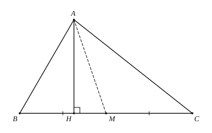

# 三角形基础

## 1. 概念与分类

由不在同一直线上的三条线段首尾顺次联结所组成的图形叫做**三角形**，记作 $\triangle ABC$。

按边分类：不等边三角形；等腰三角形（含等边三角形）。

按角分类：锐角三角形；直角三角形；钝角三角形。

注意：等边三角形是特殊的等腰三角形；等腰直角三角形同时属于“等腰”与“直角”两类。

---

## 2. 边角关系

### 2.1 三边关系

任意两边之和大于第三边，任意两边之差小于第三边：

$$a+b>c,\quad a+c>b,\quad b+c>a.$$

判定能否构成三角形时，三个不等式都要检查（通常验证“较小两边之和大于第三边”即可）。

### 2.2 边角大小关系

在同一个三角形中：**大边对大角，大角对大边**；等边对等角。

### 2.3 稳定性

三角形具有稳定性（三边确定后形状唯一）。

---

## 3. 内角和与外角

### 3.1 内角和定理

$$\angle A+\angle B+\angle C=180^\circ.$$

**证明（简述）：** 过顶点 $A$ 作 $l\parallel BC$，则内错角分别等于 $\angle B,\angle C$，平角 $180^\circ$ 拆成三份，即得内角和为 $180^\circ$。

### 3.2 外角

三角形一边的延长线与邻边所成的角叫做**外角**。

- 外角等于与它不相邻的两个内角之和；
- 外角大于任何一个与它不相邻的内角；
- 三角形三个外角（每个顶点取一个）之和等于 $360^\circ$。

---

## 4. 三条重要线段

| 名称 | 定义要点 | 符号语言（以 $AD$ 为例） |
|------|----------|---------------------------|
| **高** | 从顶点向对边所在直线作垂线，顶点到垂足的线段 | $AD\perp BC$，或 $\angle ADB=\angle ADC=90^\circ$ |
| **中线** | 连接顶点与对边中点的线段 | $BD=DC=\dfrac{1}{2}BC$ |
| **角平分线** | 内角平分线与对边交点到顶点的线段 | $\angle BAD=\angle CAD=\dfrac{1}{2}\angle BAC$ |

注意：

- 钝角三角形有两条高在形外（需延长对边）；
- 中线、角平分线（作为三角形中的线段）在形内；
- 三条高（或延长线）交于一点；三条中线交于一点；三条角平分线交于一点。

---

## 5. 四心简述

| 名称 | 定义（交点） | 主要性质 |
|------|--------------|----------|
| **重心** $G$ | 三中线交点 | 重心分每条中线为 $2:1$（靠近顶点的一段较长） |
| **内心** $I$ | 三角平分线交点 | 到三边距离相等；内切圆圆心 |
| **外心** $O$ | 三边垂直平分线交点 | 到三顶点距离相等；外接圆圆心 |
| **垂心** $H$ | 三高（或延长线）交点 | 锐角三角形在形内，直角三角形在直角顶点，钝角三角形在形外 |

等边三角形中四心重合。直角三角形外心为斜边中点。

---

## 6. 典型例题

### 例 1：三边关系

边长 $1,2,3$ 不能构成三角形（$1+2=3$）；边长 $2,3,4$ 可以（$2+3>4$）。

已知三边 $3,5,x$，则 $|5-3|<x<5+3$，即 $2<x<8$。故 $x=5$ 可以，$x=2,8,11$ 不可以。

### 例 2：等腰与外角

$\triangle ABC$ 中 $AB=AC$，点 $D$ 在 $BC$ 延长线上，$\angle ACD=110^\circ$。

邻内角与外角互补：$\angle ACB=180^\circ-110^\circ=70^\circ$。又 $AB=AC\Rightarrow\angle B=\angle C=70^\circ$，故

$$\angle A=180^\circ-70^\circ-70^\circ=40^\circ.$$

（也可用外角定理：$\angle ACD=\angle A+\angle B$，结合等腰求解。）

### 例 3：中线与重心

若 $AD$ 是中线，$G$ 为重心，则 $AG:GD=2:1$，且 $AG=\dfrac{2}{3}AD$。

---

## 7. 小结

先用三边关系判断能否构成三角形；求角优先内角和与外角定理；分清高、中线、角平分线的垂直、中点、平分角三类结论。四心先记“谁的交点、有何等距性质”。
