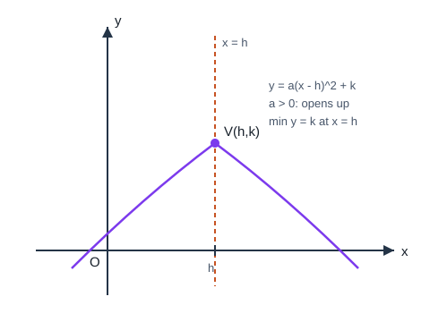

# 二次函数

## 1. 二次函数的定义与三种形式

### 1.1 定义

一般地，形如

$$y=ax^2+bx+c\quad(a\neq 0)$$

的函数叫做**二次函数**。其中 $a$ 是二次项系数，$b$ 是一次项系数，$c$ 是常数项。

$y=ax^2$、$y=ax^2+bx$、$y=ax^2+c$ 都是二次函数的特殊情形，但都必须 $a\neq 0$。

### 1.2 三种常用解析式

| 名称 | 形式 | 适用场景 |
| --- | --- | --- |
| 一般式 | $y=ax^2+bx+c$（$a\neq 0$） | 已知三点，或已知与 $y$ 轴交点等 |
| 顶点式 | $y=a(x-h)^2+k$（$a\neq 0$） | 已知顶点 $(h,k)$，再给另一点 |
| 交点式 | $y=a(x-x_1)(x-x_2)$（$a\neq 0$） | 已知与 $x$ 轴两交点 $(x_1,0)$、$(x_2,0)$ |

三种形式可以互相转化。一般式配方可得顶点式：

$$y=ax^2+bx+c=a\left(x+\frac{b}{2a}\right)^2+\frac{4ac-b^2}{4a}.$$

---

## 2. 图像与性质

二次函数的图像是**抛物线**。

### 2.1 系数的作用

| 系数 | 作用 | 结论 |
| --- | --- | --- |
| $a$ | 开口方向与开口大小 | $a>0$ 开口向上；$a<0$ 开口向下；$|a|$ 越大开口越窄 |
| $c$ | 与 $y$ 轴交点 | 交点为 $(0,c)$ |
| $a,b$ | 对称轴位置 | 对称轴 $x=-\dfrac{b}{2a}$；口诀“左同右异”：$ab>0$ 在 $y$ 轴左侧，$ab<0$ 在右侧，$b=0$ 时对称轴为 $y$ 轴 |
| $a,b,c$ | 与 $x$ 轴交点个数 | 由判别式 $\Delta=b^2-4ac$ 决定 |

特殊值：$x=1$ 时 $y=a+b+c$；$x=-1$ 时 $y=a-b+c$。

### 2.2 顶点与对称轴

对 $y=ax^2+bx+c$（$a\neq 0$）：

- 对称轴：直线 $x=-\dfrac{b}{2a}$；
- 顶点坐标：
$$\left(-\frac{b}{2a},\,\frac{4ac-b^2}{4a}\right).$$

对顶点式 $y=a(x-h)^2+k$：

- 顶点为 $(h,k)$；
- 对称轴为直线 $x=h$。

抛物线关于对称轴成轴对称：若点 $(h+t,\,y_0)$ 在图像上，则 $(h-t,\,y_0)$ 也在图像上。

### 2.3 增减区间（顶点取闭区间）

设对称轴为 $x=h$。

**当 $a>0$（开口向上）时：**

- 在 $\big(-\infty,\,h\big]$ 上，$y$ 随 $x$ 增大而减小；
- 在 $\big[h,\,+\infty\big)$ 上，$y$ 随 $x$ 增大而增大。

简记：左减右增。

**当 $a<0$（开口向下）时：**

- 在 $\big(-\infty,\,h\big]$ 上，$y$ 随 $x$ 增大而增大；
- 在 $\big[h,\,+\infty\big)$ 上，$y$ 随 $x$ 增大而减小。

简记：左增右减。

说明：增减区间在顶点处取**闭区间**，顶点同时属于两侧区间。这是苏科版及中考表述的规范写法。

### 2.4 最值

- 若 $a>0$，抛物线有最低点，当 $x=h$ 时，$y$ 有**最小值** $k$（或 $\dfrac{4ac-b^2}{4a}$）；
- 若 $a<0$，抛物线有最高点，当 $x=h$ 时，$y$ 有**最大值** $k$。

若自变量有实际范围 $x\in[m,n]$，则最值在顶点（若顶点横坐标落在区间内）或区间端点处取得：先比较 $y(m)$、$y(n)$，以及（若 $h\in[m,n]$）顶点处的函数值。

---

## 3. 二次函数与方程、不等式

### 3.1 与一元二次方程

方程 $ax^2+bx+c=0$ 的实数根，就是抛物线 $y=ax^2+bx+c$ 与 $x$ 轴交点的横坐标。

| 判别式 $\Delta=b^2-4ac$ | 与 $x$ 轴交点 | 方程的根 |
| --- | --- | --- |
| $\Delta>0$ | 两个不同交点 | 两个不相等实根 |
| $\Delta=0$ | 一个交点（顶点在 $x$ 轴上） | 两个相等实根 |
| $\Delta<0$ | 无交点 | 无实根 |

若两根为 $x_1,x_2$，则交点式为 $y=a(x-x_1)(x-x_2)$，且

$$x_1+x_2=-\frac{b}{a},\qquad x_1x_2=\frac{c}{a}.$$

### 3.2 与一元二次不等式（图像法）

解 $ax^2+bx+c>0$ 或 $<0$ 时：

1. 先求抛物线与 $x$ 轴的交点（若 $\Delta<0$，结合开口方向判断）；
2. 看抛物线在 $x$ 轴上方还是下方；
3. 写出对应的 $x$ 取值范围。

例如 $a>0$ 且 $\Delta>0$，两根 $x_1<x_2$，则

$$ax^2+bx+c>0\Leftrightarrow x<x_1\text{ 或 }x>x_2,$$

$$ax^2+bx+c<0\Leftrightarrow x_1<x<x_2.$$

### 3.3 抛物线与直线的交点

直线 $y=mx+n$ 与抛物线 $y=ax^2+bx+c$ 的交点个数，由方程组化成的二次方程

$$ax^2+(b-m)x+(c-n)=0$$

的判别式决定。

---

## 4. 典型例题

### 例 1：一般式化顶点式

求 $y=x^2-4x+3$ 的顶点、对称轴、增减区间与最值。

解：配方

$$y=(x-2)^2-1.$$

故顶点 $(2,-1)$，对称轴 $x=2$。因为 $a=1>0$：

- 在 $(-\infty,2]$ 上递减，在 $[2,+\infty)$ 上递增；
- 最小值为 $-1$（当 $x=2$ 时）。

与 $x$ 轴交点：令 $y=0$，得 $(x-1)(x-3)=0$，交点 $(1,0)$、$(3,0)$。$\Delta=(-4)^2-4\cdot1\cdot3=4>0$。

### 例 2：用顶点式求解析式

抛物线顶点为 $(1,3)$，且过点 $(2,5)$。设

$$y=a(x-1)^2+3.$$

代入 $(2,5)$：$a+3=5$，$a=2$。故

$$y=2(x-1)^2+3=2x^2-4x+5.$$

### 例 3：用交点式求解析式

抛物线与 $x$ 轴交于 $(-1,0)$、$(3,0)$，与 $y$ 轴交于 $(0,-3)$。设

$$y=a(x+1)(x-3).$$

令 $x=0$：$a(1)(-3)=-3$，得 $a=1$。故

$$y=(x+1)(x-3)=x^2-2x-3.$$

### 例 4：判别式与开口

已知 $y=x^2-2kx+2k+3$。

1. 对称轴 $x=k$，顶点纵坐标为
$$y\big|_{x=k}=k^2-2k\cdot k+2k+3=-k^2+2k+3.$$
2. 与 $x$ 轴有两个交点 $\Leftrightarrow \Delta>0$：
$$\Delta=4k^2-4(2k+3)=4k^2-8k-12=4(k^2-2k-3)=4(k-3)(k+1).$$
故 $\Delta>0\Leftrightarrow k<-1$ 或 $k>3$。

### 例 5：实际最值

某商品进价 $40$ 元。若售价定为 $60$ 元，一周可售 $100$ 件；售价每提高 $1$ 元，一周少售 $2$ 件。设售价提高 $x$ 元，周利润为 $y$ 元。则

$$y=(60+x-40)(100-2x)=(20+x)(100-2x)=-2x^2+60x+2000.$$

配方或用顶点公式：对称轴 $x=-\dfrac{60}{2(-2)}=15$。因为 $a=-2<0$，当 $x=15$ 时利润最大：

$$y_{\max}=-2\cdot15^2+60\cdot15+2000=2450.$$

即售价定为 $75$ 元时，周利润最大为 $2450$ 元。需检验 $x=15$ 是否在实际允许范围内（件数 $100-2x>0\Rightarrow x<50$，满足）。

---

## 5. 小结

二次函数三条线：开口看 $a$，位置看对称轴与顶点，与 $x$ 轴关系看 $\Delta$。写增减区间时顶点用闭区间；闭区间上的最值还要和端点比较。应用题把实际关系写成二次函数，再在定义域内求顶点或端点最值。
