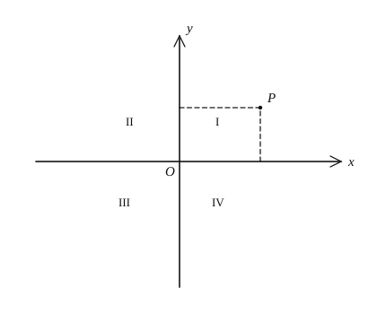

# 函数与坐标系

## 1. 变量、常量与函数

### 1.1 变量与常量

在一个变化过程中：

- 数值发生变化的量叫做**变量**；
- 数值始终保持不变的量叫做**常量**。

同一字母在不同问题中可能是变量，也可能是常量，要结合具体过程判断。

### 1.2 函数的定义

一般地，在一个变化过程中，有两个变量 $x$ 和 $y$。如果对于 $x$ 的每一个确定的值，$y$ 都有**唯一**确定的值与之对应，那么就说 $y$ 是 $x$ 的**函数**。其中：

- $x$ 叫做**自变量**；
- $y$ 叫做**因变量**。

若自变量取值为 $a$ 时，对应的函数值为 $b$，则记作 $y\big|_{x=a}=b$，或 $f(a)=b$。

核心特征是“一对一或多对一”，但不能“一对多”：同一个 $x$ 不能对应两个不同的 $y$。

### 1.3 函数的三种表示法

| 表示法 | 含义 | 优点 | 局限 |
| --- | --- | --- | --- |
| 解析法 | 用等式（解析式）表示 $y$ 与 $x$ 的关系 | 精确、便于计算与推导性质 | 不够直观；有些实际问题不易写出解析式 |
| 图像法 | 用坐标系中的图形表示关系 | 直观显示增减趋势与特殊点 | 读数多为近似；不易直接得精确解析式 |
| 列表法 | 列出若干组对应值 | 查询方便 | 只能列有限组；难反映整体规律 |

三种表示法可以互相转化：由解析式描点画图；由图像或表格用待定系数法求解析式。

### 1.4 自变量的取值范围

使函数有意义时，自变量的取值范围通常从下列方面考虑：

1. 解析式是整式时，$x$ 可取全体实数；
2. 解析式是分式时，分母不等于 $0$；
3. 解析式含二次根式时，被开方数非负；
4. 实际问题中，还要考虑长度、时间、人数等量的实际意义（非负、整数等）。

例：函数 $y=\dfrac{1}{x-1}$ 要求 $x\neq 1$；函数 $y=\sqrt{x-1}$ 要求 $x\ge 1$；函数 $y=\dfrac{\sqrt{x}}{x-1}$ 要求 $x\ge 0$ 且 $x\neq 1$。

---

## 2. 平面直角坐标系

### 2.1 构成

平面内由两条互相垂直、有公共原点的数轴组成的图形，叫做**平面直角坐标系**。

- 水平数轴叫做 **$x$ 轴**（横轴），规定向右为正方向；
- 竖直数轴叫做 **$y$ 轴**（纵轴），规定向上为正方向；
- 两轴交点叫做**原点** $O$，坐标为 $(0,0)$。

### 2.2 象限

$x$ 轴、$y$ 轴把平面分成四个部分，按逆时针方向依次叫做第一、二、三、四象限。

**坐标轴上的点不属于任何象限。**

### 2.3 点的坐标

平面内任意一点 $P$ 都对应唯一的有序实数对 $(x,y)$，其中：

- $x$ 叫做点 $P$ 的**横坐标**；
- $y$ 叫做点 $P$ 的**纵坐标**。

横前纵后，顺序不可颠倒。反之，每一个有序实数对也对应平面内唯一的点。因此：

$$\{\text{平面内的点}\} \longleftrightarrow \{\text{有序实数对}(x,y)\}.$$

---

## 3. 点坐标的性质

设点 $P(x,y)$。

### 3.1 各象限内点的坐标特征

| 位置 | 横坐标 | 纵坐标 | 符号特征 |
| --- | --- | --- | --- |
| 第一象限 | $x>0$ | $y>0$ | $(+,+)$ |
| 第二象限 | $x<0$ | $y>0$ | $(-,+)$ |
| 第三象限 | $x<0$ | $y<0$ | $(-,-)$ |
| 第四象限 | $x>0$ | $y<0$ | $(+,-)$ |

### 3.2 坐标轴上的点

- $x$ 轴上的点：$y=0$，即 $P(x,0)$；
- $y$ 轴上的点：$x=0$，即 $P(0,y)$；
- 原点：$P(0,0)$。

### 3.3 到坐标轴与原点的距离

- 到 $x$ 轴的距离：$|y|$；
- 到 $y$ 轴的距离：$|x|$；
- 到原点的距离：$\sqrt{x^2+y^2}$。

### 3.4 平行于坐标轴的直线

- 平行于 $x$ 轴的直线：$y=$ 常数（纵坐标相同）；
- 平行于 $y$ 轴的直线：$x=$ 常数（横坐标相同）。

### 3.5 平移

点 $P(x,y)$：

- 向右平移 $a$（$a>0$）个单位 $\to (x+a,\,y)$；
- 向左平移 $a$（$a>0$）个单位 $\to (x-a,\,y)$；
- 向上平移 $b$（$b>0$）个单位 $\to (x,\,y+b)$；
- 向下平移 $b$（$b>0$）个单位 $\to (x,\,y-b)$。

口诀：右加左减看横坐标，上加下减看纵坐标。

### 3.6 关于坐标轴与原点的对称

设点 $P(x,y)$：

- 关于 $x$ 轴的对称点：$(x,-y)$；
- 关于 $y$ 轴的对称点：$(-x,y)$；
- 关于原点的对称点：$(-x,-y)$；
- 关于直线 $y=x$ 的对称点：$(y,x)$；
- 关于直线 $y=-x$ 的对称点：$(-y,-x)$。

### 3.7 绕原点旋转【培优拓展】

点 $P(x,y)$ 绕原点 $O$：

- 逆时针旋转 $90^\circ$ $\to (-y,\,x)$；
- 顺时针旋转 $90^\circ$ $\to (y,\,-x)$；
- 旋转 $180^\circ$ $\to (-x,\,-y)$。

顺时针旋转 $270^\circ$ 与逆时针旋转 $90^\circ$ 结果相同；逆时针旋转 $270^\circ$ 与顺时针旋转 $90^\circ$ 结果相同。

---

## 4. 典型例题

### 例 1：判断是否为函数

下列对应中，$y$ 是 $x$ 的函数的是：

- $y=2x+1$（是：每个 $x$ 对应唯一 $y$）；
- $x=y^2$（不是：例如 $x=1$ 时 $y=\pm 1$，一对多）；
- 圆 $x^2+y^2=1$（整体不是 $y$ 关于 $x$ 的函数）。

从图像上看：若存在一条垂直于 $x$ 轴的直线与图像有两个或更多交点，则不能表示 $y$ 是 $x$ 的函数。

### 例 2：求自变量取值范围

求函数 $y=\dfrac{\sqrt{x-2}}{x-3}$ 的自变量取值范围。

解：需同时满足

$$x-2\ge 0,\qquad x-3\neq 0,$$

即

$$x\ge 2,\quad x\neq 3.$$

### 例 3：象限与对称

已知点 $A(2,-3)$。

1. $A$ 在第四象限；
2. 关于 $x$ 轴的对称点为 $(2,3)$；
3. 关于 $y$ 轴的对称点为 $(-2,-3)$；
4. 关于原点的对称点为 $(-2,3)$；
5. 向左平移 $2$ 个单位、向上平移 $3$ 个单位后得到 $(0,0)$。

### 例 4：距离

点 $P(-3,4)$ 到 $x$ 轴、到 $y$ 轴、到原点的距离分别是

$$|4|=4,\qquad |-3|=3,\qquad \sqrt{(-3)^2+4^2}=5.$$

---

## 5. 小结

函数的本质是“自变量每一个取值对应唯一因变量”。坐标系把“数”与“形”对应起来：象限看符号，轴上看零，平移与对称改坐标。后续一次函数、反比例函数、二次函数，都是在坐标系中研究解析式与图像的对应关系。
