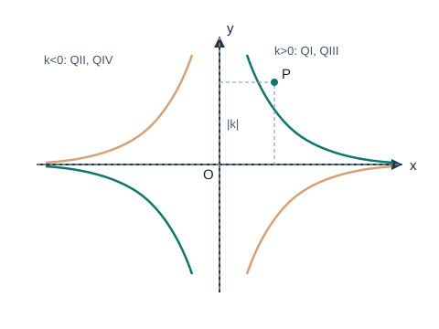

# 反比例函数

## 1. 反比例函数的定义

### 1.1 三种等价形式

一般地，形如

$$y=\frac{k}{x}\quad(k\neq 0)$$

的函数叫做**反比例函数**，$k$ 叫做比例系数。自变量 $x$ 的取值范围是 $x\neq 0$。

下列形式等价（均要求 $k\neq 0$）：

$$y=\frac{k}{x},\qquad y=kx^{-1},\qquad xy=k.$$

易错：

- $y=\dfrac{k}{x}+b$（$b\neq 0$）、$y=\dfrac{k}{x^2}$ 都**不是**反比例函数；
- 必须强调 $k\neq 0$；求出 $k$ 后要检验。

### 1.2 待定系数法

已知图像上一点 $(x_0,y_0)$（$x_0\neq 0$），则

$$k=x_0y_0,$$

从而 $y=\dfrac{x_0y_0}{x}$。

---

## 2. 图像与性质

### 2.1 图像特征

反比例函数的图像是**双曲线**，由两个分支组成：

1. 两个分支都无限接近 $x$ 轴和 $y$ 轴，但**永不与坐标轴相交**；
2. 图像关于原点成中心对称；
3. 图像也是轴对称图形，对称轴是直线 $y=x$ 与 $y=-x$（即一、三象限角平分线与二、四象限角平分线）。

### 2.2 $k$ 的符号与象限、增减性

| $k$ 的符号 | 经过象限 | 增减性（务必加前提） |
| --- | --- | --- |
| $k>0$ | 第一、三象限 | **在每个象限内**，$y$ 随 $x$ 增大而减小 |
| $k<0$ | 第二、四象限 | **在每个象限内**，$y$ 随 $x$ 增大而增大 |

特别提醒：不能笼统说“$k>0$ 时 $y$ 随 $x$ 增大而减小”。因为当 $x$ 从负数变到正数时，要跨过 $x=0$，函数在两支上分别讨论。

### 2.3 $|k|$ 的几何意义

设点 $P(x,y)$ 在双曲线 $y=\dfrac{k}{x}$ 上。过 $P$ 分别向 $x$ 轴、$y$ 轴作垂线，与两轴围成的矩形面积为

$$|x|\cdot|y|=|k|.$$

以原点、$P$ 在两轴上的垂足为顶点的直角三角形面积为

$$\frac12|k|.$$

因此，双曲线上任意一点对应的“轴对齐矩形”面积都等于 $|k|$。

---

## 3. 反比例函数与一次函数

### 3.1 求交点

将

$$y=kx+b,\qquad y=\frac{m}{x}$$

联立，得

$$kx+b=\frac{m}{x}.$$

两边乘 $x$（注意 $x\neq 0$）：

$$kx^2+bx-m=0.$$

用判别式讨论交点个数，解出 $x$ 后再求 $y$。

### 3.2 中心对称性的应用

若正比例函数 $y=kx$（$k\neq 0$）与反比例函数 $y=\dfrac{m}{x}$（$m\neq 0$）相交于点 $A(a,b)$，则另一交点必为

$$B(-a,-b).$$

**证明：** 点 $A(a,b)$ 在两图像上，故 $b=ka$ 且 $ab=m$。点 $(-a,-b)$ 满足

$$-b=k(-a),\qquad (-a)(-b)=ab=m,$$

故也在两图像上。又因联立后得到的二次方程至多两个实根，故交点恰为 $A,B$。

### 3.3 由图像比较函数值

在同一坐标系中，某区间上图像位置靠上的函数值更大。常结合交点横坐标，写出不等式

$$kx+b>\frac{m}{x}$$

的解集（注意 $x\neq 0$，并按象限或区间分段）。

---

## 4. 典型例题

### 例 1：求解析式与判断象限

反比例函数图像经过点 $P(2,-4)$。

1. 求解析式：
$$k=2\times(-4)=-8,\qquad y=-\frac{8}{x}.$$
2. 因为 $k=-8<0$，图像位于第二、四象限。
3. 在每个象限内，$y$ 随 $x$ 增大而增大。

### 例 2：面积

点 $P$ 在 $y=\dfrac{6}{x}$ 的图像上，过 $P$ 作两轴的垂线，所得矩形面积为

$$|k|=6.$$

对应三角形面积为 $3$。

### 例 3：与一次函数交点

已知双曲线 $y=\dfrac{m}{x}$（$x<0$）与直线 $y=kx+b$ 交于 $A(-2,6)$、$B(-6,a)$。

1. 由 $A$ 在双曲线上：$m=(-2)\times 6=-12$，故 $y=-\dfrac{12}{x}$。
2. 由 $B$ 在双曲线上：$a=\dfrac{-12}{-6}=2$，故 $B(-6,2)$。
3. 设直线 $y=kx+b$，代入 $A,B$：
$$\begin{cases}-2k+b=6,\\ -6k+b=2,\end{cases}$$
得 $k=1$，$b=8$，故直线为 $y=x+8$。
4. $\triangle ABO$ 的面积（顶点 $O(0,0)$、$A(x_A,y_A)$、$B(x_B,y_B)$）：
$$S_{\triangle ABO}=\frac12\big|x_Ay_B-x_By_A\big|=\frac12\big|(-2)(2)-(-6)(6)\big|=\frac12\cdot 32=16.$$

### 例 4：实际应用

蓄电池电压 $U$ 一定，电流 $I$ 与电阻 $R$ 满足

$$I=\frac{U}{R},$$

即 $I$ 是 $R$ 的反比例函数（$R>0$，只取第一象限一支）。由图像上一点可读出 $U=IR$，再求其他对应值。

---

## 5. 小结

反比例函数盯住三点：$k\neq 0$ 与 $x\neq 0$；双曲线两支及“每个象限内”的增减性；$|k|$ 等于轴对齐矩形面积。与一次函数综合时，联立化成二次方程，并注意中心对称给出另一交点。
