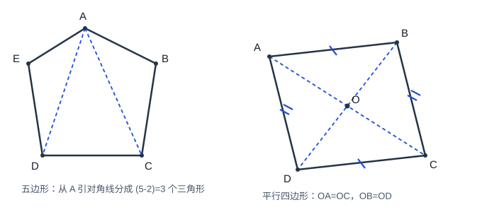
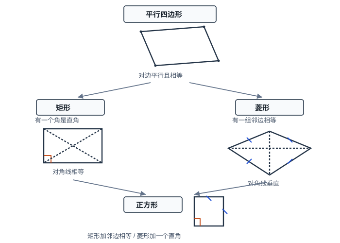

# 四边形

## 1. 多边形

### 1.1 定义与分类

由 $n$ 条不在同一直线上的线段（$n\ge 3$）首尾顺次相接围成的封闭平面图形叫做 **$n$ 边形**。本文要求边不相交（除相邻边在公共端点外），即**简单多边形**。

- **凸多边形：** 任意一边向两方延长后，其余各边都在延长线的同侧；每个内角都小于 $180^\circ$。
- **凹多边形：** 至少有一边延长后，其余边不在同侧，且至少有一个内角大于 $180^\circ$。
- **正多边形：** 各边相等且各内角相等的凸多边形。

四边形能构成的条件：任意三边之和大于第四边。

### 1.2 内角和与外角和

从 $n$ 边形的一个顶点引对角线，可分成 $(n-2)$ 个三角形，故

$$n\text{边形内角和}=(n-2)\cdot 180^\circ\quad(n\ge 3).$$

在每个顶点取一个外角（与内角相邻且互补），绕边界一周，外角和恒为

$$\text{任意多边形外角和}=360^\circ$$

（与边数、形状无关）。

正 $n$ 边形：每个内角 $=\dfrac{(n-2)\cdot 180^\circ}{n}$，每个外角 $=\dfrac{360^\circ}{n}$。

### 1.3 对角线

连接多边形不相邻两顶点的线段叫做**对角线**。从 $n$ 边形一个顶点可引 $(n-3)$ 条对角线；对角线总条数为

$$\dfrac{n(n-3)}{2}.$$

### 1.4 正多边形对称性（简述）

正 $n$ 边形有 $n$ 条对称轴；$n$ 为偶数时是中心对称图形，$n$ 为奇数时不是。

---

## 2. 平行四边形

### 2.1 定义与性质

两组对边分别平行的四边形叫做**平行四边形**，记作 $\square ABCD$。

设 $\square ABCD$ 的对角线 $AC$、$BD$ 交于点 $O$，则：

1. **边：** $AB\parallel CD$，$AD\parallel BC$，且 $AB=CD$，$AD=BC$；
2. **角：** $\angle A=\angle C$，$\angle B=\angle D$；邻角互补，如 $\angle A+\angle B=180^\circ$；
3. **对角线：** $OA=OC$，$OB=OD$（对角线互相平分）；
4. **对称性：** 中心对称图形，对称中心为 $O$（一般不是轴对称图形）；
5. **面积：** $S=ah$（$a$ 为底，$h$ 为对应高）。

### 2.2 判定

四边形满足下列**任一**条件即为平行四边形：

1. 两组对边分别平行（定义）；
2. 两组对边分别相等；
3. 一组对边平行且相等（证明中最常用）；
4. 两组对角分别相等；
5. 对角线互相平分。

易错伪条件（**不能**判定）：“一组对边平行，另一组对边相等”（等腰梯形反例）；“一组对边相等，一组对角相等”。

### 2.3 性质证明思路（对角线互相平分）

已知 $\square ABCD$，证 $OA=OC$，$OB=OD$。

**证明：** 因 $AB\parallel CD$，得 $\angle BAC=\angle DCA$（内错角）；因 $AD\parallel BC$，得 $\angle BDC=\angle DBA$。又 $AB=CD$，故

$$\triangle AOB\cong\triangle COD\ (\mathrm{ASA}),$$

从而 $OA=OC$，$OB=OD$。

### 2.4 判定证明思路（一组对边平行且相等）

已知四边形 $ABCD$ 中 $AB\parallel CD$ 且 $AB=CD$，证其为平行四边形。

**证明：** 连结 $AC$。由 $AB\parallel CD$ 得 $\angle BAC=\angle DCA$（内错角）。在 $\triangle ABC$ 与 $\triangle CDA$ 中，$AB=CD$，$\angle BAC=\angle DCA$，$AC=CA$，故

$$\triangle ABC\cong\triangle CDA\ (\mathrm{SAS}),$$

从而 $AD=BC$ 且 $\angle DAC=\angle BCA$，故 $AD\parallel BC$。两组对边分别平行，因此 $ABCD$ 是平行四边形。

（也可由全等得 $AD=BC$，再与 $AB=CD$ 用“两组对边分别相等”判定。）

---

## 3. 三角形的中位线

### 3.1 定理

连接三角形两边中点的线段叫做三角形的**中位线**。

**定理：** 三角形的中位线平行于第三边，并且等于第三边的一半。

设 $\triangle ABC$ 中 $D$、$E$ 分别为 $AB$、$AC$ 的中点，则

$$DE\parallel BC,\qquad DE=\dfrac{1}{2}BC.$$

**证明思路：** 延长 $DE$ 至 $F$ 使 $EF=DE$，证四边形 $DBCF$ 为平行四边形（或用“两组对边分别相等”），得 $DF\parallel BC$ 且 $DF=BC$，从而 $DE\parallel BC$ 且 $DE=\dfrac12 BC$。

作用：证平行；证线段倍分。

注意：中位线 $\neq$ 中线（中线是顶点到对边中点）。

### 3.2 推论

1. 三角形三条中位线围成的三角形，周长是原三角形的 $\dfrac12$，面积是原三角形的 $\dfrac14$。
2. **中点四边形：** 顺次连接任意四边形各边中点，所得四边形是平行四边形。
3. 中点四边形的形状由原四边形对角线决定：
   - 原对角线相等 $\Rightarrow$ 中点四边形是菱形；
   - 原对角线垂直 $\Rightarrow$ 中点四边形是矩形；
   - 原对角线相等且垂直 $\Rightarrow$ 中点四边形是正方形。

易错：顺次连接矩形各边中点一般得**菱形**（因矩形对角线相等），不是矩形；连接菱形各边中点一般得**矩形**（因菱形对角线垂直）。

---

## 4. 矩形

### 4.1 定义与性质

有一个角是直角的平行四边形叫做**矩形**。

性质（在平行四边形基础上）：

1. 四个角都是直角；
2. 对角线相等：$AC=BD$，且仍互相平分，故四个直角三角形全等；
3. 轴对称图形，有两条对称轴（两对边中点连线）。

**推论：** 直角三角形斜边上的中线等于斜边的一半（矩形对角线性质的特例）。

面积：$S=ab$（长 $\times$ 宽）。

### 4.2 判定

1. 有一个角是直角的平行四边形是矩形（定义）；
2. 对角线相等的平行四边形是矩形；
3. 有三个角是直角的四边形是矩形（第四角也必为直角）；
4. 四个角都相等的四边形是矩形。

易错：仅“对角线相等的四边形”不够（等腰梯形反例）；“两个角是直角”也不够（需三个直角或先有平行四边形）。

### 4.3 性质证明思路（对角线相等）

已知矩形 $ABCD$，证 $AC=BD$。

**证明：** $\angle ABC=\angle BAD=90^\circ$，$AB=AB$，$AD=BC$（平行四边形对边相等），故

$$\triangle ABD\cong\triangle BAC\ (\mathrm{SAS}),$$

从而 $BD=AC$。

---

## 5. 菱形

### 5.1 定义与性质

有一组邻边相等的平行四边形叫做**菱形**。

性质（在平行四边形基础上）：

1. 四条边都相等；
2. 对角线互相垂直平分，并且每一条对角线平分一组对角；
3. 轴对称图形，对称轴为两条对角线所在直线。

面积：

$$S=ah=\dfrac{1}{2}d_1d_2$$

（$d_1,d_2$ 为两条对角线长）。对角线把菱形分成四个全等的直角三角形，边长可由勾股定理求得。

### 5.2 判定

1. 有一组邻边相等的平行四边形是菱形（定义）；
2. 四条边都相等的四边形是菱形；
3. 对角线互相垂直的平行四边形是菱形。

易错：仅“对角线垂直的四边形”不够（筝形反例）；仅“一组邻边相等的四边形”也不够（需平行四边形前提）。已知四边相等可直接判定菱形，不必先证平行四边形。

### 5.3 性质证明思路（对角线垂直）

已知菱形 $ABCD$，对角线交于 $O$，证 $AC\perp BD$。

**证明：** $AB=AD$（菱形四边相等），$AO$ 公共，$BO=DO$（平行四边形对角线互相平分），故

$$\triangle AOB\cong\triangle AOD\ (\mathrm{SSS}),$$

从而 $\angle AOB=\angle AOD=90^\circ$，即 $AC\perp BD$。同理可得对角线平分对角。

---

## 6. 正方形

### 6.1 定义与性质

有一组邻边相等并且有一个角是直角的平行四边形叫做**正方形**。它兼具矩形与菱形的全部性质。

主要性质：

1. 四边相等，四个角都是直角；
2. 对角线互相垂直平分且相等，每条对角线平分一组对角（分成 $45^\circ$）；
3. 对角线把正方形分成四个全等的等腰直角三角形；
4. 中心对称；轴对称，共 $4$ 条对称轴（两条对角线 + 两对边中点连线）。

面积：$S=a^2=\dfrac{1}{2}d^2$（$d$ 为对角线长，因 $d_1=d_2=d$）。

### 6.2 判定

从不同起点补条件：

| 已知 | 再补条件 | 结论 |
|------|----------|------|
| 平行四边形 | 邻边相等且有一角为直角 | 正方形 |
| 平行四边形 | 对角线垂直且相等 | 正方形 |
| 矩形 | 一组邻边相等 | 正方形 |
| 矩形 | 对角线互相垂直 | 正方形 |
| 菱形 | 有一个角是直角 | 正方形 |
| 菱形 | 对角线相等 | 正方形 |

易错：仅“对角线垂直且相等的四边形”缺平行四边形前提；矩形只补“对角线垂直”或菱形只补“对角线相等”时，需确认对应判定成立。

---

## 7. 特殊平行四边形的从属关系

$$\text{正方形}\subset\text{矩形}\subset\text{平行四边形},\qquad\text{正方形}\subset\text{菱形}\subset\text{平行四边形}.$$

记忆口诀：

- 矩形 $=$ 平行四边形 $+$ 直角（或对角线相等）；
- 菱形 $=$ 平行四边形 $+$ 邻边相等（或对角线垂直）；
- 正方形 $=$ 矩形 $+$ 邻边相等 $=$ 菱形 $+$ 直角。

普通平行四边形**没有**“对角线相等”“对角线垂直”“四角为直角”“四边相等”等性质，勿与矩形、菱形混淆。

---

## 8. 典型例题

### 例 1：多边形内角和与对角线

一个多边形的内角和是它外角和的 $4$ 倍。求从这个多边形一个顶点引出的对角线条数。

**解：** 外角和为 $360^\circ$，故内角和为 $1440^\circ$。由 $(n-2)\cdot 180^\circ=1440^\circ$ 得 $n-2=8$，$n=10$。从一个顶点可引

$$n-3=7$$

条对角线。

### 例 2：正多边形外角

正十边形一个外角的度数是

$$\dfrac{360^\circ}{10}=36^\circ.$$

### 例 3：平行四边形判定

已知四边形 $ABCD$ 中 $AB\parallel CD$，$AB=CD$。求证：$ABCD$ 是平行四边形。

**证明：** 连结 $AC$。由 $AB\parallel CD$ 得 $\angle BAC=\angle DCA$（内错角相等）。在 $\triangle ABC$ 与 $\triangle CDA$ 中，

$$AB=CD,\quad\angle BAC=\angle DCA,\quad AC=CA,$$

所以 $\triangle ABC\cong\triangle CDA$（SAS），从而 $AD=BC$ 且 $\angle DAC=\angle BCA$，故 $AD\parallel BC$。两组对边分别平行，因此 $ABCD$ 是平行四边形。

### 例 4：中位线

$\triangle ABC$ 中，$D$、$E$ 分别为 $AB$、$AC$ 中点，$BC=10$。则 $DE=5$，且 $DE\parallel BC$。

### 例 5：矩形对角线

矩形 $ABCD$ 中，对角线交于 $O$，$\angle AOB=60^\circ$，$AB=4$。因对角线相等且互相平分，$OA=OB$，故 $\triangle AOB$ 为等边三角形，$OA=4$，于是

$$AC=2OA=8.$$

### 例 6：菱形面积与边长

菱形对角线 $AC=6$，$BD=8$。则面积

$$S=\dfrac{1}{2}\times 6\times 8=24.$$

对角线互相垂直平分，半对角线为 $3$、$4$，边长

$$AB=\sqrt{3^2+4^2}=5,$$

周长为 $20$。

### 例 7：正方形判定

已知菱形 $ABCD$ 中 $\angle A=90^\circ$。求证：$ABCD$ 是正方形。

**证明：** 菱形四边相等；又有一个角是直角，故四个角都是直角（邻角互补），因此 $ABCD$ 是正方形。

### 例 8：中点四边形

矩形 $ABCD$ 对角线相等。顺次连接各边中点得四边形 $EFGH$。由推论，$EFGH$ 是菱形（原对角线相等 $\Rightarrow$ 中点四边形为菱形）。

---

## 9. 小结

多边形盯住内角和 $(n-2)\cdot 180^\circ$、外角和恒为 $360^\circ$ 及对角线条数。平行四边形核心是“对边平行且相等、对角相等、邻角互补、对角线互相平分”；判定优先用“一组对边平行且相等”。中位线平行于第三边且等于其一半；中点四边形形状看原对角线。矩形抓对角线相等与直角；菱形抓四边相等与对角线垂直（平分对角）；正方形是二者交集。判定时勿漏“平行四边形”前提。
