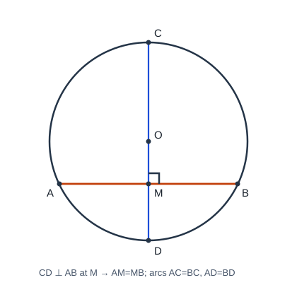

# 圆基础

## 1. 圆的相关概念

### 1.1 定义与表示

- **动态：** 平面内线段 $OA$ 绕定点 $O$ 旋转一周，另一端点 $A$ 形成的图形叫做**圆**；$O$ 为圆心，$OA$ 为半径。
- **静态：** 到定点的距离等于定长的点的集合叫做圆；定点为圆心，定长为半径。

以 $O$ 为圆心的圆记作 $\odot O$。确定一个圆需要：**圆心**（位置）与**半径**（大小），缺一不可。

### 1.2 弦、直径、弧

| 名称 | 定义要点 |
|------|----------|
| **弦** | 连接圆上任意两点的线段 |
| **直径** | 经过圆心的弦；是圆中最长的弦，长度为半径的 $2$ 倍 |
| **弧** | 圆上两点间的部分；以 $A,B$ 为端点记作 $\overset{\frown}{AB}$ |
| **半圆** | 直径两端点把圆分成的每一条弧 |
| **劣弧 / 优弧** | 小于半圆的弧 / 大于半圆的弧（优弧常用三个字母，如 $\overset{\frown}{ACB}$） |
| **等弧** | 在同圆或等圆中能够互相重合的弧 |

**同圆：** 圆心相同且半径相等（同一圆）；**等圆：** 能完全重合的圆；**同心圆：** 圆心相同、半径不等的两圆。

### 1.3 圆心角、圆周角、扇形与弓形

- **圆心角：** 顶点在圆心的角。
- **圆周角：** 顶点在圆上，并且两边都与圆相交的角。
- **扇形：** 两条半径与它们所夹的弧围成的图形。
- **弓形：** 弦及其所对的弧组成的图形（同一弦对应劣弧、优弧两个弓形）。

易错：直径一定是弦，弦不一定是直径；等弧强调“同圆或等圆中能重合”，不是“看起来差不多”。

---

## 2. 圆的对称性

圆是**轴对称图形**：每一条直径所在直线都是对称轴，有无数条对称轴。

圆是**中心对称图形**：对称中心是圆心；绕圆心旋转任意角度都能与自身重合（旋转不变性）。

---

## 3. 垂径定理

### 3.1 定理与推论

**垂径定理：** 垂直于弦的直径平分这条弦，并且平分弦所对的两条弧。

如图，$\odot O$ 中直径 $CD\perp$ 弦 $AB$ 于 $M$，则

$$AM=MB,\qquad \overset{\frown}{AC}=\overset{\frown}{BC},\qquad \overset{\frown}{AD}=\overset{\frown}{BD}.$$

**推论：** 平分弦（不是直径）的直径垂直于弦，并且平分弦所对的两条弧。

常用口诀：过圆心垂直弦 $\Rightarrow$ 平分弦与弧；平分弦（非直径）的直径 $\Rightarrow$ 垂直弦并平分弧。

### 3.2 证明要点

连接 $OA,OB$。因 $OA=OB$，故 $\triangle OAB$ 为等腰三角形。又直径 $CD\perp AB$ 于 $M$，由等腰三角形“三线合一”（或直角三角形全等）：

$$\mathrm{Rt}\triangle OMA\cong\mathrm{Rt}\triangle OMB \Rightarrow AM=MB,\ \angle AOM=\angle BOM,$$

从而圆心角相等 $\Rightarrow$ 所对弧相等，即平分弦所对的两条弧。

### 3.3 计算模型

弦长、弦心距、半径常构成直角三角形：设半径为 $R$，弦 $AB=2a$，弦心距为 $d$，则

$$a^2+d^2=R^2.$$

注意：弦心距是圆心到弦的距离；直径垂直弦时，垂足是弦的中点。

---

## 4. 圆心角、弧、弦的关系

**定理：** 在同圆或等圆中，相等的圆心角所对的弧相等，所对的弦也相等。

**推论：** 在同圆或等圆中，若两个圆心角、两条弧、两条弦中有一组量相等，则其余各组对应量分别相等。

前提“同圆或等圆”不可省；通常还伴随弦心距相等。

---

## 5. 圆周角定理

**圆周角定理：** 一条弧所对的圆周角等于它所对的圆心角的一半。

**推论 1：** 同弧或等弧所对的圆周角相等。

**推论 2：** 半圆（或直径）所对的圆周角是直角；$90^\circ$ 的圆周角所对的弦是直径。

---

## 6. 圆内接四边形

四个顶点都在同一个圆上的四边形叫做**圆内接四边形**，该圆是它的**外接圆**。

**性质：**

1. **对角互补：** $\angle A+\angle C=180^\circ$，$\angle B+\angle D=180^\circ$；
2. **外角等于内对角：** 任一外角等于它的内对角。

常用：证四点共圆时可证对角互补；有直径时优先用“直径所对圆周角为直角”。

---

## 7. 小结

圆由圆心与半径确定；垂径定理把“垂直、平分弦、平分弧”绑在一起，计算时构造直角三角形。圆周角等于同弧圆心角的一半；直径对直角、直角对直径。圆内接四边形对角互补。做题先分清所对的是哪一段弧（劣弧还是优弧）。
