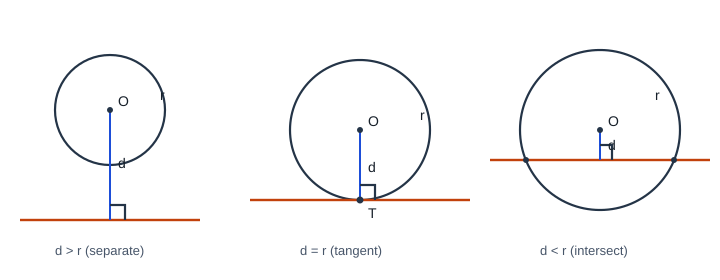

# 圆的位置关系

## 1. 点与圆的位置关系

设 $\odot O$ 半径为 $r$，点 $P$ 到圆心 $O$ 的距离为 $d=OP$。

| 位置关系 | 距离与半径 | 公共点 |
|----------|------------|--------|
| 点在圆内 | $d<r$ | — |
| 点在圆上 | $d=r$ | $P$ 在圆周上 |
| 点在圆外 | $d>r$ | — |

判定与性质互逆：由位置推 $d$ 与 $r$ 的大小，也可由 $d$ 与 $r$ 的大小推位置。

补充：过一点可作无数圆；过两点可作无数圆（圆心在线段垂直平分线上）；过不共线三点有且仅有一个圆。三点共线则无圆。

---

## 2. 直线与圆的位置关系

设圆心 $O$ 到直线 $l$ 的距离为 $d$，半径为 $r$。

| 位置关系 | 公共点个数 | 距离关系 | 直线名称 |
|----------|------------|----------|----------|
| 相交 | $2$ | $d<r$ | 割线 |
| 相切 | $1$（切点） | $d=r$ | 切线 |
| 相离 | $0$ | $d>r$ | — |

结论：$l$ 与 $\odot O$ 相交 $\Leftrightarrow d<r$；相切 $\Leftrightarrow d=r$；相离 $\Leftrightarrow d>r$。

易错：比较的是**圆心到直线的距离**与半径，不是随便一条线段。

---

## 3. 切线的判定与性质

### 3.1 定义

直线与圆有且只有一个公共点时，叫做圆的**切线**，这个公共点叫做**切点**。

### 3.2 性质定理

圆的切线垂直于经过切点的半径。

设切点为 $T$，则 $OT\perp$ 切线。

补充：

1. 经过圆心且垂直于切线的直线必过切点；
2. 经过切点且垂直于切线的直线必过圆心。

### 3.3 判定定理

经过半径外端并且垂直于这条半径的直线是圆的切线。

两个条件缺一不可：

1. 直线经过半径的外端（点在圆上）；
2. 直线垂直于该半径。

**解题策略：**

- 已知直线与圆有公共点：连半径，证垂直；
- 未知公共点：作圆心到直线的垂线，证 $d=r$。

---

## 4. 切线长定理

从圆外一点引圆的切线，这点与切点之间的线段长叫做这点到圆的**切线长**。

**切线长定理：** 从圆外一点引圆的两条切线，它们的切线长相等；圆心与这点的连线平分两条切线的夹角。

设圆外一点 $P$，切点为 $A,B$，则

$$PA=PB,\qquad \angle APO=\angle BPO.$$

常连接 $OA,OB,OP$，得到两个全等的直角三角形，用来证线段相等或求角。

---

## 5. 外接圆与内切圆（简述）

| | 外接圆 | 内切圆 |
|--|--------|--------|
| 定义 | 过三角形三顶点的圆 | 与三边都相切的圆 |
| 圆心 | **外心**（三边垂直平分线交点） | **内心**（三角平分线交点） |
| 性质 | 到三顶点距离相等 | 到三边距离相等 |

直角三角形外心在斜边中点；等边三角形外心、内心重合。勿把外心与内心混淆。

---

## 6. 两圆的位置关系（培优 / 衔接）

设两圆半径为 $r_1,r_2$（不妨 $r_1\ge r_2$），圆心距为 $d$。

| 位置 | 条件 | 公共点 |
|------|------|--------|
| 外离 | $d>r_1+r_2$ | $0$ |
| 外切 | $d=r_1+r_2$ | $1$ |
| 相交 | $|r_1-r_2|<d<r_1+r_2$ | $2$ |
| 内切 | $d=|r_1-r_2|$ | $1$ |
| 内含 | $d<|r_1-r_2|$ | $0$ |

苏科版课内以点—线与圆为主；两圆五种关系常在中考综合或衔接高中时出现，记住“圆心距与两半径和差比较”即可。

---

## 7. 典型例题

### 例 1：点与圆

$\odot O$ 半径 $5\,\mathrm{cm}$。若 $OP=5$，则 $P$ 在圆上；若直径为 $4\,\mathrm{cm}$ 而 $OP=4\,\mathrm{cm}$，则 $d=4>r=2$，点在圆外。

### 例 2：直线与圆

圆心到直线距离 $d=3$，半径 $r=5$，则 $d<r$，直线与圆相交。若 $d=r$，则相切。

### 例 3：切线判定

点 $A$ 在 $\odot O$ 上，$OA\perp l$ 且 $A$ 在 $l$ 上，则 $l$ 是 $\odot O$ 的切线（点在圆上且半径垂直直线）。

### 例 4：切线长

圆外一点 $P$ 作两切线，切点 $A,B$。若 $PA=6$，则 $PB=6$；又 $OA\perp PA$，$OB\perp PB$，可在直角三角形中求 $OP$ 或夹角。

---

## 8. 小结

点、线与圆的位置一律用距离 $d$ 与半径 $r$ 比较。切线判定抓“点在圆上 + 半径垂直直线”；性质是“切线垂直过切点的半径”。切线长相等常用来证等腰或全等。两圆位置用圆心距与半径和、差比较（培优）。
