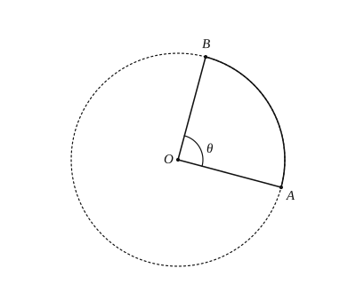

# 圆的计算

## 1. 弧长公式

圆心角为 $n^\circ$、半径为 $R$ 的弧长：

$$l=\dfrac{n\pi R}{180}.$$

说明：

- $n$ 表示圆心角度数（$1^\circ$ 的倍数），公式中 $n$ 与 $180$ 都不带单位；
- 已知 $l,n,R$ 中任意两个，可求第三个；
- 整圆周长 $C=2\pi R$ 对应 $n=360$。

易错：不要把弧长公式与扇形面积公式的分母（$180$ / $360$）记反；计算时角度制与弧度制不要混用。

---

## 2. 扇形面积

圆心角为 $n^\circ$、半径为 $R$ 的扇形面积：

$$S_{\text{扇形}}=\dfrac{n\pi R^{2}}{360}.$$

若已知弧长 $l$，还有

$$S_{\text{扇形}}=\dfrac{1}{2}lR.$$

推导提示：扇形是圆的 $\dfrac{n}{360}$，故面积为整圆 $\pi R^{2}$ 的 $\dfrac{n}{360}$；由 $l=\dfrac{n\pi R}{180}$ 消去 $n$ 即得 $\dfrac{1}{2}lR$。

已知 $S,l,n,R$ 中任意两个，一般可求其余量。关键是先明确：**半径、圆心角度数或弧长**。

---

## 3. 圆锥的侧面展开

### 3.1 母线与展开图

连接圆锥顶点与底面圆周上任意一点的线段叫做**母线**，记作 $l$。

圆锥侧面展开图是一个**扇形**：

- 扇形半径 $=$ 圆锥母线长 $l$；
- 扇形弧长 $=$ 圆锥底面周长 $2\pi r$（$r$ 为底面半径）。

因此

$$\dfrac{n\pi l}{180}=2\pi r \quad\Rightarrow\quad n=\dfrac{360r}{l},$$

其中 $n^\circ$ 为侧面展开扇形的圆心角。

### 3.2 侧面积与全面积

$$S_{\text{侧}}=\pi r l,\qquad S_{\text{全}}=\pi r l+\pi r^{2}=\pi r(l+r).$$

（侧面积即展开扇形面积；全面积再加底面圆面积。）

### 3.3 母线、高与底半径

轴截面中，母线 $l$、高 $h$、底面半径 $r$ 构成直角三角形：

$$l^{2}=h^{2}+r^{2}.$$

易错：展开扇形的半径是母线 $l$，不是底面半径 $r$；求侧面积时不要漏乘 $\pi$，也不要把全面积当成侧面积。

---

## 4. 典型例题

### 例 1：求弧长

半径 $R=3$，圆心角 $n=50^\circ$，则

$$l=\dfrac{50\pi\cdot 3}{180}=\dfrac{5\pi}{6}.$$

若圆周角为 $50^\circ$，所对弧的圆心角为 $100^\circ$，再代入弧长公式。

### 例 2：由面积求半径

扇形圆心角 $120^\circ$，面积 $12\pi$，则

$$\dfrac{120\pi R^{2}}{360}=12\pi \Rightarrow \dfrac{R^{2}}{3}=12 \Rightarrow R^{2}=36 \Rightarrow R=6.$$

### 例 3：由弧长求圆心角

扇形半径 $6$，面积 $6\pi$，则

$$\dfrac{n\pi\cdot 36}{360}=6\pi \Rightarrow \dfrac{n}{10}=6 \Rightarrow n=60.$$

或先由 $S=\dfrac{1}{2}lR$ 得 $l=2$，再 $l=\dfrac{n\pi R}{180}$ 求 $n$。

### 例 4：圆锥展开

底面半径 $r=3$，母线 $l=9$，则侧面积

$$S_{\text{侧}}=\pi\cdot 3\cdot 9=27\pi,$$

展开扇形圆心角

$$n=\dfrac{360\cdot 3}{9}=120.$$

若已知高 $h=4$，底半径 $r=3$，则母线 $l=\sqrt{3^{2}+4^{2}}=5$，再算侧面积 $\pi\cdot 3\cdot 5=15\pi$。

---

## 5. 小结

弧长 $l=\dfrac{n\pi R}{180}$，扇形面积 $S=\dfrac{n\pi R^{2}}{360}=\dfrac{1}{2}lR$。圆锥侧面展开是扇形：弧长等于底面周长，半径等于母线；侧面积 $\pi rl$。先分清哪个是母线、哪个是底半径，再代入公式。
