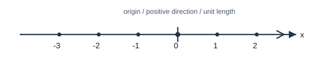

# 实数及其运算

## 1. 实数的分类

### 1.1 正数与负数

- 大于 $0$ 的数叫做**正数**；在正数前面加上“$-$”得到的数叫做**负数**；负数前面的负号不能省略。
- $0$ 既不是正数，也不是负数。
- 正数、负数常用来表示具有相反意义的量：先规定一种意义为正，则相反意义用负表示。

### 1.2 有理数与无理数

- **有理数：** 整数与分数的统称。整数包括正整数、$0$、负整数；分数包括正分数、负分数。有理数都可写成 $\dfrac{p}{q}$（$p,q$ 为整数且 $q\neq 0$）。其小数形式为有限小数或无限循环小数。
- **无理数：** 无限不循环小数。常见类型：开方开不尽的数（如 $\sqrt{2}$）、含 $\pi$ 的数（如 $\pi$、$2\pi$）、有特定规律但永不循环的小数（如 $0.1010010001\ldots$）。
- **实数：** 有理数与无理数统称实数。

易错提醒：

- $\sqrt{4}=2$ 是有理数，不是“带根号就是无理数”；
- $3.14$ 是 $\pi$ 的近似值，本身是有理数；$\pi$ 才是无理数；
- 无限循环小数是有理数，不是无理数。

---

## 2. 数轴、相反数、绝对值、倒数

### 2.1 数轴

规定了**原点、正方向、单位长度**的直线叫做数轴。三要素缺一不可。

性质：实数与数轴上的点一一对应；数轴上右边的点表示的数大于左边的点表示的数。

### 2.2 相反数

- 代数定义：只有符号不同的两个数互为相反数；$a$ 的相反数是 $-a$，$0$ 的相反数是 $0$。
- 几何定义：数轴上关于原点对称的两点所表示的数互为相反数。
- 判定：$a+b=0 \Leftrightarrow a,b$ 互为相反数。

### 2.3 绝对值

$$|a|=\begin{cases}a,&a>0,\\0,&a=0,\\-a,&a<0.\end{cases}$$

- 几何意义：$|a|$ 表示数轴上表示 $a$ 的点到原点的距离；$|x-a|$ 表示 $x$ 与 $a$ 的距离。
- 非负性：$|a|\ge 0$。
- $|a|=|b|\Rightarrow a=\pm b$。

### 2.4 倒数

乘积为 $1$ 的两个数互为倒数。$a\neq 0$ 时，$a$ 的倒数是 $\dfrac{1}{a}$。$0$ 没有倒数。

---

## 3. 科学记数法与近似数

### 3.1 科学记数法

把一个数写成

$$a\times 10^n\quad（1\le |a|<10,\ n\in\mathbb{Z})$$

的形式，叫做科学记数法。

- 当原数绝对值 $\ge 10$ 时，$n$ 为正整数，等于原数整数位位数减 $1$；
- 当原数绝对值 $<1$ 时，$n$ 为负整数，其绝对值等于原数左起第一个非零数字前 $0$ 的个数（含小数点前的 $0$）。

例：$36000=3.6\times 10^4$，$0.00036=3.6\times 10^{-4}$，$-36000=-3.6\times 10^4$。

### 3.2 近似数与有效数字

- 精确到某一位：用四舍五入保留到指定数位。
- **有效数字：** 从左起第一个非零数字到末位的所有数字。例如近似数 $3.20$ 精确到百分位，有 $3$ 个有效数字；$3.2\times 10^3$ 有 $2$ 个有效数字。

---

## 4. 实数大小比较

常用方法：

1. **数轴法：** 右边大于左边。
2. **类别法：** 正数 $>0>$ 负数；两个负数比较时，绝对值大的反而小。
3. **作差法：** $a-b>0\Leftrightarrow a>b$；$a-b=0\Leftrightarrow a=b$；$a-b<0\Leftrightarrow a<b$。
4. **平方比较：** 对正实数 $a,b$，有 $a^2>b^2\Leftrightarrow a>b$；对负实数 $a,b$，有 $a^2>b^2\Leftrightarrow a<b$。
5. **倒数比较：** 若 $ab>0$ 且 $\dfrac{1}{a}>\dfrac{1}{b}$，则 $a<b$。

---

## 5. 实数运算

### 5.1 四则运算法则

- 加法：同号相加，取相同符号并把绝对值相加；异号相加，取绝对值较大者的符号，并用较大绝对值减较小绝对值。
- 减法：减去一个数等于加上这个数的相反数。
- 乘法：同号得正，异号得负，绝对值相乘；任何数与 $0$ 相乘得 $0$。
- 除法：除以一个不为 $0$ 的数，等于乘以这个数的倒数。

### 5.2 幂与根

- $a^0=1$（$a\neq 0$）。
- $(-1)^n=1$（$n$ 为偶数）；$(-1)^n=-1$（$n$ 为奇数）。
- 若 $a\neq 0$，$n$ 为正整数，则 $a^{-n}=\dfrac{1}{a^n}$。
- 运算顺序：先乘方（开方），再乘除，最后加减；有括号先算括号。

有理数的运算律在实数范围内仍然成立。

---

## 6. 典型例题

### 例 1：正负数的意义

若向东走 $80$ 米记作 $+80$ 米，则向西走 $60$ 米记作 $-60$ 米。

### 例 2：绝对值化简

化简 $|x-1|+|x-3|$（分类讨论）。

- 当 $x<1$ 时，原式 $=(1-x)+(3-x)=4-2x$；
- 当 $1\le x\le 3$ 时，原式 $=(x-1)+(3-x)=2$；
- 当 $x>3$ 时，原式 $=(x-1)+(x-3)=2x-4$。

最小值在 $[1,3]$ 上取得，最小值为 $2$。

### 例 3：科学记数法

把 $0.0000205$ 用科学记数法表示：$2.05\times 10^{-5}$。

---

## 7. 小结

实数复习抓住三条线：分类（有理/无理）、表示（数轴与科学记数法）、运算（法则与顺序）。绝对值问题优先看几何意义；比较大小优先作差或数轴。
