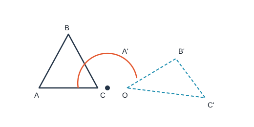

# 对称平移与旋转

## 1. 轴对称

### 1.1 轴对称图形与成轴对称

| | 轴对称图形 | 两个图形成轴对称 |
|--|------------|------------------|
| 对象 | **一个**图形 | **两个**图形 |
| 定义 | 沿某直线对折后两部分重合 | 沿某直线对折后两图形重合 |
| 该直线 | 对称轴（可有多条） | 对称轴（通常一条） |

把轴对称图形沿对称轴分成两部分，则这两部分成轴对称；把成轴对称的两图形看作整体，则整体是轴对称图形。

常见轴对称图形：等腰三角形、矩形、菱形、正方形、圆等。

### 1.2 性质

若两个图形关于直线 $l$ 成轴对称，则：

1. 对应线段相等，对应角相等；
2. **对应点连线被对称轴垂直平分**；
3. 两图形全等。

折叠的实质是轴对称：折痕为对称轴，折叠前后对应边、对应角相等。

### 1.3 简单作图

作点 $P$ 关于直线 $l$ 的对称点 $P'$：

1. 过 $P$ 作 $l$ 的垂线，垂足为 $H$；
2. 在垂线另一侧取 $HP'=HP$，则 $P'$ 为对称点。

作已知图形的对称图形：先作各关键点的对称点，再顺次连接。

---

## 2. 平移

### 2.1 定义与要素

在平面内，图形沿某一方向移动一定距离，这种运动叫做**平移**。

三大要素：**方向**、**距离**（有时也强调起点/对应点）。

平移不改变图形的形状和大小。

### 2.2 性质

1. 对应线段平行（或共线）且相等，对应角相等；
2. 各对应点所连线段平行（或共线）且相等；
3. 平移前后图形全等。

### 2.3 作图步骤

1. 确定平移方向与距离；
2. 取出原图形关键点；
3. 将各关键点按同一方向、同一距离平移得对应点；
4. 顺次连接对应点。

---

## 3. 旋转

### 3.1 定义与要素

在平面内，图形绕一个定点沿某一方向（顺时针或逆时针）转过一个角度，叫做**旋转**。

- 定点：旋转中心；
- 转过的角：旋转角。

三大要素：**旋转中心**、**旋转方向**、**旋转角**。

### 3.2 性质

1. 对应点到旋转中心的距离相等；
2. 每对对应点与旋转中心连线的夹角等于旋转角；
3. 旋转前后图形全等。

旋转是全等变换：只改变位置，不改变大小与形状。解题时主动写出 $OA=OA'$、$\angle AOA'=\theta$ 等，再结合等腰、全等或三角函数。

### 3.3 作图步骤

1. 确定旋转中心、方向与旋转角；
2. 连接各关键点与旋转中心；
3. 按方向将各连线转过旋转角，截取等长得对应点；
4. 顺次连接对应点。

### 3.4 中心对称

| | 中心对称图形 | 两个图形成中心对称 |
|--|--------------|---------------------|
| 定义 | 绕某点旋转 $180^\circ$ 后与自身重合 | 绕某点旋转 $180^\circ$ 后与另一图形重合 |
| 该点 | 对称中心 | 对称中心 |

性质：对应点连线过对称中心且被中心平分；对应线段相等、对应角相等。

常见中心对称图形：平行四边形、矩形、菱形、正方形、正六边形、圆等。

注意：矩形、菱形、正方形、圆既是轴对称图形，又是中心对称图形；等腰（含等边）三角形是轴对称图形，但一般**不是**中心对称图形（绕中心转 $180^\circ$ 不能与自身重合）。

---

## 4. 三种变换对比

| | 轴对称 | 平移 | 旋转 |
|--|--------|------|------|
| 决定因素 | 对称轴 | 方向、距离 | 中心、方向、角度 |
| 对应点关系 | 连线被轴垂直平分 | 连线平行且相等 | 到中心等距，夹角=旋转角 |
| 图形关系 | 全等 | 全等 | 全等 |

综合题常把“对称 / 平移 / 旋转”翻译成边角相等，再用全等、相似或勾股求解。

---

## 5. 典型例题

### 例 1：轴对称性质判断

$\triangle ABC$ 与 $\triangle A'B'C'$ 关于直线 $MN$ 对称，$BB'$ 交 $MN$ 于 $O$。由定义与性质：

$$AB=A'B',\quad OB=OB',\quad\triangle ABC\cong\triangle A'B'C'.$$

又对应点连线被对称轴垂直平分，故 $AA'\perp MN$、$BB'\perp MN$，从而 $AA'\parallel BB'$。判断题紧扣“垂直平分”与“全等”，不要漏掉平行关系。

### 例 2：对称与周长

$\angle AOB$ 内有点 $P$，作 $P$ 关于 $OA$、$OB$ 的对称点 $P_1$、$P_2$，连接 $P_1P_2$ 交 $OA$、$OB$ 于 $M$、$N$。由对称知

$$PM=P_1M,\quad PN=P_2N,$$

故 $\triangle PMN$ 的周长等于 $P_1P_2$。若 $P_1P_2=12\,\mathrm{cm}$，则周长为 $12\,\mathrm{cm}$。

### 例 3：平移性质

图形沿向量平移后，对应边平行且相等。若已知平移前后某两边平行，可用来证明平行四边形或求对应点坐标（坐标系中：横坐标同加 $a$，纵坐标同加 $b$）。

### 例 4：旋转与全等

点 $P$ 绕点 $O$ 逆时针旋转 $90^\circ$ 得到 $P'$，则

$$OP=OP',\quad\angle POP'=90^\circ.$$

从而 $\triangle OPP'$ 为等腰直角三角形。若还有其他点同时旋转同一角度，则对应三角形全等，对应线段相等。

### 例 5：折叠最短路径（简述）

求线段 $PA+PB$ 的最小值（$P$ 在直线 $l$ 上）：作 $A$ 关于 $l$ 的对称点 $A'$，连接 $A'B$ 交 $l$ 于 $P$，则 $PA+PB=A'B$ 最小。依据是轴对称下 $PA=PA'$，折线化为直线段。

---

## 6. 小结

轴对称看“垂直平分”，平移看“同向等距”，旋转看“等径等角”。三者都是全等变换，综合题先写出对应相等，再选全等判定或计算。中心对称是旋转 $180^\circ$ 的特殊情形；识别题注意“一个图形的性质”与“两个图形的位置关系”不要混淆。
