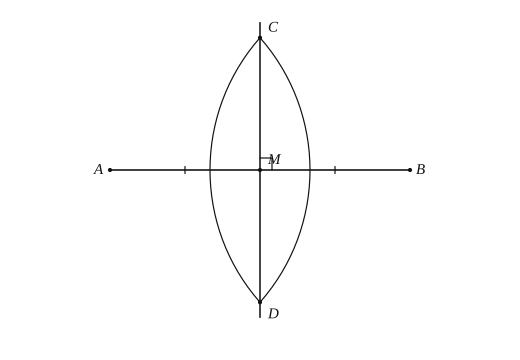

# 尺规作图

## 1. 尺规作图是什么

在几何里，限定只用**没有刻度的直尺**和**圆规**来画图，叫做**尺规作图**。

- 直尺：画直线、射线、线段（不能量长度、不能直接画直角）；
- 圆规：画圆或弧，并把一段长度“搬”到别处。

中考常要求：**保留作图痕迹，不写作法**，并标出关键字母。

---

## 2. 五种基本作图

### 2.1 作一条线段等于已知线段

已知线段 $a$，求作线段 $AB=a$。

作法要点：作射线；以端点为圆心、$a$ 为半径画弧，与射线交于另一端点。

实质：用圆规把长度 $a$ 复制过去。

### 2.2 作一个角等于已知角

已知 $\angle AOB$，求作 $\angle A'O'B'=\angle AOB$。

作法要点：

1. 以 $O$ 为圆心画弧，交 $OA$、$OB$ 于 $C$、$D$；
2. 作射线 $O'A'$，以 $O'$ 为圆心、$OC$ 为半径画弧，交 $O'A'$ 于 $C'$；
3. 以 $C'$ 为圆心、$CD$ 为半径画弧，与前弧交于 $D'$；作射线 $O'B'$。

**依据：** $\triangle C'O'D'\cong\triangle COD$（SSS）$\Rightarrow\angle A'O'B'=\angle AOB$。

### 2.3 作已知角的平分线

已知 $\angle AOB$，求作射线 $OE$，使 $\angle AOE=\angle BOE$。

作法要点：以 $O$ 为圆心画弧交两边于 $C$、$D$；分别以 $C$、$D$ 为圆心、相同半径画弧交于 $E$（在角内部）；作射线 $OE$。

**依据：** $\triangle OCE\cong\triangle ODE$（SSS）$\Rightarrow\angle COE=\angle DOE$。

### 2.4 作已知线段的垂直平分线

已知线段 $AB$，求作直线 $l$，使 $l$ 垂直平分 $AB$。

作法要点：分别以 $A$、$B$ 为圆心、大于 $\dfrac{1}{2}AB$ 的相同半径画弧，两弧交于 $P$、$Q$；作直线 $PQ$。

**性质：** 垂直平分线上任意一点到 $A$、$B$ 的距离相等；反之，到 $A$、$B$ 距离相等的点在垂直平分线上。

### 2.5 过一点作已知直线的垂线

分两种情形：

| 情形 | 作法要点 |
|------|----------|
| 点 $P$ 在直线 $l$ 上 | 以 $P$ 为圆心画弧交 $l$ 于两点，再作这两点所连线段的垂直平分线（过 $P$） |
| 点 $P$ 在直线 $l$ 外 | 以 $P$ 为圆心画弧交 $l$ 于两点，再作这两点所连线段的垂直平分线 |

实质都归结为“作垂直平分线”。

---

## 3. 常用延伸作图

### 3.1 过直线外一点作平行线

已知直线 $l$ 与线外一点 $P$，求作过 $P$ 且与 $l$ 平行的直线。

常用：过 $P$ 作截线，再在 $P$ 处作与同位角（或内错角）相等的角，由“同位角相等 $\Rightarrow$ 两直线平行”得平行线。

### 3.2 作角的和与差

- **和：** 在已知角一边外侧（或内侧）再作一个等于另一已知角的角，拼成和角；
- **差：** 在较大角内部截取等于较小角的角，余下即为差角。

### 3.3 中点与垂足

- 线段中点：作垂直平分线与线段的交点；
- 点到直线的垂足：过该点作垂线，垂线与已知直线的交点。

---

## 4. 作三角形

根据已知条件，用基本作图拼出三角形。常见类型：

| 已知 | 作法思路 | 存在性注意 |
|------|----------|------------|
| 三边 $a,b,c$ | 先作一边，再以两端为圆心、另两边为半径画弧交顶点 | 须满足三角形三边关系：$a+b>c$ 等 |
| 两边及其夹角 | 先作夹角，再在两边上截取已知长，连线 | 夹角须为 $0^\circ$ 与 $180^\circ$ 之间的角 |
| 两角及其夹边 | 先作夹边，两端作两已知角，两边相交 | 两角之和须小于 $180^\circ$ |
| 直角边与斜边（直角三角形） | 先作直角，截直角边，再以直角边一端为圆心、斜边为半径画弧 | 斜边必须**大于**直角边 |

例：已知线段 $m$、$n$，求作 $\triangle ABC$，使 $\angle A=90^\circ$，$AB=m$，$BC=n$。

作法要点：作 $\angle A=90^\circ$，在一边上截取 $AB=m$；以 $B$ 为圆心、$n$ 为半径画弧，与另一直角边交于 $C$（需 $n>m$，否则弧与射线可能不相交）。

连接后可用 **HL** 说明所作直角三角形满足条件（斜边与一直角边确定）。

---

## 5. 存在性与易错

1. **两弧相交：** 半径须足够大（如垂直平分线半径 $>\dfrac{1}{2}AB$），否则无交点；
2. **作三角形：** 先检验边角条件是否允许存在，再动手；
3. **角平分线交点：** 两弧交点应取在角的**内部**；
4. **平行与垂直：** 作平行常借助“作等角”；作垂线常借助“垂直平分线”；
5. **痕迹：** 弧、交点、辅助射线都要保留，阅卷看痕迹是否合理。

作图题后半段常接计算或证明：作图得到的等长、等角、垂直、中点，要立刻翻译成全等、等腰等条件。

---

## 6. 典型例题

### 例 1：作等长线段

在 $\mathrm{Rt}\triangle ABC$ 中，$\angle B=90^\circ$，$\angle A=30^\circ$。在斜边 $AC$ 上求作 $AO=BC$，连接 $OB$。

作法：以 $A$ 为圆心、$BC$ 长为半径画弧，交 $AC$ 于 $O$。

若已知 $OB=2$，由 $\angle A=30^\circ$ 及直角三角形性质可求 $AB$（作图后进入计算）。

### 例 2：作等角的依据

“作一个角等于已知角”的步骤中，判定 $\triangle C'O'D'\cong\triangle COD$ 的依据是 **SSS**（三边分别相等），从而对应角相等。

### 例 3：角平分线与全等

等腰 $\triangle ABC$，$AB=AC$，$AD$ 为角平分线。以 $A$ 为圆心、$AD$ 为半径画弧，交 $AB$、$AC$ 于 $E$、$F$，连接 $DE$、$DF$。

**证明：** $\triangle ADE\cong\triangle ADF$。

在 $\triangle ADE$ 与 $\triangle ADF$ 中，

$$AE=AF\ \text{（同圆半径）},\quad AD=AD\ \text{（公共边）},\quad\angle EAD=\angle FAD\ \text{（角平分线）},$$

故 $\triangle ADE\cong\triangle ADF$（SAS）。

若 $\angle BAC=80^\circ$，则 $\angle BAD=40^\circ$，再结合等腰与外角可求相关角。

### 例 4：作角平分线与平行

已知 $\angle AOB=50^\circ$，点 $C$ 在 $OA$ 上。求作点 $P$，使 $\angle AOP=25^\circ$ 且 $CP\parallel OB$。

思路：先作 $\angle AOB$ 的平分线得 $25^\circ$ 射线；再过 $C$ 作该射线的平行线……（或先作平分线，再过 $C$ 作 $OB$ 的平行线交平分线于 $P$）。关键是“平分 + 平行”两个基本作图的组合。

---

## 7. 小结

五种基本作图是核心：等长、等角、角平分线、垂直平分线、垂线；平行、中点、作三角形都由它们组合而成。动笔前先想“用哪条基本作图”，并检查交点是否存在。作图得到的相等与垂直，证明时优先考虑 SSS、SAS、HL 等全等判定。
