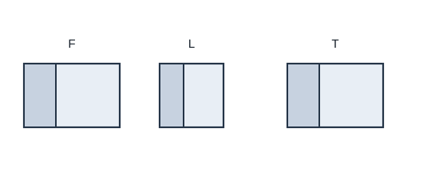

# 投影与视图

## 1. 投影

用光线照射物体，在某个平面上得到的影子，叫做物体的**投影**。投影面通常是地面或墙壁。

### 1.1 平行投影

光线可看成彼此平行（如阳光）时，所成投影叫做**平行投影**。

结论：

1. **等高**物体垂直地面放置时，同一时刻在阳光下影长相等；
2. **等长**物体平行于地面放置时，阳光下影长相等，且影长等于物体本身长度；
3. 同一时刻，不同竖直物体的**物高与影长成正比例**：

$$\frac{H_1}{h_1}=\frac{H_2}{h_2}.$$

（$H$ 为物高，$h$ 为影长；必须同一时刻测量。）

北半球一天中，物体影子指向大致：西 $\to$ 西北 $\to$ 北 $\to$ 东北 $\to$ 东；影长先变短再变长。

判别：物体与影子上对应点的连线彼此平行 $\Rightarrow$ 平行光线。

### 1.2 中心投影

光线从一点（点光源）发出时，所成投影叫做**中心投影**。生活中如路灯、手电筒、投影仪灯光。

结论：

1. 等高竖直物体：离点光源越近，影子越短；越远，影子越长；
2. 等长且平行于投影面的物体：一般离光源越近影子越长，越远越短，但不会短于物体本身长度；
3. **共线：** 点光源、物体边缘上的点、影子上的对应点在同一直线上。

光源与影子分居物体两侧；光源或物体方向改变时，影子方向随之改变。

### 1.3 平行投影与中心投影的对比

| | 平行投影 | 中心投影 |
|--|----------|----------|
| 光线 | 平行（如阳光） | 从一点发出 |
| 等高竖直物 | 同一时刻影长相等 | 近光源影短，远则影长 |
| 对应点连线 | 彼此平行 | 过点光源共线 |

---

## 2. 三视图

### 2.1 概念

从某一方向观察物体得到的图形叫做**视图**。

取三个互相垂直的投影面：正面、水平面、侧面。物体在其上的正投影分别是：

- **主视图（Front）：** 从前往后看；
- **俯视图（Top）：** 从上往下看；
- **左视图（Left）：** 从左往右看。

三者合称**三视图**。

### 2.2 位置与尺寸关系

规定摆放：

- 主视图在左；
- 俯视图在主视图正下方；
- 左视图在主视图正右方。

尺寸口诀：

$$\text{长对正},\quad\text{高平齐},\quad\text{宽相等}.$$

| 视图 | 反映的量 |
|------|----------|
| 主视图 | 长、高 |
| 俯视图 | 长、宽 |
| 左视图 | 高、宽 |

### 2.3 画法要点

1. 先定主视图位置并画出主视图；
2. 正下方画俯视图，与主视图**长对正**；
3. 正右方画左视图，与主视图**高平齐**，与俯视图**宽相等**；
4. 看得见的轮廓用实线，被遮挡的轮廓用**虚线**。

简单几何体（长方体、圆柱、圆锥、球、组合体）先分清“从前、从上、从左”各看见什么形状，再落笔。

### 2.4 由三视图还原几何体

分别根据主、俯、左想象物体的前面、上面、左侧面，再综合成立体形状。注意：

- 俯视图中的位置对应左右、前后关系；
- 虚线提示内部或后方有被挡的棱；
- 组合体先拆成基本几何体再拼。

---

## 3. 典型例题

### 例 1：同一时刻影长测高

同一时刻，身高 $1.5\,\mathrm{m}$ 的人影长 $1.8\,\mathrm{m}$，旗杆影长 $11.3\,\mathrm{m}$。由比例

$$\frac{H}{11.3}=\frac{1.5}{1.8}\implies H=\frac{1.5}{1.8}\times 11.3.$$

若人影长恰好等于身高，则旗杆高等于其影长。

### 例 2：影子落在墙上

小明身高 $1.5\,\mathrm{m}$，影长 $1.8\,\mathrm{m}$。立柱影子一部分在地面 $CE=1.2\,\mathrm{m}$，一部分在墙上 $EH=1.5\,\mathrm{m}$。

思路：先由小明得物高与影长比；地面段对应“完整投影”的一部分，墙上竖直段需把光线看成平行线，用相似或比例分段求立柱总高。

### 例 3：中心投影与相似比

三角形硬纸板面积为 $60\,\mathrm{cm}^2$，平行于投影面，点光源 $O$ 下投影为 $\triangle A_1B_1C_1$。若 $OB:BB_1=2:3$，则

$$\frac{OB}{OB_1}=\frac{2}{2+3}=\frac{2}{5}.$$

相似比为 $\dfrac{OB_1}{OB}=\dfrac{5}{2}$，面积比为平方：

$$S' = 60\times\left(\frac{5}{2}\right)^2=375\,\mathrm{cm}^2.$$

### 例 4：读三视图

给定主、俯、左三个平面图形时：先看主视图定高度与长度轮廓，再看俯视图定前后宽度与左右分布，最后用左视图核对高度与宽度是否一致；有虚线则补上被挡棱。

---

## 4. 小结

平行投影抓“同一时刻成比例”；中心投影抓“光源—物点—影点共线”。三视图记住摆放位置与“长对正、高平齐、宽相等”，实线可见、虚线被挡。由视图还原时三面信息对照，避免只看一个视图就下结论。
