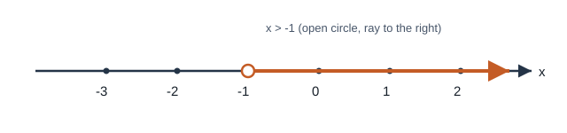
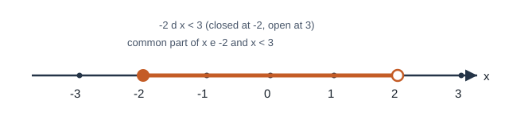

# 方程与不等式

## 1. 一元一次方程

### 1.1 概念

- **方程：** 含有未知数的等式。
- **方程的解（根）：** 使方程左右两边相等的未知数的值。
- **一元一次方程：** 只含有一个未知数，未知数的次数都是 $1$，且两边都是整式的方程。

判定要点：未知数次数为 $1$；分母中不含未知数（否则是分式方程）。

### 1.2 等式的基本性质

1. 等式两边都加上（或都减去）同一个数或式，结果仍是等式：若 $a=b$，则 $a\pm c=b\pm c$。
2. 等式两边都乘或都除以同一个不为 $0$ 的数或式，结果仍是等式：若 $a=b$ 且 $c\neq 0$，则 $ac=bc$，$\dfrac{a}{c}=\dfrac{b}{c}$。
3. **传递性：** 若 $a=b$ 且 $b=c$，则 $a=c$。

### 1.3 解法步骤

解一元一次方程的一般步骤：

1. **去分母：** 两边同乘各分母的最小公倍数（常数项勿漏乘）；
2. **去括号：** 先小括号，再中括号，最后大括号；
3. **移项：** 含未知数的项移到一边，常数项移到另一边（移项变号）；
4. **合并同类项：** 化为 $ax=b$（$a\neq 0$）；
5. **系数化为 $1$：** $x=\dfrac{b}{a}$；
6. **检验：** 代入原方程核对。

易错点：去分母漏乘不含分母的项；移项忘记变号；系数化为 $1$ 时乘除混淆。

### 1.4 应用题步骤

审（弄清已知与所求）$\to$ 设（设未知数）$\to$ 找（等量关系）$\to$ 列（列方程）$\to$ 解 $\to$ 答（检验并写单位）。

常见类型：数字问题、销售（利润 $=$ 售价 $-$ 进价，利润率 $=\dfrac{\text{利润}}{\text{进价}}\times 100\%$）、工程、行程（相遇：$S_{\text{甲}}+S_{\text{乙}}=S_{\text{总}}$；追及：$S_{\text{快}}-S_{\text{慢}}=S_{\text{相距}}$）、水流（顺水 $=$ 静水 $+$ 水流；逆水 $=$ 静水 $-$ 水流）。

### 例 1：已知解求参数

已知 $x=2$ 是关于 $x$ 的方程 $x+m=7$ 的解，求 $m$。

**解：** 代入得 $2+m=7$，故

$$\boxed{m=5}.$$

---

## 2. 二元一次方程组

### 2.1 概念

- **二元一次方程：** 含有两个未知数，并且含有未知数的项的次数都是 $1$ 的方程。
- **二元一次方程组：** 含有两个未知数、未知数次数都是 $1$，并且由两个方程组成的方程组。例如

$$\begin{cases}x+y=2,\\x-y=0.\end{cases}$$

- **解：** 使两个方程同时成立的未知数的值，即两个方程的公共解。

### 2.2 消元思想

把未知数个数由多化少、逐一求解，叫做**消元思想**。常用两种方法：

#### 代入消元法（代入法）

从一个方程中解出一个未知数（用另一个未知数表示），再代入另一个方程，消去一个未知数。

#### 加减消元法（加减法）

当同一未知数的系数相等或相反时，两方程相减或相加即可消元；若系数不成倍数，可先两边同乘适当常数，使系数相等或相反，再加减。

### 例 2：代入法

解方程组

$$\begin{cases}x+y=5,\\2x-y=4.\end{cases}$$

**解：** 由第一个方程得 $y=5-x$，代入第二个方程：

$$2x-(5-x)=4 \Longrightarrow 3x-5=4 \Longrightarrow 3x=9 \Longrightarrow x=3,$$

从而 $y=2$。故

$$\boxed{\begin{cases}x=3,\\y=2.\end{cases}}$$

### 例 3：加减法

解方程组

$$\begin{cases}3x+2y=8,\\3x-y=2.\end{cases}$$

**解：** 两式相减得 $3y=6$，即 $y=2$。代入 $3x-y=2$ 得 $3x=4$，$x=\dfrac{4}{3}$。故

$$\boxed{\begin{cases}x=\dfrac{4}{3},\\y=2.\end{cases}}$$

### 2.3 应用

步骤与一元一次方程类似：审、设、列、解、检验（是否符合实际）、答。常用关系：单价 $\times$ 数量 $=$ 总价；利润 $=$ 实际售价 $-$ 成本；实际售价 $=$ 标价 $\times$ 折扣。

---

## 3. 分式方程

### 3.1 概念

**分母中含有未知数**的方程叫做**分式方程**。分母只有常数的方程不是分式方程。

隐含条件：使各分母为零的未知数取值都不是原方程的解。

### 3.2 解法

基本思路：去分母，化为整式方程。步骤：

1. 找**最简公分母**（分母为多项式时先因式分解）；
2. 两边同乘最简公分母，化为整式方程（整式项勿漏乘；分子为多项式时加括号）；
3. 解整式方程；
4. **验根：** 把所得的根代入最简公分母，使最简公分母为 $0$ 的是**增根**，必须舍去；否则是原方程的解。

### 3.3 增根与无解

- **增根：** 去分母后整式方程的解，但不适合原分式方程（使某分母为 $0$）。增根不是原方程的解。
- **无解：** 整式方程本身无解，或所得解全部是增根。

含参时“有增根”：增根必须使最简公分母为 $0$，且是去分母后整式方程的解；由此确定参数，并再检验。

### 例 4：解分式方程并验根

解方程

$$\frac{3}{x-1}-\frac{2}{x}=1.$$

**解：** 最简公分母为 $x(x-1)$。两边同乘得

$$3x-2(x-1)=x(x-1) \Longrightarrow 3x-2x+2=x^2-x \Longrightarrow x^2-2x-2=0.$$

由求根公式得

$$x=\frac{2\pm\sqrt{4+8}}{2}=1\pm\sqrt{3}.$$

检验：$x=1+\sqrt{3}$ 与 $x=1-\sqrt{3}$ 都不使 $x(x-1)=0$，故都是原方程的解。

$$\boxed{x=1\pm\sqrt{3}}.$$

### 例 5：增根导致无解

解方程

$$\frac{1}{x-1}+\frac{1}{x+1}=\frac{2}{x^2-1}.$$

**解：** 最简公分母为 $(x-1)(x+1)=x^2-1$。两边同乘得

$$(x+1)+(x-1)=2 \Longrightarrow 2x=2 \Longrightarrow x=1.$$

检验：当 $x=1$ 时，最简公分母 $x^2-1=0$，故 $x=1$ 是增根，应舍去。

$$\boxed{原方程无解}.$$

### 3.4 应用

常见于工程、行程等（时间 $=\dfrac{\text{工作量}}{\text{效率}}$，时间 $=\dfrac{\text{路程}}{\text{速度}}$）。步骤：设、找等量、列分式方程、解、**双重检验**（一验分式方程增根，二验实际意义）、答。

---

## 4. 一元二次方程

### 4.1 概念与一般形式

只含有一个未知数，并且未知数的最高次数是 $2$ 的**整式方程**，叫做一元二次方程。必须同时满足：整式方程；一个未知数；最高次数为 $2$；二次项系数不为 $0$。

一般形式：

$$ax^2+bx+c=0\quad（a\neq 0).$$

其中 $ax^2$ 是二次项，$bx$ 是一次项，$c$ 是常数项。确定 $a,b,c$ 时须先化为右边为 $0$ 的一般形式，且**连同符号**一起读（如 $x^2-3=0$ 中 $b=0$，$c=-3$）。

含参方程称为“关于 $x$ 的一元二次方程”时，隐含 $a\neq 0$。

### 4.2 四种解法

方法选择建议：能直接开方则开方；能因式分解则分解；否则用配方法或公式法。

#### （1）直接开平方法

形如 $x^2=p$ 或 $(nx+m)^2=p$（$p\ge 0$）：

$$x^2=p\ (p\ge 0)\Longrightarrow x=\pm\sqrt{p};$$

$$(nx+m)^2=p\ (p\ge 0)\Longrightarrow nx+m=\pm\sqrt{p}.$$

若右边为负数，则无实数解。

#### （2）配方法

步骤：化为一般形式 $\to$ 两边同除以 $a$ 使二次项系数为 $1$ $\to$ 常数项移到右边 $\to$ 两边同加一次项系数一半的平方 $\to$ 左边配成完全平方式 $\to$ 再开平方。

对 $x^2+px+q=0$，配方得

$$\left(x+\frac{p}{2}\right)^2=\frac{p^2}{4}-q.$$

#### （3）公式法

求根公式（$a\neq 0$ 且 $\Delta=b^2-4ac\ge 0$）：

$$x=\frac{-b\pm\sqrt{b^2-4ac}}{2a}.$$

步骤：确定 $a,b,c$（注意符号）$\to$ 算 $\Delta$ $\to$ $\Delta\ge 0$ 时代入公式。

#### （4）因式分解法

移项使右边为 $0$ $\to$ 左边分解为两个一次因式的积 $\to$ 令每个因式为 $0$ $\to$ 解两个一元一次方程。实质是降次。

### 例 6：因式分解法

解方程 $x^2-5x+6=0$。

**解：** $(x-2)(x-3)=0$，故 $x-2=0$ 或 $x-3=0$。

$$\boxed{x_1=2,\ x_2=3}.$$

### 例 7：配方法

解方程 $x^2+6x-7=0$。

**解：** $x^2+6x=7$，两边加 $9$：

$$(x+3)^2=16 \Longrightarrow x+3=\pm 4.$$

故 $x=1$ 或 $x=-7$。

$$\boxed{x_1=1,\ x_2=-7}.$$

### 例 8：公式法

解方程 $2x^2-3x-2=0$。

**解：** $a=2$，$b=-3$，$c=-2$，$\Delta=9+16=25$，

$$x=\frac{3\pm 5}{4}.$$

故 $x_1=2$，$x_2=-\dfrac{1}{2}$。

$$\boxed{x_1=2,\ x_2=-\dfrac12}.$$

### 4.3 根的判别式

对 $ax^2+bx+c=0$（$a\neq 0$），令

$$\Delta=b^2-4ac.$$

则：

- $\Delta>0$：有两个不相等的实数根；
- $\Delta=0$：有两个相等的实数根（也称有重根）；
- $\Delta<0$：没有实数根。

### 例 9：用判别式求参数范围

若关于 $x$ 的方程 $x^2-2x+m=0$ 有两个不相等的实数根，求 $m$ 的取值范围。

**解：** $\Delta=4-4m>0$，即 $1-m>0$，

$$\boxed{m<1}.$$

### 4.4 根与系数的关系（韦达定理）【苏科版课内】

若 $ax^2+bx+c=0$（$a\neq 0$）有两个实数根 $x_1,x_2$（即需 $\Delta\ge 0$），则

$$x_1+x_2=-\frac{b}{a},\qquad x_1x_2=\frac{c}{a}.$$

易错：两根之和对 $b$ 带负号；使用前须保证有实根；含参时联立 $\Delta\ge 0$。

常用变形：

$$x_1^2+x_2^2=(x_1+x_2)^2-2x_1x_2,$$

$$\frac{1}{x_1}+\frac{1}{x_2}=\frac{x_1+x_2}{x_1x_2}\quad（x_1x_2\neq 0).$$

### 例 10：韦达定理

已知 $a,b$ 是方程 $x^2+2x-3=0$ 的两根，求 $\dfrac{1}{a}+\dfrac{1}{b}$。

**解：** $a+b=-2$，$ab=-3$，故

$$\frac{1}{a}+\frac{1}{b}=\frac{a+b}{ab}=\frac{-2}{-3}=\frac{2}{3}.$$

$$\boxed{\dfrac{2}{3}}.$$

### 4.5 应用与含参简要

列方程步骤：审、设、列、解、检验、答。常见类型：

- **数字问题：** 两位数 $10b+a$（$b$ 为十位，$a$ 为个位）；
- **增长率：** 原量 $A$，每次增长率 $x$，两次后为 $A(1+x)^2$（降价则为 $A(1-x)^2$）；
- **形积问题：** 勾股、面积、相似比例化为方程。

舍根依据：长度 $>0$、人数为整数、增长率合理等。

含参时常见三类：由 $\Delta$ 讨论根的情况；由韦达列关于参数的方程，并验证 $\Delta\ge 0$；“有增根”类问题须同时满足最简公分母为 $0$ 与整式方程。

### 例 11：增长率

某商品原价 $100$ 元，连续两次降价的百分率相同，降价后售价为 $81$ 元。求每次降价的百分率。

**解：** 设每次降价百分率为 $x$，则

$$100(1-x)^2=81 \Longrightarrow (1-x)^2=\frac{81}{100} \Longrightarrow 1-x=\pm\frac{9}{10}.$$

$1-x=\dfrac{9}{10}$ 得 $x=\dfrac{1}{10}$；$1-x=-\dfrac{9}{10}$ 得 $x=\dfrac{19}{10}>1$，不合题意，舍去。

$$\boxed{每次降价 10\%}.$$

---

## 5. 一元一次不等式（组）

### 5.1 概念

用 $<$、$>$、$\le$、$\ge$ 表示大小关系的式子叫做**不等式**；用 $\neq$ 表示不等关系的式子也是不等式。

- **不等式的解：** 能使不等式成立的未知数的值；
- **解集：** 所有解组成的集合。

含有一个未知数且未知数次数为 $1$ 的不等式，叫做**一元一次不等式**。几个含有同一未知数的一元一次不等式合在一起，组成**一元一次不等式组**。

### 5.2 不等式的基本性质

1. 两边加（或减）同一个数或式，不等号方向**不变**；
2. 两边乘（或除以）同一个**正数**，方向**不变**；
3. 两边乘（或除以）同一个**负数**，方向**必须改变**。

这是与解方程的核心区别。传递性：若 $a>b$ 且 $b>c$，则 $a>c$。同向不等式可相加；一般不能直接相减。

### 5.3 解一元一次不等式

步骤与解一元一次方程类似：去分母、去括号、移项、合并、系数化为 $1$。其中**去分母**和**系数化为 $1$** 时，若乘（除）负数，必须变号。

解集常用 $x>a$、$x\le a$ 等形式，并在数轴上表示：

- 空心点表示不含端点（$<$ 或 $>$）；
- 实心点表示含端点（$\le$ 或 $\ge$）；
- 射线或线段表示解集范围。

### 例 12：解不等式

解不等式 $-2(x-3)>4$，并在数轴上表示解集。

**解：** $-2x+6>4$，$\ -2x>-2$。两边同除以 $-2$，变号得

$$\boxed{x<1}.$$

（数轴上在 $1$ 处画空心点，向左画射线。）

### 5.4 解一元一次不等式组

先分别求出每个不等式的解集，再求**公共部分**（可借助数轴）。口诀：

- 同大取大；同小取小；
- 大小小大中间找；
- 大大小小找不到（无解）。

### 例 13：不等式组

解不等式组

$$\begin{cases}x+1\ge -1,\\2x-1<5.\end{cases}$$

**解：** 第一个得 $x\ge -2$；第二个得 $x<3$。公共部分为

$$\boxed{-2\le x<3}.$$

### 5.5 整数解

在解集内找出符合题意的整数。若解集为有限区间，可逐一列举；若为一侧无限，答案常写成“所有满足……的整数”或结合实际给出范围。

### 例 14：整数解

不等式组 $-2\le x<3$ 的整数解为

$$\boxed{x=-2,-1,0,1,2}.$$

### 5.6 应用

由“至少”“最多”“不超过”“不低于”“多于”“少于”等关键词建立不等关系。步骤：设未知数 $\to$ 列不等式（组）$\to$ 求解集 $\to$ 结合实际取整或取范围 $\to$ 作答。

注意：人数、件数等须为非负整数；速度、长度等须为正数。

### 例 15：实际问题

某班至少要订 $40$ 份报纸。甲种每份 $2$ 元，乙种每份 $3$ 元。现有 $100$ 元，设订甲种 $x$ 份、乙种 $y$ 份，且两种都订，写出应满足的不等式组（不必求解）。

**解：**

$$\boxed{\begin{cases}x+y\ge 40,\\2x+3y\le 100,\\x\ge 1,\ y\ge 1\end{cases}\quad（x,y\text{ 为正整数）}}.$$

---

## 6. 典型综合例题

### 例 16：方程组应用

鸡兔同笼：头共 $35$ 个，脚共 $94$ 只。鸡、兔各几只？

**解：** 设鸡 $x$ 只，兔 $y$ 只，则

$$\begin{cases}x+y=35,\\2x+4y=94.\end{cases}$$

由第一个得 $x=35-y$，代入第二个：$2(35-y)+4y=94$，即 $70+2y=94$，$y=12$，$x=23$。

$$\boxed{鸡 23 只，兔 12 只}.$$

### 例 17：分式方程应用（工程）

甲单独做某工程需 $10$ 天，乙单独做需 $15$ 天。两人合作若干天后剩下的由乙单独做完，共用 $9$ 天完成。求两人合作了几天。

**解：** 设合作了 $x$ 天，则乙单独做了 $9-x$ 天。

$$\frac{x}{10}+\frac{x}{15}+\frac{9-x}{15}=1.$$

去分母（乘 $30$）：$3x+2x+2(9-x)=30$，即 $3x+18=30$，$x=4$。

检验：$x=4$ 时各分母不为 $0$，且 $0<4<9$，符合题意。

$$\boxed{合作了 4 天}.$$

### 例 18：含参一元二次方程【培优简要】

已知关于 $x$ 的方程 $x^2-5x+m=0$ 有两个实数根 $x_1,x_2$，且 $x_1+x_2=2x_1x_2$，求 $m$。

**解：** 由韦达定理，$x_1+x_2=5$，$x_1x_2=m$。由题意 $5=2m$，得 $m=\dfrac{5}{2}$。

再检验判别式：

$$\Delta=25-4\cdot\frac{5}{2}=25-10=15>0,$$

有两个不相等的实数根，符合题意。

$$\boxed{m=\dfrac{5}{2}}.$$

说明：若只由韦达求出参数、不检验 $\Delta\ge 0$，可能得到使方程无实根的伪解，必须舍去。

---

## 7. 小结

- **一次方程（组）：** 等式性质保真；去分母勿漏乘；方程组靠消元（代入或加减）。
- **分式方程：** 去分母后必验根；增根使最简公分母为 $0$，不是原方程的解。
- **一元二次方程：** 开方、配方、公式、因式分解四法；先看 $\Delta$；韦达用 $-\dfrac{b}{a}$ 与 $\dfrac{c}{a}$，且须有实根。
- **不等式（组）：** 乘除负数必变号；解集取公共部分，数轴帮助判断；应用题结合整数与实际意义取舍。

检查清单：符号（移项、韦达、不等式变号）；分母不为 $0$；$\Delta$ 与 $a\neq 0$；实际问题的单位与正负性。

---
