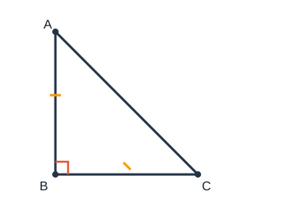

# 等腰与直角三角形

## 1. 等腰三角形

### 1.1 性质

设 $\triangle ABC$ 中 $AB=AC$（$A$ 为顶点，$BC$ 为底边）：

1. **等边对等角：** $\angle B=\angle C$；
2. **三线合一：** 顶角平分线、底边上的中线、底边上的高互相重合。

其他常用结论：两腰上的中线（高）分别相等；两底角的平分线相等。顶角可为锐角、直角或钝角，底角必为锐角。

### 1.2 判定

1. 定义：有两边相等 $\Rightarrow$ 等腰三角形；
2. **等角对等边：** 若 $\angle B=\angle C$，则 $AB=AC$。

注意：未判定为等腰前，不要使用“腰”“底角”等名称。

### 1.3 多解意识

只给两边长、未指明哪边是腰时，必须分类：已知边作腰或作底，并检验三边关系与内角合理性。

例：两边长为 $2\,\mathrm{cm}$、$4\,\mathrm{cm}$。

- 若腰为 $4$，底为 $2$：可构成，周长 $4+4+2=10$；
- 若腰为 $2$，底为 $4$：$2+2=4$，不能构成三角形。

故周长只能是 $10\,\mathrm{cm}$。

---

## 2. 等边三角形

三边都相等的三角形叫做**等边三角形**。

### 2.1 性质

三个内角都等于 $60^\circ$；是轴对称图形，有三条对称轴；具有等腰三角形的一切性质（任意一边上都三线合一）。

### 2.2 判定

1. 三边相等；
2. 三个角都相等；
3. 有一个角是 $60^\circ$ 的等腰三角形是等边三角形。

---

## 3. 直角三角形

### 3.1 性质

在 $\mathrm{Rt}\triangle ABC$ 中，$\angle C=90^\circ$，斜边为 $AB$：

1. 两锐角互余：$\angle A+\angle B=90^\circ$；
2. **斜边上的中线等于斜边的一半**；
3. 若一锐角为 $30^\circ$，则它所对的直角边等于斜边的一半；
4. 若一条直角边等于斜边的一半，则它所对的角等于 $30^\circ$（上述性质的逆）。

### 3.2 判定

1. 有一个角等于 $90^\circ$；
2. 两锐角互余；
3. 一边上的中线等于该边的一半（则该边为斜边，三角形为直角三角形）；
4. **勾股定理的逆定理**（见下节）。

---

## 4. 勾股定理与逆定理

### 4.1 勾股定理

直角三角形两直角边为 $a,b$，斜边为 $c$，则

$$a^2+b^2=c^2.$$

### 4.2 逆定理

若三角形三边 $a,b,c$（$c$ 为最长边）满足 $a^2+b^2=c^2$，则这个三角形是直角三角形，直角对着边 $c$。

例：$3,4,5$；$5,12,13$；$6,8,10$ 可构成直角三角形；$7,9,13$ 因 $7^2+9^2\neq 13^2$，不能。

### 4.3 面积

直角三角形面积等于两直角边乘积的一半：$S=\dfrac{1}{2}ab$。

---

## 5. 折叠与旋转（简述）

- **折叠：** 折痕是对称轴；对应点到折痕距离相等，对应线段、对应角相等，常出现等腰或全等。
- **旋转：** 对应点到旋转中心距离相等，旋转角相等；对应线段相等、对应角相等。

解题时把“对应相等”翻译成边角条件，再回到等腰、全等或勾股。

---

## 6. 典型例题

### 例 1：等腰求顶角

等腰三角形一个底角为 $50^\circ$，则顶角为

$$180^\circ-50^\circ-50^\circ=80^\circ.$$

### 例 2：含 $30^\circ$ 的直角三角形

在 $\mathrm{Rt}\triangle ABC$ 中，$\angle C=90^\circ$，$\angle A=30^\circ$，$BC=2$，则斜边 $AB=4$，另一直角边

$$AC=\sqrt{AB^2-BC^2}=\sqrt{16-4}=2\sqrt{3}.$$

### 例 3：勾股定理应用

旗杆高 $24\,\mathrm{m}$，影长 $7\,\mathrm{m}$，则旗杆顶端到影子顶端的距离为

$$\sqrt{24^2+7^2}=\sqrt{576+49}=\sqrt{625}=25\ (\mathrm{m}).$$

### 例 4：三线合一证明思路

等腰 $\triangle ABC$ 中 $AB=AC$，取底边中点 $D$，连 $AD$。由 SSS 得 $\triangle ABD\cong\triangle ACD$，故 $\angle BAD=\angle CAD$ 且 $\angle ADB=\angle ADC=90^\circ$，即三线合一。

---

## 7. 小结

等腰抓“等边对等角”与“三线合一”；等边抓 $60^\circ$；直角抓互余、斜边中线、勾股及 $30^\circ$ 对边为斜边一半。未指明腰底时务必分类；折叠旋转先落实对应相等。
