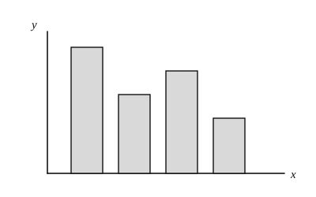

# 统计与概率

## 1. 数据的收集

### 1.1 全面调查与抽样调查

- **全面调查（普查）：** 对所考察对象的**全体**进行调查。结果精确，但费时费力；有些调查具有破坏性，不能普查（如测灯泡寿命、汽车抗撞）。
- **抽样调查：** 只对部分对象进行调查，用样本估计总体。省时省力，但存在抽样误差。

选用原则：对象少、必须精确、且调查不破坏对象时，宜普查；对象多、破坏性试验或只需大致了解时，宜抽样。

### 1.2 总体、个体、样本

| 概念 | 含义 |
|------|------|
| **总体** | 所要考察对象的全体 |
| **个体** | 总体中的每一个考察对象 |
| **样本** | 从总体中抽取的部分个体 |
| **样本容量** | 样本中个体的数目（注意：容量是个数，与具体数值无关） |

抽样要求：样本要有**代表性**（尽量随机、覆盖各层），样本容量要**足够大**。只抽某一局部（如只抽城区、只抽乡村）容易产生偏差。

### 例 1：调查方式的选择

下列调查适合采用全面调查的是：了解某班同学的跳远成绩。

理由：对象是一个班，人数不多，且调查不具破坏性。而“全国中学生身高”“某批次汽车抗撞击能力”“冷饮市场上冰激凌质量”等，或对象过多，或具破坏性，宜用抽样调查。

---

## 2. 统计图

### 2.1 条形统计图

用长方形的**高**表示数据。

特点：能看出各组的具体数据；便于比较各组差别。

### 2.2 折线统计图

用折线表示数据随时间（或顺序）的变化。

特点：易于显示**增减趋势**。描述气温、产量随时间变化时，优先选折线图。

### 2.3 扇形统计图

用一个圆代表总体，各扇形表示各部分所占**百分比**。

$$\text{扇形圆心角}=360^\circ\times\text{该部分所占百分比}.$$

特点：直观反映部分与总体的比例关系；一般不直接给出各组具体个数（除非另知总数）。各部分百分比之和应为 $1$（或 $100\%$）。

### 2.4 频数分布直方图

- **频数：** 某个对象（或某一组）出现的次数。
- **频率：** 频数与总次数的比：

$$\text{频率}=\frac{\text{频数}}{\text{总次数}}.$$

频数分布直方图用横轴表示各组数据区间，纵轴表示频数，小长方形的高表示该组频数，用来反映数据在各小范围内的分布情况。

绘制要点：先求极差（最大值减最小值），再定组距与组数；分点可比数据多一位小数，避免恰落在分界点上产生歧义。

易错：扇形图看**比例**，条形图看**数量对比**，折线图看**趋势**，直方图看**分组分布**——读图时先看坐标轴含义与单位。

---

## 3. 数据的分析

### 3.1 平均数

一组数据 $x_1,x_2,\ldots,x_n$ 的**算术平均数**为

$$\bar{x}=\frac{x_1+x_2+\cdots+x_n}{n}.$$

若 $x_1$ 出现 $f_1$ 次，$x_2$ 出现 $f_2$ 次，$\ldots$，$x_k$ 出现 $f_k$ 次，且 $f_1+f_2+\cdots+f_k=n$，则

$$\bar{x}=\frac{x_1 f_1+x_2 f_2+\cdots+x_k f_k}{n}$$

叫做**加权平均数**，其中 $f_1,f_2,\ldots,f_k$ 叫做权。权越大，该数据对平均数的影响越大。

平均数容易受**极端值**影响。

### 3.2 中位数

将数据按大小依次排列：

- 个数为奇数时，正中间的那个数是中位数；
- 个数为偶数时，最中间两个数的平均数是中位数。

中位数不易受极端值影响，常用来反映“中间水平”。

### 3.3 众数

一组数据中**出现次数最多**的数据叫做众数。众数可能不止一个，也可能每个数都只出现一次（此时通常认为没有众数，或每个都是众数——以题目约定为准）。众数反映“最常见”的水平。

### 3.4 极差与方差

**极差：** 一组数据中最大值与最小值的差。极差越大，数据波动范围越大；计算简单，但只看两端，中间信息利用不足。

**方差：** 各数据与平均数的差的平方的平均数。设平均数为 $\bar{x}$，则

$$s^2=\frac{1}{n}\Bigl[(x_1-\bar{x})^2+(x_2-\bar{x})^2+\cdots+(x_n-\bar{x})^2\Bigr].$$

方差（或其算术平方根——标准差）越大，数据越**分散**，波动越大；方差越小，数据越**集中**，越稳定。比较两组成绩“谁更稳定”时，常用方差。

### 例 2：众数与中位数

数据：$5,7,3,6,8,6,4,7,5,6$。

排序：$3,4,5,5,6,6,6,7,7,8$。

- 众数：$6$（出现 $3$ 次，最多）；
- 中位数：中间两数为第 $5$、$6$ 个数，都是 $6$，故中位数为 $6$。

### 例 3：平均数与众数

数据：$13,14,14,16,18$。

$$\bar{x}=\frac{13+14+14+16+18}{5}=15,\qquad\text{众数为 }14.$$

### 例 4：方差比较波动

甲：$2,4,6$；乙：$3,4,5$。

两组成绩平均数都是 $4$，但

$$s_{\text{甲}}^2=\frac{(2-4)^2+(4-4)^2+(6-4)^2}{3}=\frac{8}{3},\qquad s_{\text{乙}}^2=\frac{(3-4)^2+(4-4)^2+(5-4)^2}{3}=\frac{2}{3}.$$

故乙的方差更小，成绩更稳定。极差：甲为 $4$，乙为 $2$，结论一致。

---

## 4. 概率的基本概念

### 4.1 必然事件、不可能事件、随机事件

| 类型 | 含义 | 概率 |
|------|------|------|
| **必然事件** | 在一定条件下一定发生 | $P=1$ |
| **不可能事件** | 在一定条件下一定不发生 | $P=0$ |
| **随机事件** | 可能发生也可能不发生 | $0<P<1$ |

例：任意画一个三角形，内角和为 $180^\circ$——必然事件；从只有红球的袋子中摸出黄球——不可能事件；掷一枚均匀硬币正面朝上——随机事件。

### 4.2 概率的意义

随机事件 $A$ 发生的可能性大小用数 $P(A)$ 刻画，叫做 $A$ 的**概率**。概率是一个确定的数；大量重复试验时，频率会稳定在概率附近，但不能用一次试验结果否定理论概率。

---

## 5. 古典概型

一次试验中，若：

1. 所有可能出现的结果只有**有限个**；
2. 每种结果出现的可能性**相等**；

则称这种模型为**古典概型**。此时

$$P(A)=\frac{m}{n},$$

其中 $n$ 为所有等可能结果的总数，$m$ 为事件 $A$ 包含的结果数。答案一般写成最简分数。

前提缺一不可：结果不等可能时，不能直接用“有利数／总数”。

---

## 6. 列举法、列表法与树状图

### 6.1 列举法

按一定顺序把所有等可能结果写出来，保证**不重不漏**，再数出有利结果个数。

### 6.2 列表法

试验由**两步**组成、结果较多时，用表格列出所有有序对（或无序对，须与题意一致），再计数。

### 6.3 树状图法

试验步骤为两步及以上时，分步画出树状图，每条完整分支对应一个等可能结果。

选用提示：两步试验常用列表；三步及以上常用树状图。

### 6.4 放回与不放回（务必分清）

- **放回（有放回）：** 每次抽完放回再抽，前后独立，总数不变。例如袋中 $3$ 红 $2$ 白，有放回连摸两次都是红球：

$$P=\frac{3}{5}\times\frac{3}{5}=\frac{9}{25}.$$

- **不放回：** 抽完不放回，第二次的分母（以及分子）会变。同样情形不放回：

$$P=\frac{3}{5}\times\frac{2}{4}=\frac{3}{10}.$$

一次性随机摸出 $2$ 个，与“依次不放回摸两个再看组合”在等可能意义下结论一致，但列举时要统一用**有序**或**无序**，不可混用。

### 例 5：一次摸一张

不透明盒中有“美”“好”“淮”“安”四张卡片（除文字外相同）。随机抽 $1$ 张，恰好抽到“淮”的概率为

$$P=\frac{1}{4}.$$

### 例 6：不放回摸两张（树状图／列表）

接上题：一次随机抽取 $2$ 张，求恰好抽到“美”与“好”各一张的概率。

用有序列表（不放回）：第一张 $4$ 种、第二张 $3$ 种，共 $4\times 3=12$ 种等可能结果。有利结果只有（美，好）、（好，美），共 $2$ 种。故

$$P=\frac{2}{12}=\frac{1}{6}.$$

（若用无序组合：$\mathrm{C}_{4}^{2}=6$ 种取法，有利 $1$ 种，同样得 $\dfrac{1}{6}$。）

### 例 7：一次性摸出两个（无序）

抽奖盒中有标着 $10$ 元、$20$ 元、$30$ 元的三个小球，一次性随机摸出两个。金额之和为 $50$ 元的概率是多少？

全部无序取法：$\{\,10,20\,\},\{\,10,30\,\},\{\,20,30\,\}$，共 $3$ 种等可能结果。和为 $50$ 的只有 $\{\,20,30\,\}$，故

$$P=\frac{1}{3}.$$

### 例 8：不放回摸球求相邻道次

盒中有标号 $1,2,3,4$ 的四个小球。甲先摸一个不放回，乙再摸一个。求甲、乙道次相邻的概率。

有序列表（对角线表示同号不可能）：共 $4\times 3=12$ 种等可能结果。相邻有序对为

$$(1,2),(2,1),(2,3),(3,2),(3,4),(4,3),$$

共 $6$ 种。故

$$P=\frac{6}{12}=\frac{1}{2}.$$

### 例 9：两步独立试验（列表）

甲转盘四等分标 $A,B,C,D$，乙转盘三等分标 $P,Q,R$，指针落在等分区域上的可能性相等。求甲落在 $C$ 且乙不落在 $Q$ 的概率。

所有结果：$4\times 3=12$ 种。甲为 $C$ 且乙为 $P$ 或 $R$ 的结果有 $2$ 种，故

$$P=\frac{2}{12}=\frac{1}{6}.$$

（甲落在 $C$ 的概率为 $\dfrac{1}{4}$，乙不落在 $Q$ 的概率为 $\dfrac{2}{3}$，两盘独立时也可直接相乘：$\dfrac{1}{4}\times\dfrac{2}{3}=\dfrac{1}{6}$。）

---

## 7. 用频率估计概率

做大量重复试验时，事件 $A$ 出现的**频率**

$$f_n(A)=\frac{n_A}{n}$$

会在某个常数附近摆动，显示出稳定性；可用频率估计概率。

适用：所有结果不是有限个、结果极多、或各结果不等可能，难以用古典概型直接计算时。

注意：频率是试验值，会随试验波动；概率是理论值。试验次数越多，估计通常越可靠，但单次试验不能说明“下一次一定怎样”。

### 例 10：频率估计

某射手射击 $200$ 次，命中 $170$ 次，则命中频率为 $\dfrac{170}{200}=\dfrac{17}{20}$，可估计其命中概率约为 $\dfrac{17}{20}$。

---

## 8. 小结

- **统计：** 先分清普查／抽样与总体／样本；读图先看类型与坐标；描述一组数据时，平均数、中位数、众数各有侧重，波动用极差或方差衡量。
- **概率：** 先判断事件类型；古典概型务必确认“有限＋等可能”；两步用列表、多步用树状图；**放回与不放回分母不同**，有序与无序列举不可混用。
- **频率与概率：** 大量重复下用频率估计概率，二者不要混为一谈。
