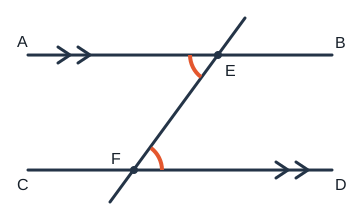

# 角与平行线

## 1. 直线与线段

### 1.1 基本事实

- **两点确定一条直线：** 经过两点有且只有一条直线。
- **两点之间，线段最短：** 连接两点的所有线中，线段最短。

### 1.2 中点与距离

- 点 $M$ 是线段 $AB$ 的**中点** $\Leftrightarrow AM=MB=\dfrac{1}{2}AB$。
- 两点的**距离**是连接两点的线段的长度。
- 若 $B$ 在线段 $AC$ 上，则 $AC=AB+BC$。

易错：直线无限延伸、无端点；线段有两个端点、有长度。

---

## 2. 角

### 2.1 分类与度量

- 锐角：$0^\circ<\alpha<90^\circ$；直角：$\alpha=90^\circ$；钝角：$90^\circ<\alpha<180^\circ$；平角：$180^\circ$；周角：$360^\circ$。
- $1^\circ=60'$，$1'=60''$。

### 2.2 角平分线

从一个角的顶点出发，把这个角分成两个相等的角的射线，叫做这个角的**角平分线**。

**性质：** 角平分线上的点到角的两边的距离相等。

**逆定理：** 角的内部到角的两边距离相等的点在角平分线上。

### 2.3 余角与补角

- 两角之和为 $90^\circ$，互为**余角**；两角之和为 $180^\circ$，互为**补角**。
- 同角（或等角）的余角相等；同角（或等角）的补角相等。

---

## 3. 相交线

### 3.1 对顶角与邻补角

- **对顶角：** 有公共顶点，且一边互为另一边的反向延长线。性质：对顶角相等。
- **邻补角：** 有一条公共边，另一边互为反向延长线。性质：邻补角互补（和为 $180^\circ$）。

易错：对顶角必相等，但相等的角不一定是对顶角；和为 $180^\circ$ 的两角也不一定是邻补角。

### 3.2 三线八角

两条直线被第三条直线（截线）所截，形成同位角、内错角、同旁内角：

- **同位角：** 在截线同侧、被截两直线同侧；
- **内错角：** 在两直线之间、截线两侧；
- **同旁内角：** 在两直线之间、截线同侧。

### 3.3 垂线与中垂线

- 同一平面内，过一点有且只有一条直线与已知直线垂直；垂线段最短。
- 点到直线的距离：垂线段的长度。
- **线段垂直平分线：** 其上任意一点到线段两端距离相等；逆定理亦成立。

---

## 4. 平行线

### 4.1 定义与公理

同一平面内不相交的两条直线叫做**平行线**，记作 $l_1\parallel l_2$。

- **平行公理：** 过直线外一点，有且只有一条直线与已知直线平行。
- **推论：** 若 $a\parallel c$ 且 $b\parallel c$，则 $a\parallel b$。

### 4.2 判定与性质（双向）

设直线 $l_1,l_2$ 被截线 $t$ 所截：

| 条件 | 判定（证平行） | 性质（用平行） |
|------|----------------|----------------|
| 同位角 | 同位角相等 $\Rightarrow$ 两直线平行 | 两直线平行 $\Rightarrow$ 同位角相等 |
| 内错角 | 内错角相等 $\Rightarrow$ 两直线平行 | 两直线平行 $\Rightarrow$ 内错角相等 |
| 同旁内角 | 同旁内角互补 $\Rightarrow$ 两直线平行 | 两直线平行 $\Rightarrow$ 同旁内角互补 |

口诀：**判定**是“由角推平行”，**性质**是“由平行推角”。二者不可颠倒。

---

## 5. 命题

- **命题：** 判断一件事情的语句，由题设与结论组成。
- 题设成立时结论一定成立 $\Rightarrow$ **真命题**；否则为**假命题**。
- 交换题设与结论得到**逆命题**。原命题与逆命题不一定同真同假。

例：“对顶角相等”为真；其逆“相等的角是对顶角”为假。

证明常用综合法；否定结论并导出矛盾可用反证法。

---

## 6. 典型例题

### 例 1：基本事实选用

隧道取直线缩短路程，依据是“两点之间，线段最短”。

### 例 2：邻补角与垂直

点 $O$ 在直线 $AB$ 上，$OC\perp OD$，$\angle BOD=40^\circ$。因为 $AOB$ 为平角，且 $OC\perp OD$，可先得 $\angle COD=90^\circ$，再求与 $\angle BOD$ 相邻的角：

$$\angle COD+\angle BOD=90^\circ+40^\circ=130^\circ$$

（具体所求角以图形标号为准；核心是平角、直角与邻补角的组合。）

### 例 3：平行线与内错角

如图，$l_1\parallel l_2$，截线 $t$ 截出的内错角 $\angle 1$ 与 $\angle 2$ 相等。若另有同旁内角，则互补。

**证明（内错角相等 $\Rightarrow$ 平行，简述）：** 若内错角相等，则它们的邻补角（同位角位置）亦相等，由“同位角相等 $\Rightarrow$ 两直线平行”得 $l_1\parallel l_2$。

计算题中：先由平行写出角相等或互补，再与三角形内角和联立求未知角。

---

## 7. 小结

角的计算盯住余补角、对顶角、邻补角；平行问题先分清“判定还是性质”，再选同位、内错或同旁内角。命题题注意原命题与逆命题未必同真假。
