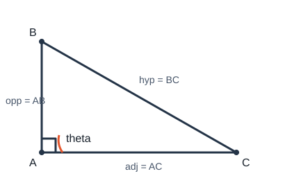

# 锐角三角函数

## 1. 定义

在 $\mathrm{Rt}\triangle ABC$ 中，$\angle C=90^\circ$，设 $\angle A$ 的对边为 $a$、邻边为 $b$、斜边为 $c$，则

$$\sin A=\frac{\text{opp}}{\text{hyp}}=\frac{a}{c},\qquad\cos A=\frac{\text{adj}}{\text{hyp}}=\frac{b}{c},\qquad\tan A=\frac{\text{opp}}{\text{adj}}=\frac{a}{b}.$$

（图中对 $\angle A$：$\mathrm{opp}=BC=a$，$\mathrm{adj}=AC=b$，$\mathrm{hyp}=AB=c$。）

要点：

- 三角函数值只与角的大小有关，与三角形边长的绝对大小无关（相似比相同）；
- 定义建立在直角三角形中；一般三角形中要先构造直角三角形再谈对边、邻边。

常用恒等式：$\sin^2 A+\cos^2 A=1$；$\tan A=\dfrac{\sin A}{\cos A}$（$\cos A\neq 0$）。

互余关系：$\sin A=\cos(90^\circ-A)$，$\cos A=\sin(90^\circ-A)$。

---

## 2. 特殊角的三角函数值

| $\alpha$ | $\sin\alpha$ | $\cos\alpha$ | $\tan\alpha$ |
|----------|--------------|--------------|--------------|
| $30^\circ$ | $\dfrac{1}{2}$ | $\dfrac{\sqrt{3}}{2}$ | $\dfrac{\sqrt{3}}{3}$ |
| $45^\circ$ | $\dfrac{\sqrt{2}}{2}$ | $\dfrac{\sqrt{2}}{2}$ | $1$ |
| $60^\circ$ | $\dfrac{\sqrt{3}}{2}$ | $\dfrac{1}{2}$ | $\sqrt{3}$ |

易错：$\sin 30^\circ$ 与 $\sin 60^\circ$ 不要颠倒；$\tan 30^\circ=\dfrac{\sqrt{3}}{3}$，$\tan 60^\circ=\sqrt{3}$。

可用含 $30^\circ$–$60^\circ$–$90^\circ$ 或等腰直角三角形由定义推出上表，避免死记混淆。

---

## 3. 解直角三角形

在直角三角形中，除直角外有三条边、两个锐角；由已知元素求出其余未知元素，叫做**解直角三角形**。

在 $\mathrm{Rt}\triangle ABC$，$\angle C=90^\circ$ 中：

$$a^2+b^2=c^2,\qquad\angle A+\angle B=90^\circ,$$

$$\sin A=\cos B=\frac{a}{c},\quad\cos A=\sin B=\frac{b}{c},\quad\tan A=\frac{a}{b}.$$

方法口诀：

- 已知斜边求直角边：用正弦或余弦；
- 已知两直角边求另一边：勾股定理；已知两直角边求锐角：用正切；
- 已知一边一锐角：先求另一锐角（互余），再用边角关系求边；
- 已知直角边求斜边：斜边 $=\dfrac{\text{直角边}}{\sin\text{或}\cos}$（对应该角）。

计算尽量保留精确值（含根式），最后一步再取近似（若题目要求）。

---

## 4. 简单应用

### 4.1 仰角与俯角

视线与水平线所成的角：视线在水平线上方为**仰角**，下方为**俯角**。

### 4.2 坡度与坡角

坡面铅直高度 $h$ 与水平宽度 $l$ 的比叫做**坡度**（坡比）：

$$i=\frac{h}{l}=\tan\alpha,$$

其中 $\alpha$ 为坡面与水平面的夹角（**坡角**）。坡度越大，坡面越陡。注意分母是水平宽度，不是斜坡长。

### 4.3 方向角

指北或指南方向线与目标方向线所成的小于 $90^\circ$ 的水平角叫做方向角（方位角）。

---

## 5. 非直角三角形的转化（简述）

遇锐角或钝角三角形需求边角时，可自一顶点向对边（或延长线）**作高**，把原三角形分成两个直角三角形，再在直角三角形中使用定义或勾股定理。

作高后注意：钝角三角形的高在形外；分段边上的线段常用和差关系还原。

---

## 6. 典型例题

### 例 1：由边求正弦

在 $\mathrm{Rt}\triangle ABC$ 中，$\angle C=90^\circ$，$AB=7$，$AC=3$，则

$$\sin B=\frac{AC}{AB}=\frac{3}{7}.$$

（$AC$ 是 $\angle B$ 的对边，$AB$ 是斜边。）

### 例 2：勾股后再求三角函数

在 $\mathrm{Rt}\triangle ABC$ 中，$\angle A=90^\circ$，$AB=3$，$AC=4$，则 $BC=5$，

$$\sin B=\frac{AC}{BC}=\frac{4}{5}.$$

### 例 3：特殊角与解三角形

在 $\mathrm{Rt}\triangle ABC$ 中，$\angle C=90^\circ$，$\angle A=30^\circ$，$BC=2$，则

$$AB=\frac{BC}{\sin 30^\circ}=\frac{2}{1/2}=4,\qquad AC=BC\cdot\tan 60^\circ=2\sqrt{3}$$

（或先由 $30^\circ$ 对边为斜边一半得 $AB=4$，再用勾股求 $AC$）。

### 例 4：坡度

若坡度 $i=1:2$，则 $\tan\alpha=\dfrac{1}{2}$；已知水平宽求高度时，$h=i\cdot l$。

---

## 7. 小结

定义抓住 opp / adj / hyp 三个比；特殊角 $30^\circ,45^\circ,60^\circ$ 的表要熟练；解直角三角形按“已知什么选公式”。应用题先画直角三角形，标清仰俯角或坡角；非直角先作高再算。
