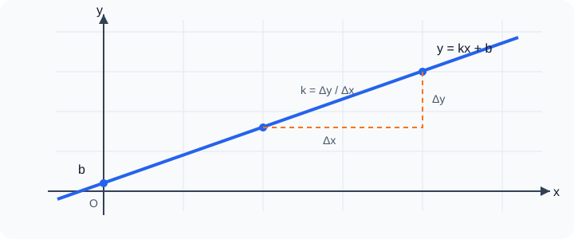

# 一次函数

## 0. 从出租车计价器说起

小林上车时，计价器先显示起步价；汽车每多行驶一段路，费用便按固定标准增加。若不考虑分段计价，路程 $x$ 与费用 $y$ 的关系可以写成 $y=kx+b$：$b$ 像“刚上车时已有的读数”，$k$ 像“每走 $1$ 千米增加的钱”。

一次函数研究的正是这种“初始量 + 固定变化量”的关系。它把表格、解析式、直线图像、方程和不等式连成同一种语言。



---

## 1. 知识地图

```text
变化过程
├─ 常量、变量
├─ 函数：一个 x 对应唯一一个 y
│  ├─ 表格
│  ├─ 解析式
│  └─ 图像
└─ 一次函数 y=kx+b（k≠0）
   ├─ 特例：正比例函数 y=kx
   ├─ 图像：一条直线
   ├─ k：倾斜方向、增减快慢
   ├─ b：与 y 轴交点
   ├─ 待定系数法
   ├─ 与方程、不等式的联系
   └─ 实际应用：费用、行程、方案比较
```

---

## 2. 函数的概念与表示

### 2.1 常量、变量与函数

在某个变化过程中，数值保持不变的量叫常量，数值发生变化的量叫变量。

一般地，在一个变化过程中有两个变量 $x,y$。如果给定 $x$ 的一个值，就能相应地确定 $y$ 的唯一值，那么称 $y$ 是 $x$ 的函数，$x$ 是自变量。

“唯一”是关键：

- 一个允许的 $x$ 只能对应一个 $y$；
- 不同的 $x$ 可以对应同一个 $y$；
- 必须先看清自变量的取值范围。

例如，正方形边长为 $x$，周长 $y=4x$，实际情境中 $x>0$。解析式有意义不等于实际情境允许所有实数。

### 2.2 函数的三种常见表示

1. **列表法**：适合记录离散数据，直观但不易看出全部规律；
2. **解析式法**：适合计算和推理；
3. **图像法**：适合观察变化趋势、交点和取值范围。

函数图像由所有满足关系式的点 $(x,y)$ 组成。判断点 $P(a,b)$ 是否在图像上，只需检验把 $x=a,y=b$ 代入后等式是否成立。

### 2.3 自变量取值范围

- 整式型解析式通常允许 $x$ 取任意实数；
- 分母不能为 $0$；
- 偶次根式内的数不能为负（拓展到相关表达式时使用）；
- 实际问题还要满足数量非负、时间合理、件数为整数等条件。

---

## 3. 一次函数与正比例函数

### 3.1 定义

一般地，形如 $y=kx+b$ 的函数叫一次函数，其中 $k,b$ 是常数，且 **$k\ne0$**。

当 $b=0$ 时，$y=kx$，称为正比例函数。正比例函数是一次函数的特殊情形。

> 注意：$y=5$ 中 $k=0$，它是常函数，不是这里所说的一次函数。

### 3.2 一次函数的图像为什么是直线

任取图像上两点 $A(x_1,y_1),B(x_2,y_2)$，其中 $x_1\ne x_2$。由 $y=kx+b$ 得

$$\frac{y_2-y_1}{x_2-x_1}=k.$$

任意两点间“纵向变化量与横向变化量之比”都相同，所以图像的倾斜程度处处一致，是一条直线。反过来，非竖直直线也可写成 $y=kx+b$。

### 3.3 两点确定一条直线

画 $y=kx+b$ 的图像，只需取两个不同的点，再过两点作直线。

常取：

- 与 $y$ 轴交点：令 $x=0$，得 $(0,b)$；
- 与 $x$ 轴交点：令 $y=0$，得 $\left(-\frac bk,0\right)$。

正比例函数 $y=kx$ 必过原点，另取一点即可。

---

## 4. 图像与性质

### 4.1 $k$ 和 $b$ 的几何意义

对一次函数 $y=kx+b$：

- $k$ 决定直线的倾斜方向和变化快慢；
- $b$ 是直线与 $y$ 轴交点的纵坐标；
- 当自变量增加 $\Delta x$ 时，函数值增加 $\Delta y=k\Delta x$。

### 4.2 增减性

- 当 $k>0$ 时，$y$ 随 $x$ 的增大而增大，图像从左下向右上；
- 当 $k<0$ 时，$y$ 随 $x$ 的增大而减小，图像从左上向右下。

**证明：** 设 $x_1<x_2$，则

$$y_2-y_1=(kx_2+b)-(kx_1+b)=k(x_2-x_1).$$

因为 $x_2-x_1>0$，所以 $y_2-y_1$ 与 $k$ 同号，结论成立。

### 4.3 图像经过的象限

象限不能只看 $k$，还要结合 $b$：

- $k>0,b>0$：经过第一、二、三象限；
- $k>0,b<0$：经过第一、三、四象限；
- $k<0,b>0$：经过第一、二、四象限；
- $k<0,b<0$：经过第二、三、四象限；
- $b=0$：经过原点，$k>0$ 时过第一、三象限，$k<0$ 时过第二、四象限。

### 4.4 平移与平行

- $y=kx+b$ 可由 $y=kx$ 向上平移 $b$ 个单位得到；若 $b<0$，就是向下平移 $|b|$ 个单位；
- $y=kx+b_1$ 与 $y=kx+b_2$ 的 $k$ 相同，图像平行或重合；
- **拓展：** 在解析几何中，非竖直直线 $y=kx+b$ 的系数 $k$ 称为斜率。两条非竖直直线的斜率乘积为 $-1$ 时互相垂直；该结论不属于本章课内必备判定。

---

## 5. 待定系数法

先设解析式，再把已知条件代入，求出待定系数。

### 5.1 已知一点和 $k$

若一次函数的系数 $k=3$，且图像经过 $(2,1)$，设 $y=3x+b$。代入得 $1=6+b$，所以 $b=-5$，解析式为 $y=3x-5$。

### 5.2 已知两点

若直线经过 $A(x_1,y_1),B(x_2,y_2)$，且 $x_1\ne x_2$，可由两个点的纵坐标变化量与横坐标变化量之比求系数 $k$：

$$k=\frac{y_2-y_1}{x_2-x_1},$$

再代入任一点求 $b$。

也可设 $y=kx+b$，列二元一次方程组。答题时应写“设—代—解—答”。

### 5.3 从图像或实际条件取信息

- 过点：把点的坐标代入；
- 与轴交于某点：直接得到截距；
- 两直线平行：$k$ 相同；
- 每增加一个单位，函数值增加某数：该数就是 $k$；
- 初始量：通常对应 $b$。

---

## 6. 一次函数与方程、不等式

### 6.1 与一元一次方程

方程 $kx+b=0$ 的解，就是直线 $y=kx+b$ 与 $x$ 轴交点的横坐标，即 $x=-\frac bk$。

### 6.2 与二元一次方程

二元一次方程 $ax+by=c$（$b\ne0$）可化为

$$y=-\frac abx+\frac cb,$$

它的所有解与这条直线上的点一一对应。

两个二元一次方程组成的方程组，其解就是两条直线交点的坐标：

- 相交：一个解；
- 平行：无解；
- 重合：无数个解。

### 6.3 与一元一次不等式

不等式 $kx+b>0$ 的解集，就是直线在 $x$ 轴上方部分所对应的 $x$ 的范围；$kx+b<0$ 则看 $x$ 轴下方。

比较 $y_1=k_1x+b_1$ 与 $y_2=k_2x+b_2$：

- $y_1>y_2$：看直线 $y_1$ 在直线 $y_2$ 上方时的 $x$；
- 也可移项为 $(k_1-k_2)x+(b_1-b_2)>0$ 后计算。

---

## 7. 常用模型

### 7.1 “初始量 + 单位变化量”模型

$$总量=单位变化量\times自变量+初始量.$$

常见于水箱原有水量、手机套餐、出租车费用、弹簧长度等。

### 7.2 行程图像模型

横轴常为时间，纵轴常为路程：

- 图像越陡，速度越大；
- 水平线表示位置不变，即停止；
- 两图像交点表示同一时刻处于同一位置；
- 分段运动应写分段关系，不能强行用一个一次函数覆盖全过程。

### 7.3 方案比较模型

分别写出两种方案 $y_1,y_2$，求交点确定“临界数量”，再比较交点两侧函数值。最后结合整数、非负等实际限制回答。

### 7.4 图像信息还原模型

看到直线先读：

1. 与两坐标轴的交点；
2. 上升还是下降；
3. 横轴、纵轴的单位和实际含义；
4. 图像是线段、射线还是整条直线。

---

## 8. 典型例题

### 例 1：函数与自变量范围

一个长方形周长为 $24$ cm，一边长为 $x$ cm，面积为 $S$ cm²。写出 $S$ 关于 $x$ 的函数关系式和自变量范围。

**解：** 另一边长为 $12-x$，所以

$$S=x(12-x).$$

两边都为正，故 $x>0$ 且 $12-x>0$，即

$$0<x<12.$$

此题中的函数不是一次函数，但说明“函数”概念比“一次函数”更广。

### 例 2：待定系数法

一次函数图像经过 $A(-1,4)$、$B(3,-4)$，求解析式。

**解：** 设 $y=kx+b$。代入两点得

$$\begin{cases}-k+b=4,\\3k+b=-4.\end{cases}$$

两式相减得 $4k=-8$，所以 $k=-2$。代入得 $b=2$。

因此解析式为

$$\boxed{y=-2x+2}.$$

检验：$x=-1$ 时 $y=4$；$x=3$ 时 $y=-4$，均符合。

### 例 3：由图像解方程和不等式

已知 $y_1=2x-4$，$y_2=-x+2$。

（1）求两图像交点；（2）解 $2x-4>-x+2$；（3）解 $2x-4\le0$。

**解：**

（1）令 $2x-4=-x+2$，得 $3x=6$，所以 $x=2,y=0$，交点为 $(2,0)$。

（2）直线 $y_1$ 在 $y_2$ 上方时 $x>2$，故解集为 $\boxed{x>2}$。

（3）直线 $y=2x-4$ 在 $x$ 轴上或下方时 $x\le2$，故解集为 $\boxed{x\le2}$。

### 例 4：行程相遇

甲从相距 $30$ km 的两地中的 $A$ 地骑车出发，速度为 $12$ km/h；同时乙从 $B$ 地迎面出发，速度为 $8$ km/h。以甲出发时间为 $x$ 小时、甲到 $A$ 地的距离为纵坐标，写出两人的函数关系，并求相遇时间和地点。

**解：** 甲的位置为 $y_甲=12x$，乙的位置为 $y_乙=30-8x$。相遇时

$$12x=30-8x,$$

解得 $x=1.5$。此时 $y=12\times1.5=18$。

答：出发 $1.5$ 小时后相遇，相遇点距 $A$ 地 $18$ km。

### 例 5：收费方案比较

甲打印店收制版费 $20$ 元，每页 $0.4$ 元；乙店不收制版费，每页 $0.6$ 元。打印 $x$ 页，选择哪家更省？

**解：** 设费用分别为 $y_甲,y_乙$，则

$$y_甲=0.4x+20,\qquad y_乙=0.6x.$$

令二者相等：

$$0.4x+20=0.6x,$$

得 $x=100$。

- 当 $0<x<100$ 时，$y_乙<y_甲$，乙店更省；
- 当 $x=100$ 时，两店同价；
- 当 $x>100$ 时，$y_甲<y_乙$，甲店更省。

若页数只能取正整数，结论中的 $x$ 应限制为正整数。

### 例 6：参数与象限

一次函数 $y=(m-2)x+m+1$ 的图像随 $x$ 增大而减小，且与 $y$ 轴交点在正半轴，求 $m$ 的范围。

**解：** 增函数或减函数由 $k=m-2$ 决定。随 $x$ 墑大而减小，故 $m-2<0$。与 $y$ 轴交点在正半轴，故 $m+1>0$。

$$\begin{cases}m<2,\\m>-1.\end{cases}$$

所以

$$\boxed{-1<m<2}.$$

---

## 9. 易错点

1. **漏写 $k\ne0$。** 一次函数定义中必须有该条件。
2. **误以为一个 $y$ 不能对应多个 $x$。** 函数要求的是一个 $x$ 只能对应一个 $y$。
3. **把 $b$ 当成与 $x$ 轴交点。** 与 $y$ 轴交点是 $(0,b)$。
4. **只凭 $k$ 判断三个象限。** $k$ 决定升降，$b$ 参与决定经过哪些象限。
5. **画图只画线段。** 若定义域为全体实数，图像应向两端延伸。
6. **忘记实际范围。** 时间、长度、数量通常不能任意取实数。
7. **比较方案只求交点。** 还必须判断交点两侧谁大谁小。
8. **把“图像在上方”看成横坐标更大。** 上方比较的是同一 $x$ 下的函数值。

---

## 10. 分层练习

### A 组：基础

1. 下列关系中，$y$ 是 $x$ 的一次函数的是：① $y=3x-1$；② $y=\frac2x$；③ $y=5$；④ $y=-\frac12x$。
2. 函数 $y=-3x+6$ 与两坐标轴的交点分别是什么？
3. 点 $P(2,a)$ 在直线 $y=4x-3$ 上，求 $a$。
4. 一次函数 $y=(m+1)x-2$ 随 $x$ 增大而增大，求 $m$ 的范围。

### B 组：提高

5. 一次函数经过 $(1,3)$ 和 $(-2,-3)$，求解析式。
6. 解不等式 $-2x+6>0$，并说明其图像意义。
7. 直线 $y=2x-1$ 与 $y=-x+5$ 交于点 $M$，求 $M$ 及两直线与 $y$ 轴围成的三角形面积。
8. 水箱原有水 $18$ L，以每分钟 $2.5$ L 的速度放水。写出剩余水量 $y$ 与时间 $x$ 的关系及自变量范围。

### C 组：拓展

9. 某景区有两种购票方案：方案一每人 $40$ 元；方案二先购团体卡 $120$ 元，再按每人 $25$ 元购票。人数至少多少时方案二更省？
10. 已知一次函数 $y=(2m-1)x+3-m$ 的图像不经过第三象限，求 $m$ 的取值范围。

### 答案

1. ①④。
2. 与 $x$ 轴交于 $(2,0)$，与 $y$ 轴交于 $(0,6)$。
3. $a=5$。
4. $m>-1$。
5. $y=2x+1$。
6. $x<3$；表示直线 $y=-2x+6$ 位于 $x$ 轴上方部分对应的横坐标范围。
7. $M(2,3)$；两直线与 $y$ 轴交于 $(0,-1),(0,5)$，三角形面积为 $\frac12\times6\times2=6$。
8. $y=18-2.5x$，$0\le x\le7.2$。
9. 解 $120+25x<40x$ 得 $x>8$，人数为整数，所以至少 $9$ 人。
10. 图像不经过第三象限，必须 $k=2m-1<0$ 且 $b=3-m\ge0$，故 $m<\frac12$。（当 $b=0$ 时图像经过原点而不进入第三象限。）

---

## 11. 总结

- 函数的核心是“给定允许的 $x$，有唯一确定的 $y$”。
- 一次函数 $y=kx+b$ 中 $k\ne0$；$k$ 管升降和变化率，$b$ 管初始位置。
- 图像、解析式、表格是同一关系的不同表达。
- 待定系数法的本质是用已知点建立关于 $k,b$ 的方程。
- 方程求交点，不等式比较上下，实际问题还要检查取值范围。

---

## 12. 参考资源

以下链接均为可公开访问的学习入口，页面内容和开放状态可能随平台调整。

### 网站

- [国家中小学智慧教育平台](https://basic.smartedu.cn/)：教育部主办，可在站内搜索“一次函数”。
- [基础教育精品课](https://jpk.basic.smartedu.cn/)：可检索初中数学微课、任务单与教学设计。
- [GeoGebra：一次函数](https://www.geogebra.org/m/qxgmy3c7)：拖动参数观察直线变化。
- [GeoGebra：初中函数资源集](https://www.geogebra.org/m/jdmtd3p7)：含一次函数作图资源。

### 视频

- [哔哩哔哩检索：苏科版 一次函数](https://search.bilibili.com/all?keyword=%E8%8B%8F%E7%A7%91%E7%89%88%20%E4%B8%80%E6%AC%A1%E5%87%BD%E6%95%B0)：从公开检索页选择与学校当前教材版次一致的视频，避免依赖可能下架的单个稿件。
