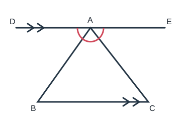
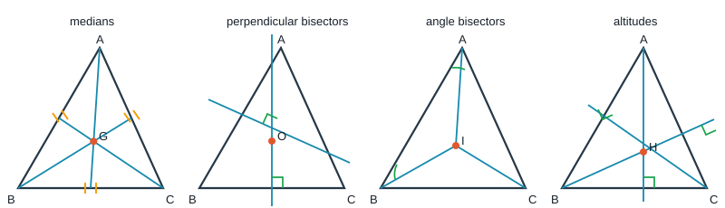

# 三角形基础

> 三根木条能不能钉成一个三角架，不只看“有三根”，还要看任意两根能否够到一起。三角形稳定，是因为三条边与三个角互相约束。本篇从“能否组成”走到“怎样计算和证明”。

## 0. 知识边界与地图

### 0.1 边界说明

- **【苏科版课内】**三角形及分类，三边关系，内角和、外角，角平分线、中线、高，多边形内角和与外角和；等腰、等边三角形的性质与判定在苏科版后续“轴对称图形”等单元中属于课内，本篇作跨章节归纳。
- **【培优拓展】**倍长中线、面积等积变换，重心、外心、内心、垂心的系统性质，欧拉线等只作边界提示。
- 全等判定另见《全等三角形》，尺规步骤另见《尺规作图》。

### 0.2 知识地图

```text
三角形
├─ 边：三边关系、按边分类
├─ 角：内角和、外角、按角分类
├─ 重要线段：中线、角平分线、高
├─ 特殊三角形：等腰、等边、直角
└─ 推广到多边形：内角和、外角和
        ↓
课内计算与说理
        ↓
培优：辅助线、面积、四心
```

## 1. 【苏科版课内】三角形的基本元素

由不在同一直线上的三条线段首尾相接组成的图形叫三角形，记作 $\triangle ABC$。三边为 $AB,BC,CA$，三内角为 $\angle A,\angle B,\angle C$。

### 1.1 分类

- 按角：锐角三角形、直角三角形、钝角三角形；
- 按边：不等边三角形、等腰三角形；等边三角形是特殊的等腰三角形。

### 1.2 三边关系

三角形任意两边之和大于第三边，任意两边之差小于第三边。若三边为 $a,b,c$，可合写为：

$$|a-b|<c<a+b.$$

**证明：** 在 $\triangle ABC$ 中，两点间线段最短，所以折线 $AB+BC>AC$。轮换顶点得到另外两组不等式。由 $a+c>b$ 与 $b+c>a$ 可分别得到 $c>b-a$ 与 $c>a-b$，故 $c>|a-b|$。

判断三条正数能否成三角形，只需检验“较小两边之和大于最大边”。

## 2. 【苏科版课内】角的定理

### 2.1 三角形内角和



$$\angle A+\angle B+\angle C=180^\circ.$$

**证明：** 过 $A$ 作 $DE\parallel BC$。由内错角相等，$\angle DAB=\angle B,\angle CAE=\angle C$。直线 $DE$ 上三个相邻角组成平角，所以

$$\angle B+\angle A+\angle C=\angle DAB+\angle BAC+\angle CAE=180^\circ.$$

推论：

- 直角三角形两个锐角互余；
- 一个三角形至多有一个直角或钝角。

### 2.2 外角定理

三角形的一边与另一边的延长线所组成的角叫三角形的外角。若延长 $BC$ 到 $D$，则 $\angle ACD$ 是 $\triangle ABC$ 在 $C$ 点的一个外角。

$$\angle ACD=\angle A+\angle B.$$

**证明：** $\angle ACD+\angle ACB=180^\circ$，而 $\angle A+\angle B+\angle ACB=180^\circ$，两式相减即得。

因此，三角形的一个外角大于任何一个与它不相邻的内角。

## 3. 【苏科版课内】三条重要线段

- **中线**：连接顶点与对边中点；三条中线交于一点。
- **角平分线**：平分一个内角的射线与对边相交所得线段；三条内角平分线交于一点。
- **高**：从顶点向对边所在直线作垂线，顶点与垂足间的线段；三条高所在直线交于一点。

注意：钝角三角形有两条高落在边的延长线上；“高”是线段，“高所在直线”才可向两端延伸。

面积公式：

$$S_{\triangle ABC}=\frac12 ah_a=\frac12 bh_b=\frac12 ch_c.$$

同底等高的三角形面积相等；同高时面积比等于底边比。

## 4. 【苏科版课内】特殊三角形

### 4.1 等腰三角形

若 $AB=AC$，则底角相等：

$$AB=AC\quad\Longrightarrow\quad\angle B=\angle C.$$

**证明：** 作顶角 $\angle A$ 的平分线 $AD$。在 $\triangle ABD$ 与 $\triangle ACD$ 中，$AB=AC,\angle BAD=\angle CAD,AD=AD$，由 SAS 得两三角形全等，所以 $\angle B=\angle C$。

反过来，若 $\angle B=\angle C$，则 $AB=AC$。这叫“等角对等边”，可由 ASA 全等证明。

等腰三角形顶角平分线、底边中线、底边上的高互相重合，简称“三线合一”。使用时必须先明确它是**等腰三角形中从顶角引出的线**。

### 4.2 等边三角形

- 三边相等 $\Longleftrightarrow$ 三个角都为 $60^\circ$；
- 有一个角为 $60^\circ$ 的等腰三角形是等边三角形。

### 4.3 直角三角形

若 $\angle C=90^\circ$，则 $AB$ 是斜边，$AC,BC$ 是直角边。直角三角形斜边上的中线等于斜边的一半是苏科版后续课内重要结论：

$$CD=\frac12 AB.$$

其证明可用矩形性质或全等构造，不能只凭图形认定。

## 5. 【苏科版课内】多边形

从一个顶点向其他不相邻顶点引对角线，可把 $n$ 边形分成 $n-2$ 个三角形，所以内角和为：

$$S_n=(n-2)\times180^\circ\quad(n\ge3).$$

任意凸多边形的外角和为 $360^\circ$。证明：每个内角与相邻外角之和为 $180^\circ$，所以外角和为 $n\cdot180^\circ-(n-2)\cdot180^\circ=360^\circ$。

## 6. 【培优拓展】模型与辅助线

### 6.1 倍长中线

若 $AM$ 是 $\triangle ABC$ 的中线，延长 $AM$ 到 $D$，使 $MD=MA$。因为 $BM=CM$、$\angle BMA=\angle CMD$、$AM=DM$，可由 SAS 构造全等三角形，把分散在 $M$ 两侧的边角转移到一起。

这一辅助线适用于：题目同时出现“中点”和边长和差，或需要把一条中线与两边建立联系。

### 6.2 面积桥梁

若 $D$ 是 $BC$ 中点，则 $\triangle ABD$ 与 $\triangle ACD$ 同高且底相等：

$$S_{\triangle ABD}=S_{\triangle ACD}.$$

若点 $P$ 在与 $BC$ 平行的直线上移动，则 $S_{\triangle PBC}$ 不变。面积法只需要底和高，不需要先证明三角形全等。

### 6.3 四心系统（培优边界）



- **重心 $G$**：三条中线交点；把每条中线按顶点到重心 $2:1$ 分割。该比例需在相似或面积工具学完后证明。
- **外心 $O$**：三边垂直平分线交点；$OA=OB=OC$，是外接圆圆心。
- **内心 $I$**：三条内角平分线交点；到三边距离相等，是内切圆圆心。
- **垂心 $H$**：三条高所在直线交点。

四心的位置：

- 锐角三角形：四心均在内部；
- 直角三角形：垂心是直角顶点，外心是斜边中点；
- 钝角三角形：外心、垂心在三角形外部，重心、内心仍在内部。

“欧拉线、九点圆”等不属于本篇课内要求，不在练习中直接调用。

## 7. 代表例题（完整解答）

### 例 1【课内】三边关系

两边长为 $5,9$，第三边长为整数，第三边有多少种取值？

**解：** 由三边关系：

$$|9-5|<x<9+5,$$

即 $4<x<14$。整数 $x$ 可取 $5,6,\ldots,13$，共 $9$ 种。

### 例 2【课内】内外角

$\triangle ABC$ 中，$\angle A=48^\circ$，$C$ 点外角为 $123^\circ$，求 $\angle B,\angle C$。

**解：** 外角等于两个不相邻内角之和，所以

$$\angle B=123^\circ-48^\circ=75^\circ.$$

内外角互补，故 $\angle C=180^\circ-123^\circ=57^\circ$。

### 例 3【课内综合】等腰三角形分类讨论

等腰三角形一个角为 $40^\circ$，求其余两角。

**解：**

- 若 $40^\circ$ 是顶角，则两底角均为 $(180^\circ-40^\circ)/2=70^\circ$；
- 若 $40^\circ$ 是底角，则另一底角为 $40^\circ$，顶角为 $100^\circ$。

所以答案为 $70^\circ,70^\circ$ 或 $40^\circ,100^\circ$。

### 例 4【培优】中线与周长

在 $\triangle ABC$ 中，$AM$ 为中线。延长 $AM$ 到 $D$，使 $MD=MA$。证明 $AB+AC>2AM$。

**证明：** 因 $BM=CM,\angle BMA=\angle CMD,AM=DM$，所以 $\triangle ABM\cong\triangle DCM$，从而 $AB=CD$。在 $\triangle ACD$ 中，

$$AC+CD>AD=AM+MD=2AM.$$

代入 $CD=AB$，得 $AB+AC>2AM$。

## 8. 易错辨析

1. **两边和大于第三边只验一次即可？** 只有在已确定最大边时，验“较小两边之和大于最大边”才够。
2. **外角等于两个内角之和？** 应是两个**不相邻**内角之和。
3. **中线也是高？** 一般不是；等腰三角形顶角引出的中线才与高、角平分线重合。
4. **三角形的高都在内部？** 钝角三角形有两条高在外部。
5. **外心总在三角形内？** 错，直角三角形外心在斜边中点，钝角三角形外心在外部。
6. **等腰三角形给一个角只有一组答案？** 未说明顶角或底角时要分类。

## 9. 分层练习

### A 组：课内基础

1. 长为 $3,4,8$ 的三条线段能否组成三角形？
2. 两边为 $7,12$，第三边为整数，写出取值范围。
3. 三角形两角为 $35^\circ,76^\circ$，求第三角。
4. 一个外角为 $130^\circ$，与它不相邻的一个内角为 $55^\circ$，求另一个不相邻内角。

### B 组：课内综合

5. 等腰三角形顶角为 $36^\circ$，求底角。
6. 正八边形内角和是多少？
7. 一个多边形内角和为 $1260^\circ$，求边数。
8. 证明：直角三角形两个锐角互余。

### C 组：培优拓展

9. 三角形两边为 $6,10$，第三边为奇数，求所有可能值。
10. $AM$ 是中线，延长到 $D$ 使 $MD=MA$。若 $AB=7,AC=5$，求 $CD$，并比较 $AD$ 与 $12$ 的大小。
11. 说明直角三角形的外心为何是斜边中点（可调用“斜边中线等于斜边一半”）。

## 10. 答案

1. 不能，$3+4<8$。
2. $5<x<19$，整数为 $6$ 到 $18$。
3. $69^\circ$。
4. $75^\circ$。
5. $72^\circ$。
6. $(8-2)\times180^\circ=1080^\circ$。
7. $(n-2)180^\circ=1260^\circ$，得 $n=9$。
8. 由内角和减去直角：$\angle A+\angle B=180^\circ-90^\circ=90^\circ$。
9. $4<x<16$，奇数为 $5,7,9,11,13,15$。
10. 由全等得 $CD=AB=7$；在 $\triangle ACD$ 中 $AD<AC+CD=12$。
11. 设斜边中点为 $D$，斜边中线定理给出 $DA=DB=DC$，故 $D$ 到三个顶点等距，是外心。

## 11. 总结与自查

- 组成三角形先查三边关系，求角先查内角和或外角定理；
- 看到中点优先考虑同底等高、倍长中线或全等；
- 看到等腰先标等边和等角，再判断能否“三线合一”；
- 四心要按“哪三条线相交”准确区分，不越过当前已学工具调用结论。

## 12. 真实链接

- [教育部：义务教育课程方案和课程标准（2022 年版）](https://www.moe.gov.cn/srcsite/A26/s8001/202204/t20220420_619921.html)
- [GeoGebra Geometry（用于检验动态图形猜想）](https://www.geogebra.org/geometry)

> 本文例题与图形均为原创改编，不收录付费题库原文；不同印次的苏科版章节顺序可能略有调整。
- [哔哩哔哩检索：苏科版 三角形](https://search.bilibili.com/all?keyword=%E8%8B%8F%E7%A7%91%E7%89%88%20%E4%B8%89%E8%A7%92%E5%BD%A2)
