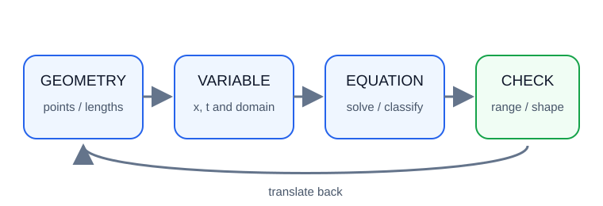
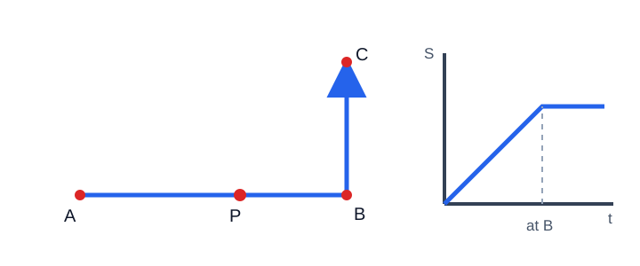

# 代数几何

> 定位：苏科版初中数学“平面直角坐标系、一次函数、反比例函数、二次函数、方程、三角形与四边形”基础上的培优专题。**【课内】**表示教材范围内可直接使用；**【拓展】**表示本文先解释、再使用的方法。不使用向量、参数方程、导数等未解释的高中工具。

## 1. 给图形装上“数字仪表盘”

几何图形像一辆正在行驶的车：点在动、面积在变、特殊形状会在某一刻出现。只盯图形，容易漏掉位置；把点写成坐标，把长度和面积写成式子，就像装上仪表盘，变化会留下可计算的记录。

代数几何不是把所有题都硬算，而是在两种语言间翻译：

- 几何语言告诉我们该设什么、有哪些限制；
- 代数语言负责求值、判定存在性；
- 算完必须翻译回图形并检查位置是否合法。

## 2. 先修知识与边界

### 2.1 【课内】可直接使用

- 平面直角坐标系，两点横纵坐标差；
- 一次函数、反比例函数、二次函数的图象与基本性质；
- 二元一次方程组、一元二次方程及根的判别；
- 勾股定理、全等、相似；
- 三角形、平行四边形、矩形、菱形、正方形的判定与性质；
- 三角形面积、梯形面积；
- 配方法求二次式在给定范围内的最值。

### 2.2 【拓展】本文推导后使用

**两点距离公式（由勾股定理推出）：** 若 $A(x_1,y_1)$、$B(x_2,y_2)$，作水平、竖直辅助线得到直角三角形，则

$$AB=\sqrt{(x_2-x_1)^2+(y_2-y_1)^2}.$$

它不是需要背诵的高中结论，而是勾股定理的坐标写法。

**坐标面积公式的有限使用：** 当一点在坐标轴或平行于坐标轴的直线上时，优先用“底乘高的一半”。本文不直接使用未证明的行列式公式。

**存在性判定：** “存在点满足条件”要转成方程有解，并同时检查：

$$\text{代数有实数解}\quad+\quad\text{解在动点范围内}\quad+\quad\text{图形不退化}.$$

## 3. 方法地图

| 问题 | 首选变量 | 建立关系 | 最后检查 |
|---|---|---|---|
| 坐标化证明 | 点的坐标 | 距离平方、斜率的初中替代（横纵差成比例） | 坐标设置是否一般 |
| 动点长度 | 路程 $x$ 或横坐标 $x$ | 勾股、相似 | $x$ 的范围 |
| 动点面积 | 底或高 $x$ | 分割、补形 | 图形是否换边 |
| 函数与几何 | 交点坐标 | 联立方程 | 交点个数与位置 |
| 特殊四边形存在性 | 动点参数 $t$ | 边相等、垂直、对角线性质 | 分类是否完整 |
| 最值 | 一个自变量 | 一次式端点或二次式配方 | 顶点是否在区间 |

通用流程：**建系—设点—列式—定域—求解—验图。**

## 4. 核心模型与推导

### 4.1 坐标系怎样选

好坐标系应让尽可能多的点坐标简单：

1. 有直角：把两条垂直边放在坐标轴上；
2. 有对称：把对称轴作为坐标轴；
3. 有矩形：把一个顶点放原点，两边放坐标轴；
4. 已给函数图象：通常沿用原坐标系。

设矩形 $OABC$ 中 $O(0,0)$、$A(a,0)$、$C(0,b)$，则 $B(a,b)$。边上点只需一个参数，例如 $P(t,0)$，且必须写 $0\le t\le a$。

### 4.2 用距离平方避免根式

比较长度时，非负数平方后的大小关系不变。例如判断 $PA=PB$，可写

$$PA^2=PB^2.$$

代入坐标后根号消失。求完后仍要确认两边确为长度，不能对可能为负的普通代数式随意平方。

### 4.3 函数图象的交点

点 $P$ 同时在两条图象上，坐标必须同时满足两个关系。若

$$y=kx+b,\qquad y=ax^2+cx+d,$$

则令右边相等，得到一元二次方程。实数解个数对应横坐标解的个数，但还需检查：

- 两个不同横坐标通常对应两个交点；
- 重根对应一个交点；
- 若题目只取第一象限或某段图象，应删去越界解。

### 4.4 动点与分段

点沿折线 $A\to B\to C$ 运动时，路程 $x$ 与点的位置关系会在 $B$ 改变，所以面积函数通常分段。分段点不是计算技巧，而是“运动规则改变”的时刻。

### 4.5 面积函数

若三角形底边固定为 $a$，动点到该底边所在直线的距离为 $h(x)$，则

$$S(x)=\frac12 ah(x).$$

若底和高都随 $x$ 变化，常得到二次式。设

$$S(x)=-x^2+6x+4,$$

配方得

$$S(x)=13-(x-3)^2.$$

因此在定义域包含 $3$ 时最大值为 $13$；若定义域不包含 $3$，应比较最靠近 $3$ 的端点，不能机械回答顶点值。

### 4.6 存在性问题的分类依据

“是否存在点 $P$ 使四边形为平行四边形”不能只列一个方程。四个给定字母未必按周界顺序排列。可按“哪两条对角线互相平分”分类；若讨论等腰三角形，可按哪两边相等分类：

$$PA=PB,\qquad PA=AB,\qquad PB=AB.$$

分类可能产生同一个点，最终要去重；还要排除三点共线等退化情形。

### 4.7 不用“斜率乘积为 $-1$”证明垂直

该结论常被当作高中工具且含竖直线例外。初中阶段可直接用勾股定理逆定理：对三点 $A,B,C$，若

$$AB^2+AC^2=BC^2,$$

则 $\angle A=90^\circ$。这样无须处理斜率不存在的情况。

## 5. 代表例题完整解答

### 例 1　坐标化证明等腰

已知 $A(-3,0)$、$B(3,0)$，点 $P(0,4)$。证明 $\triangle PAB$ 为等腰三角形，并求面积。

**解：**

$$PA^2=(0+3)^2+(4-0)^2=25,$$

$$PB^2=(0-3)^2+(4-0)^2=25.$$

所以 $PA=PB$，三角形为等腰三角形。底 $AB=6$，高为 $4$，故

$$S_{\triangle PAB}=\frac12\times6\times4=12.$$

### 例 2　函数交点与位置检查

直线 $y=x+2$ 与抛物线 $y=x^2$ 交于 $A,B$，求交点坐标。

**解：** 联立得

$$x^2=x+2,$$

即

$$x^2-x-2=0.$$

因式分解：

$$(x-2)(x+1)=0.$$

所以 $x=2$ 或 $x=-1$。代入 $y=x^2$，得

$$A(2,4),\qquad B(-1,1).$$

两个解均为实数且无额外位置限制，因此有两个交点。

### 例 3　矩形边上动点面积

矩形 $OABC$ 中，$O(0,0)$、$A(8,0)$、$B(8,6)$、$C(0,6)$。点 $P(t,0)$ 在线段 $OA$ 上。求 $\triangle PBC$ 的面积关于 $t$ 的关系及范围。

**解：** 因为 $P\in OA$，

$$0\le t\le8.$$

以 $BC=8$ 为底，其所在直线为 $y=6$，点 $P$ 到该直线的距离恒为 $6$，所以

$$S_{\triangle PBC}=\frac12\times8\times6=24.$$

面积与 $t$ 无关。此题提醒我们：动点不一定导致所求量变化。

### 例 4　折线动点的分段面积

在矩形 $ABCD$ 中，$AB=6$、$BC=4$。点 $P$ 从 $A$ 出发，以每秒 $1$ 个单位沿 $A\to B\to C$ 运动。设运动时间为 $t$，求 $\triangle ADP$ 的面积 $S$。

**解：** 取 $AD$ 为底，$AD=4$。

当 $0\le t\le6$ 时，$P$ 在 $AB$ 上，到直线 $AD$ 的距离为 $t$，故

$$S=2t,\qquad 0\le t\le6.$$

当 $6\le t\le10$ 时，$P$ 在 $BC$ 上，到直线 $AD$ 的距离恒为 $6$，故

$$S=12,\qquad 6\le t\le10.$$

在 $t=6$ 处两式均给出 $12$，函数连续衔接。

### 例 5　二次面积最值

直角三角形两直角边之和为 $10$。两直角边分别为 $x$、$10-x$，求面积最大值。

**解：** 长度必须为正，所以

$$0<x<10.$$

面积

$$S=\frac12x(10-x)=-\frac12(x-5)^2+\frac{25}{2}.$$

因此当 $x=5$ 时，面积最大，最大值为

$$S_{\max}=\frac{25}{2}.$$

此时直角三角形为等腰直角三角形。

### 例 6　等腰三角形存在性分类

已知 $A(0,0)$、$B(4,0)$，点 $P$ 在直线 $x=1$ 上。是否存在点 $P$ 使 $\triangle ABP$ 为等腰三角形？求所有这样的点。

**解：** 设 $P(1,t)$，并按相等边分类。

第一类，$PA=PB$：

$$1+t^2=9+t^2,$$

矛盾，无解。

第二类，$PA=AB=4$：

$$1+t^2=16,$$

所以 $t=\pm\sqrt{15}$，得到 $P(1,\sqrt{15})$、$P(1,-\sqrt{15})$。

第三类，$PB=AB=4$：

$$9+t^2=16,$$

所以 $t=\pm\sqrt7$，得到 $P(1,\sqrt7)$、$P(1,-\sqrt7)$。

四点均不在直线 $AB$ 上，三角形不退化。因此共有四个点。

### 例 7　平行四边形存在性

已知 $A(0,0)$、$B(4,0)$、$C(1,3)$，求所有点 $D$，使以 $A,B,C,D$ 为顶点的四边形中存在平行四边形。

**解：** 平行四边形的两条对角线互相平分。按三种对角点配对：

1. $A,C$ 为对角点，则其中点为 $(\frac12,\frac32)$，所以 $B,D$ 的中点相同，得 $D(-3,3)$；
2. $A,B$ 为对角点，则中点为 $(2,0)$，所以 $C,D$ 的中点相同，得 $D(3,-3)$；
3. $A,D$ 为对角点，则其中点应等于 $B,C$ 的中点 $(\frac52,\frac32)$，得 $D(5,3)$。

三个点均与已知点不同且构成非退化平行四边形。

## 6. 常见陷阱

1. **先列式，后补定义域。** 定义域应在列式时由运动范围确定。
2. **把图象交点个数等同于方程实根个数。** 还要看象限、线段、射线等限制。
3. **动点经过转角却只写一个式子。** 位置规则变化就应考虑分段。
4. **只讨论一种等腰或平行四边形情形。** 分类依据必须明确且互不遗漏。
5. **坐标系设得过于特殊。** 例如一般矩形不能擅自设成正方形。
6. **平方后出现增根。** 涉及含根式方程时必须代回原条件。
7. **求出最大值却取不到。** 开区间端点、退化图形尤其要检查。

## 7. 分层练习

### A 组　课内巩固

1. 求 $A(-2,1)$、$B(4,9)$ 的距离。
2. 直线 $y=2x-1$ 与 $y=-x+5$ 的交点是什么？
3. 点 $P(t,0)$ 在线段 $OA$ 上，$O(0,0)$、$A(5,0)$，写出 $t$ 的范围。
4. 函数 $S=-x^2+8x$ 在 $0\le x\le8$ 上的最大值是多少？

### B 组　方法迁移

5. $A(-4,0)$、$B(4,0)$，点 $P(0,t)$。用距离平方说明 $PA=PB$。
6. 直线 $y=x$ 与抛物线 $y=x^2-2$ 有几个交点？求坐标。
7. 矩形长为 $8$、宽为 $5$，点 $P$ 沿一条长边运动。以另一条长边为底、$P$ 为顶点的三角形面积是否变化？
8. 两个正数之和为 $12$，以它们为矩形两边，求面积最大值。

### C 组　培优拓展

9. $A(0,0)$、$B(6,0)$，点 $P$ 在直线 $x=2$ 上。求使 $\triangle ABP$ 为等腰三角形的所有 $P$。
10. 点 $P$ 从矩形 $ABCD$ 的 $A$ 点沿 $A\to B\to C\to D$ 匀速运动，如何确定以 $AD$ 为底的三角形 $ADP$ 面积的分段点？不必列具体式子。
11. 已知 $A(0,0)$、$B(2,0)$、$C(0,3)$，求所有点 $D$，使四点能组成平行四边形。
12. 抛物线 $y=x^2-4x+3$ 与 $x$ 轴的两个交点及顶点能否组成等腰三角形？说明理由。

## 8. 答案与提示

1. $10$。
2. $(2,3)$。
3. $0\le t\le5$。
4. 配方为 $16-(x-4)^2$，最大值 $16$。
5. $PA^2=16+t^2=PB^2$。
6. 解 $x=x^2-2$，得 $x=2,-1$；交点为 $(2,2)$、$(-1,-1)$。
7. 不变，面积恒为 $\frac12\times8\times5=20$。
8. 设一边为 $x$，面积 $x(12-x)=36-(x-6)^2$，最大值 $36$。
9. 设 $P(2,t)$，分别令 $PA=PB$、$PA=AB$、$PB=AB$；答案为 $(2,\pm4\sqrt2)$、$(2,\pm2\sqrt5)$，第一类无解。
10. 在 $B,C$ 处运动边改变，应以到达 $B,C$ 的时刻为分段点；还应把起点与终点列入定义域。
11. $(2,3)$、$(-2,3)$、$(2,-3)$。
12. 交点为 $(1,0)$、$(3,0)$，顶点为 $(2,-1)$；顶点到两交点距离均为 $\sqrt2$，能组成等腰直角三角形。

## 9. 总结

- 坐标化的目标是减少变量，不是增加计算；
- 一切函数关系都必须带定义域；
- 面积题先找固定底或固定高，动点换边就考虑分段；
- 存在性问题要“分类列方程—求解—验范围—排退化—去重”；
- 能用勾股定理、相似和配方解释的地方，不搬用未说明的高中结论。

## 10. 参考资料与视频

1. 江苏凤凰科学技术出版社，义务教育教科书《数学》八、九年级相关册次：“平面直角坐标系”“一次函数”“二次函数”等章节。
2. 中华人民共和国教育部：《义务教育数学课程标准（2022年版）》，北京师范大学出版社，2022。
3. [国家中小学智慧教育平台](https://basic.smartedu.cn/)：可检索“一次函数 数与形”“二次函数 图象”“几何动点”。
4. [内蒙古中小学智慧教育平台：一次函数的数与形](https://basic.nmg.smartedu.cn/studio/index.php?id=16630&isShowShareBtn=true&r=studiowechat%2Falbum%2Fview)：介绍一次函数与方程、图象交点的联系。
5. [GeoGebra Classic](https://www.geogebra.org/classic)：免费动态数学工具，可拖动点验证分段与存在性猜想；实验只能帮助猜想，正式解答仍需证明。

> 链接核验日期：2026-07-11。本文例题与 SVG 图示均为本站原创，未复制付费课程内容。
