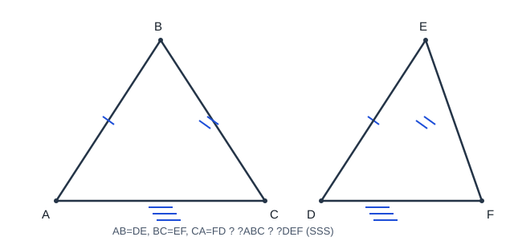
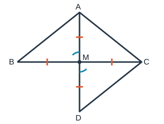

# 全等三角形

> 两把钥匙叠在一起，如果每个齿槽都完全重合，它们就是“全等”的。证明两个三角形全等，不需要把六个元素逐一核对；只要选对三组足以锁定形状和大小的条件，就能像验证钥匙一样完成判定。

## 0. 知识边界与地图

### 0.1 边界说明

- **【苏科版课内】**全等图形与对应元素；SSS、SAS、ASA、AAS、HL 判定；全等三角形的对应边、对应角相等；角平分线性质；基本证明与作图。
- **【培优拓展】**截长补短、倍长中线、旋转“手拉手”、一线三等角、双重全等；拓展结论必须由课内判定证明后使用。
- AAA 只能保证形状相同，SSA 一般不能唯一确定三角形，二者都不是一般三角形全等判定。

### 0.2 知识地图

```text
观察图形
├─ 找对应顶点
├─ 标已知边角
└─ 挖隐含条件：公共边、对顶角、中点、角平分线
        ↓
选择判定
├─ SSS
├─ SAS（夹角）
├─ ASA（夹边）
├─ AAS
└─ HL（直角三角形的斜边、直角边）
        ↓
写出全等，顺序对应
        ↓
用全等性质得到目标边或角
        ↓
培优辅助线：构造新的全等三角形
```

## 1. 【苏科版课内】概念与性质

能够完全重合的两个图形叫全等图形。若 $\triangle ABC$ 与 $\triangle DEF$ 全等，且 $A\leftrightarrow D,B\leftrightarrow E,C\leftrightarrow F$，记作：

$$\triangle ABC\cong\triangle DEF.$$

对应关系由书写顺序决定，因此：

$$AB=DE,\quad BC=EF,\quad CA=FD,$$

$$\angle A=\angle D,\quad\angle B=\angle E,\quad\angle C=\angle F.$$

全等三角形的周长、面积也相等；但“面积相等”不能反推全等。

## 2. 【苏科版课内】五种判定

### 2.1 SSS：三边分别相等



$$AB=DE,\quad BC=EF,\quad CA=FD\quad\Longrightarrow\quad\triangle ABC\cong\triangle DEF.$$

尺规作图解释：固定一边后，第三个顶点是两个定圆的交点；上下两个交点互为轴对称，所得三角形仍全等。

### 2.2 SAS：两边及其夹角分别相等

$$AB=DE,\quad AC=DF,\quad\angle BAC=\angle EDF\quad\Longrightarrow\quad\triangle ABC\cong\triangle DEF.$$

“夹角”必须是两条已知边的公共端点处的角。SSA 不属于 SAS。

### 2.3 ASA：两角及其夹边分别相等

$$\angle A=\angle D,\quad AB=DE,\quad\angle B=\angle E\quad\Longrightarrow\quad\triangle ABC\cong\triangle DEF.$$

### 2.4 AAS：两角及其中一组对应边相等

AAS 可由三角形内角和化为 ASA：两组角相等，则第三组角也相等，再结合已知边使用 ASA。

### 2.5 HL：直角三角形斜边和一直角边分别相等

在 $\angle C=\angle F=90^\circ$ 时：

$$AB=DE,\quad AC=DF\quad\Longrightarrow\quad\triangle ABC\cong\triangle DEF.$$

HL（Hypotenuse-Leg，部分英文资料也写 RHS）只能用于直角三角形，且必须明确哪条是斜边。

## 3. 【苏科版课内】关键结论与证明

### 3.1 角平分线上的点到角两边距离相等

点 $P$ 在 $\angle AOB$ 的平分线上，过 $P$ 作 $PM\perp OA,PN\perp OB$。证明 $PM=PN$。

**证明：** $\angle PMO=\angle PNO=90^\circ$，$OP=OP$，且 $\angle MOP=\angle PON$。由 AAS（或直角三角形“斜边、锐角”）得 $\triangle OMP\cong\triangle ONP$，所以 $PM=PN$。

**逆命题：** 角内一点到角两边距离相等，则该点在角平分线上。证明同样构造两个直角三角形，用 HL 得对应角相等。

### 3.2 等腰三角形“三线合一”

在 $\triangle ABC$ 中，$AB=AC$，若 $D$ 是 $BC$ 中点，则 $BD=CD,AD=AD$。由 SSS 得 $\triangle ABD\cong\triangle ACD$，所以

$$\angle BAD=\angle CAD,\qquad\angle ADB=\angle ADC.$$

两相邻角又互补，故都为 $90^\circ$。因此 $AD$ 同时是中线、角平分线和高。

### 3.3 直角三角形 HL 的合理性

设两个直角三角形斜边均为 $c$，一条直角边均为 $a$。由勾股定理，另一条直角边的正长度均为 $\sqrt{c^2-a^2}$，于是三边分别相等，可归结为 SSS。若教学顺序尚未学习勾股定理，则 HL 作为独立基本事实使用。

## 4. 【苏科版课内】证明流程

### 4.1 先找隐含条件

- 公共边：$AB=AB$；
- 对顶角相等；
- 中点产生两段相等；
- 角平分线产生两角相等；
- 平行线产生同位角或内错角相等；
- 垂直产生直角相等；
- 等式传递：若 $AB=CD,CD=EF$，则 $AB=EF$。

### 4.2 标准格式

在 $\triangle ABC$ 和 $\triangle DEF$ 中：

$$\left\{\begin{aligned}AB&=DE,\\ \angle A&=\angle D,\\ AC&=DF,\end{aligned}\right.$$

所以 $\triangle ABC\cong\triangle DEF$（SAS）。因此 $BC=EF$（全等三角形对应边相等）。

对应顺序必须与三组条件一致，不能先写结论再随意排列字母。

## 5. 【培优拓展】模型与辅助线

### 5.1 倍长中线



若 $AM$ 是中线，延长 $AM$ 到 $D$，使 $MD=MA$。由 $BM=CM$、对顶角相等、$AM=DM$，可用 SAS 得：

$$\triangle ABM\cong\triangle DCM.$$

它把 $AB$ 转移为 $CD$，把中线 $AM$ 变成 $AD$ 的一半，适合证明边长和差或角相等。

### 5.2 截长补短

- **截长：** 在较长线段上截取一段等于较短线段，构造等腰或全等；
- **补短：** 延长较短线段，使新增部分等于已知线段；
- 目标是把“和、差”转化为单条对应边。

辅助点的位置必须明确，且“截取相等”要有作图或定义依据。

### 5.3 手拉手（旋转型全等）

若 $\triangle AOB,\triangle COD$ 是绕同一点 $O$ 放置的全等特殊三角形，并有 $OA=OB,OC=OD$ 及固定夹角，则可用角的和差得到夹角相等，再由 SAS 证明交叉连接形成的三角形全等。

核心不是记图名，而是检查：

1. 两组对应边是否相等；
2. 夹角是否能由“共同旋转角 + 固定角”证明相等；
3. 对应顺序是否正确。

### 5.4 一线三等角

当三个相等角沿同一直线排列时，常利用平角和角的和差得到两组夹角相等，再结合一组边相等使用 ASA 或 AAS。若边只是成比例而非相等，应转入相似三角形，不能强判全等。

## 6. 代表例题（完整解答）

### 例 1【课内】公共边与 SAS

在 $\triangle ABC$ 中，$AB=AC$，$AD$ 平分 $\angle BAC$，点 $D$ 在 $BC$ 上。证明 $BD=CD$。

**证明：** 在 $\triangle ABD$ 与 $\triangle ACD$ 中，

$$AB=AC,\qquad \angle BAD=\angle CAD,\qquad AD=AD.$$

所以 $\triangle ABD\cong\triangle ACD$（SAS），故 $BD=CD$。

### 例 2【课内】HL

在 $\mathrm{Rt}\triangle ABC$ 与 $\mathrm{Rt}\triangle DEF$ 中，$\angle C=\angle F=90^\circ$，且 $AB=DE,AC=DF$。证明 $BC=EF$。

**证明：** $AB,DE$ 分别是两个直角三角形的斜边，$AC,DF$ 分别是一组直角边。由 HL 得 $\triangle ABC\cong\triangle DEF$，所以对应边 $BC=EF$。

### 例 3【培优】倍长中线

在 $\triangle ABC$ 中，$AM$ 是中线。证明：

$$AB+AC>2AM.$$

**证明：** 延长 $AM$ 到 $D$，使 $MD=MA$。因 $BM=CM,\angle BMA=\angle CMD,AM=DM$，所以 $\triangle ABM\cong\triangle DCM$（SAS），得 $AB=CD$。在 $\triangle ACD$ 中 $AC+CD>AD$，而 $AD=2AM$，故 $AB+AC>2AM$。

### 例 4【辨伪】SSA

已知两个三角形都有一边长 $7$、另一边长 $5$，且长为 $5$ 的边所对角均为 $30^\circ$，能否断定全等？

**解：** 不能。这是“两边及其中一边的对角”（SSA），第三个顶点可能对应两种位置，形成不同三角形。除非补充直角条件并满足 HL，或补足夹角、第三边等有效条件。

## 7. 易错辨析

1. **AAA 能判全等？** 不能，只能确定形状，大小可不同。
2. **SSA 能判全等？** 一般不能；HL 是带直角条件的特殊情形。
3. **SAS 中任意角都可以？** 必须是两条已知边的夹角。
4. **全等符号两边字母随便写？** 不行，对应顶点必须同序。
5. **证明全等后所有边角随便对应？** 要按已确定的顶点对应关系。
6. **有公共角就写“公共角相等”？** 只有两三角形确实共享同一个角才可；被线段分开的两个角不是公共角。
7. **HL 只要两个直角和斜边相等？** 还缺一组直角边相等。

## 8. 分层练习

### A 组：课内基础

1. $\triangle ABC\cong\triangle DEF$，且对应顺序如式，写出 $BC$ 的对应边和 $\angle A$ 的对应角。
2. 三边分别为 $3,4,5$ 与 $3,4,5$ 的两个三角形为何全等？
3. 两边和其中一边的对角分别相等，能否用 SAS？
4. 两直角三角形斜边均为 $10$，一直角边均为 $6$，用什么判定？

### B 组：课内综合

5. 已知 $AB=AC,D$ 是 $BC$ 中点，证明 $AD\perp BC$。
6. 已知 $\angle A=\angle D,\angle B=\angle E,AB=DE$，证明两三角形全等并写出判定。
7. 点 $P$ 在角平分线上，过 $P$ 向角两边作垂线，证明两垂线段相等。

### C 组：培优拓展

8. $AM$ 是中线，延长到 $D$ 使 $MD=MA$。写出一对全等三角形及判定。
9. 在例 3 的构造中，若 $AB=8,AC=11$，求 $CD$，并给出 $AM$ 的上界。
10. 说明为什么“两个面积相等且有一边相等的三角形全等”是错误命题。

## 9. 答案

1. $EF$，$\angle D$。
2. SSS。
3. 不能；给出的角不一定是夹角。
4. HL。
5. 由 $AB=AC,BD=CD,AD=AD$，SSS 得两三角形全等，故 $\angle ADB=\angle ADC$；两角互补且相等，所以均为 $90^\circ$。
6. ASA。
7. 构造两个直角三角形，用 AAS，详见 3.1。
8. $\triangle ABM\cong\triangle DCM$，SAS。
9. $CD=AB=8$；由 $2AM=AD<AC+CD=19$，得 $AM<9.5$。
10. 同一底边上，只要高相等面积就相等，顶点可沿平行于底边的直线移动，所得三角形一般边角不同。

## 10. 总结与自查

- 先写对应关系，再选 SSS、SAS、ASA、AAS 或 HL；
- 检查 SAS 的角是否夹角，HL 是否具备两个直角、斜边和一直角边；
- 结论必须写“全等三角形的对应边（角）相等”；
- 无法凑齐条件时，寻找公共边、对顶角、中点，或作倍长中线、截长补短；
- 若只有角相等或边成比例，应考虑相似而不是全等。

## 11. 真实链接

- [教育部：义务教育课程方案和课程标准（2022 年版）](https://www.moe.gov.cn/srcsite/A26/s8001/202204/t20220420_619921.html)
- [GeoGebra Geometry（拖动检验 SSA 反例与全等不变量）](https://www.geogebra.org/geometry)

> 本文例题、证明与图形为原创整理，不复制付费题库原文；课内边界以公开课程标准和苏科版常见教学顺序为依据。
- [哔哩哔哩检索：苏科版 全等三角形](https://search.bilibili.com/all?keyword=%E8%8B%8F%E7%A7%91%E7%89%88%20%E5%85%A8%E7%AD%89%E4%B8%89%E8%A7%92%E5%BD%A2)
