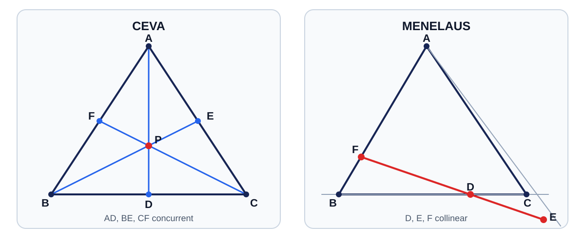

# 几何扩展定理

> **课程边界（苏科版初中）**
>
> - 本章以初中课内的平行线、全等、相似三角形、勾股定理和圆为证明工具。
> - **角平分线定理**可由初中相似或面积知识证明，但作为命名定理及其逆定理、外角平分线版本，在此统一标为**培优拓展**，不冒称苏科版初中课内必学定理。
> - **斯图尔特定理、托勒密定理、梅涅劳斯定理、塞瓦定理**均标为**培优拓展 / 高中衔接**；尤其梅涅劳斯与塞瓦绝不混称初中课内。
> - 有向线段版本涉及符号约定。本章先给适合初学者的无向长度版本，再单独说明一般形式。

## 0. 故事引入：一张三角形地图上的两类问题

在三角形区域 $ABC$ 中修三条道路：

- 从三个顶点分别通向对边，工程师想知道它们能否交于同一点；
- 一条勘测直线分别穿过三条边或其延长线，工程师想检验三个测点是否共线。

前一个问题是“**共点**”，后一个问题是“**共线**”。只用角度追逐往往很长，而塞瓦定理和梅涅劳斯定理把它们压缩成三个线段比的乘积。

但这些定理不是苏科版初中课内内容。正确的学习方式是：先明确条件，再用相似、面积等初中工具理解证明，最后把它们当作培优工具使用。

---

## 1. 知识地图

```text
初中课内证明工具
    ├─ 平行线与比例线段
    ├─ 全等、相似三角形
    ├─ 勾股定理
    ├─ 三角形面积
    └─ 圆周角、圆内接四边形
          ↓
培优扩展定理
    ├─ 一条线段
    │   ├─ 角平分线定理：分边比
    │   └─ 斯图尔特定理：中线/角平分线/任意劈线长度
    ├─ 四点共圆
    │   └─ 托勒密定理：对角线乘积 = 两组对边乘积之和
    └─ 三角形中的三条线
        ├─ 塞瓦定理：三条劈线共点
        └─ 梅涅劳斯定理：三个边上点共线
```



---

## 2. 预备：比值、面积与方向

### 2.1 同高三角形面积比

若 $\triangle ABD$ 与 $\triangle ACD$ 的底边 $BD,DC$ 在同一直线上，它们从 $A$ 到直线 $BC$ 的高相同，所以

$$\frac{S_{\triangle ABD}}{S_{\triangle ACD}}=\frac{BD}{DC}.$$

这是角平分线定理和塞瓦定理面积证明的核心。

### 2.2 同角两三角形面积比

若两个三角形有相等的夹角 $\theta$，由面积公式

$$S=\frac12ab\sin\theta,$$

可将面积比转化为夹角两边乘积之比。这里的面积公式在本章作为培优工具；若不使用三角函数，也可通过作高得到相同结论。

### 2.3 无向长度与有向线段

线段长度如 $AB$ 恒为正数。若点落在边的延长线上，仅用正长度时，定理的乘积通常写成 $1$，但必须明确“有几个点在延长线上”。

更一般的有向线段给直线规定正方向，$\overline{AB}$ 可以为正或负。此时梅涅劳斯定理常写成乘积 $-1$。两套写法不能混用。

---

## 3. 角平分线定理【培优拓展】

> 可由初中相似或面积知识证明，但本章不把它列作苏科版初中课内必学定理。

### 3.1 定理与逆定理

在 $\triangle ABC$ 中，点 $D$ 在线段 $BC$ 上。若 $AD$ 平分 $\angle BAC$，则

$$\frac{BD}{DC}=\frac{AB}{AC}.$$

逆定理也成立：若

$$\frac{BD}{DC}=\frac{AB}{AC},$$

则 $AD$ 平分 $\angle BAC$。

条件必须完整：

- $D$ 在线段 $BC$ 上；
- 比值中的两段 $BD,DC$ 与邻边 $AB,AC$ 一一对应；
- 内角平分线结论不能直接套给外角平分线。

### 3.2 面积证明

因为 $AD$ 平分 $\angle BAC$，

$$\angle BAD=\angle DAC.$$

两三角形共用边 $AD$。用“二边及夹角”面积表示：

$$\frac{S_{\triangle ABD}}{S_{\triangle ACD}}=\frac{\frac12AB\cdot AD\sin\angle BAD}{\frac12AC\cdot AD\sin\angle DAC}=\frac{AB}{AC}.$$

另一方面，两三角形对直线 $BC$ 等高，所以

$$\frac{S_{\triangle ABD}}{S_{\triangle ACD}}=\frac{BD}{DC}.$$

比较即得

$$\frac{BD}{DC}=\frac{AB}{AC}.$$

若希望完全避开三角函数，可以从 $D$ 分别向 $AB,AC$ 作垂线。角平分线上的点到角的两边距离相等，再用“底乘高的一半”得到同样面积比。

### 3.3 逆定理证明

假设 $\frac{BD}{DC}=\frac{AB}{AC}$。从 $A$ 作 $\angle BAC$ 的角平分线交 $BC$ 于 $D'$。由正定理，

$$\frac{BD'}{D'C}=\frac{AB}{AC}=\frac{BD}{DC}.$$

在线段 $BC$ 上，给定正比值只能确定唯一分点，因此 $D'=D$，故 $AD$ 是角平分线。

### 3.4 角平分线长

设 $AB=c,AC=b,BC=a,AD=l_a,BD=m,DC=n$。由角平分线定理，

$$\frac mn=\frac cb,\qquad m+n=a.$$

结合后文斯图尔特定理可得

$$l_a^2=bc-mn.$$

进一步消去 $m,n$：

$$l_a^2=bc\left[1-\frac{a^2}{(b+c)^2}\right].$$

这两个长度公式均属培优拓展。

### 3.5 例题 1

在 $\triangle ABC$ 中，$AB=6,AC=9,BC=10$，$AD$ 平分 $\angle A$。求 $BD,DC$。

**解：**

$$\frac{BD}{DC}=\frac{AB}{AC}=\frac69=\frac23.$$

又 $BD+DC=10$。设 $BD=2x,DC=3x$，则 $5x=10$，$x=2$。所以

$$BD=4,\qquad DC=6.$$

---

## 4. 斯图尔特定理【培优拓展 / 高中衔接】

### 4.1 定理

在 $\triangle ABC$ 中，$D$ 在线段 $BC$ 上。记

$$BC=a,\quad AC=b,\quad AB=c,\quad BD=m,\quad DC=n,\quad AD=d,$$

其中 $m+n=a$。则

$$b^2m+c^2n=a(d^2+mn).$$

记忆可以依赖结构，但使用时应按图核对：

- $b=AC$ 与靠近 $B$ 的底段 $m=BD$ 配对；
- $c=AB$ 与靠近 $C$ 的底段 $n=DC$ 配对。

### 4.2 证明

从 $A$ 向直线 $BC$ 作垂线，垂足为 $H$。令有向长度 $\overline{DH}=x$，则

$$AH^2=d^2-x^2.$$

又 $\overline{BH}=m+x$，$\overline{CH}=x-n$；平方后方向不影响结果。由勾股定理，

$$c^2=AH^2+(m+x)^2=d^2+m^2+2mx,$$

$$b^2=AH^2+(x-n)^2=d^2+n^2-2nx.$$

第一式乘 $n$，第二式乘 $m$ 后相加，含 $x$ 的项抵消：

$$c^2n+b^2m=(m+n)d^2+mn(m+n).$$

利用 $m+n=a$：

$$b^2m+c^2n=a(d^2+mn).$$

这个证明同时适用于垂足在边上或延长线上的情况，因为采用了有向坐标并最终平方。

### 4.3 两个重要特例

**中线：** 若 $m=n=\frac a2$，中线长记为 $m_a$，则

$$m_a^2=\frac{b^2+c^2}{2}-\frac{a^2}{4}.$$

这就是阿波罗尼斯中线公式。

**角平分线：** 若 $AD$ 平分 $\angle A$，由 $\frac mn=\frac cb$ 代入斯图尔特定理，得到

$$d^2=bc-mn.$$

### 4.4 例题 2

在 $\triangle ABC$ 中，$BC=10,AC=7,AB=9$，$D$ 是 $BC$ 中点。求中线 $AD$。

**解：** 使用中线公式：

$$AD^2=\frac{7^2+9^2}{2}-\frac{10^2}{4}=\frac{130}{2}-25=40.$$

所以

$$AD=2\sqrt{10}.$$

---

## 5. 托勒密定理【培优拓展 / 高中衔接】

### 5.1 定理与逆命题

若凸四边形 $ABCD$ 内接于同一圆，顶点按圆周顺序排列，则

$$AC\cdot BD=AB\cdot CD+BC\cdot AD.$$

即“对角线乘积等于两组对边乘积之和”。

逆命题：若一个凸四边形的边和对角线满足上式，则四点共圆。

条件中的“凸”“按顺序”“共圆”不能省略。一般四边形只有托勒密不等式，不一定取等号。

### 5.2 相似三角形证明

在对角线 $AC$ 上取点 $E$，使

$$\angle ABE=\angle DBC.$$

因为 $ABCD$ 共圆，同弧 $BC$ 所对圆周角相等：

$$\angle BAC=\angle BDC.$$

于是

$$\triangle ABE\sim\triangle DBC.$$

所以

$$\frac{AE}{DC}=\frac{AB}{DB},$$

即

$$AE\cdot DB=AB\cdot DC.$$

又因

$$\angle EBC=\angle ABC-\angle ABE=(\angle ABD+\angle DBC)-\angle DBC=\angle ABD,$$

且 $\angle BCE=\angle BCA=\angle BDA$，故

$$\triangle BCE\sim\triangle BDA.$$

从而

$$\frac{CE}{AD}=\frac{BC}{BD},$$

即

$$CE\cdot BD=BC\cdot AD.$$

两式相加，并用 $AE+CE=AC$：

$$AC\cdot BD=AB\cdot CD+BC\cdot AD.$$

### 5.3 例题 3：矩形对角线

矩形 $ABCD$ 的长、宽分别为 $a,b$，对角线长为 $d$。矩形四点共圆，由托勒密定理：

$$d^2=a^2+b^2.$$

这与勾股定理一致，说明托勒密定理包含了矩形情形。

### 5.4 例题 4：正五边形的黄金比

正五边形边长为 $1$，对角线长为 $x$。取其中四个连续顶点组成圆内接等腰梯形，其两条对角线均为 $x$，两腰与一底为 $1$，另一底为 $x$。由托勒密定理：

$$x^2=1\cdot1+1\cdot x.$$

即

$$x^2-x-1=0.$$

因 $x>0$，

$$x=\frac{1+\sqrt5}{2}.$$

---

## 6. 塞瓦定理【培优拓展 / 高中衔接】

> 塞瓦定理不是苏科版初中课内。

### 6.1 内分点版本

在 $\triangle ABC$ 中，点 $D,E,F$ 分别在线段 $BC,CA,AB$ 的内部，则直线 $AD,BE,CF$ 共点，当且仅当

$$\frac{BD}{DC}\cdot\frac{CE}{EA}\cdot\frac{AF}{FB}=1.$$

“当且仅当”包含两个方向：

- 共点 $\Rightarrow$ 比值积为 $1$；
- 比值积为 $1\Rightarrow$ 共点。

### 6.2 必要性证明：面积法

设 $AD,BE,CF$ 共于点 $P$。因为 $\triangle PBD$ 与 $\triangle PCD$ 对直线 $BC$ 等高，

$$\frac{BD}{DC}=\frac{S_{\triangle PBD}}{S_{\triangle PCD}}.$$

又 $\triangle ABD$ 与 $\triangle ACD$ 对 $BC$ 等高，所以

$$\frac{BD}{DC}=\frac{S_{\triangle ABD}}{S_{\triangle ACD}}=\frac{S_{\triangle PBD}+S_{\triangle PAB}}{S_{\triangle PCD}+S_{\triangle PCA}}.$$

更直接地分别利用同底或同高关系，可以整理为

$$\frac{BD}{DC}=\frac{S_{\triangle ABP}}{S_{\triangle ACP}},\qquad\frac{CE}{EA}=\frac{S_{\triangle BCP}}{S_{\triangle BAP}},\qquad\frac{AF}{FB}=\frac{S_{\triangle CAP}}{S_{\triangle CBP}}.$$

三式相乘，所有面积约去：

$$\frac{BD}{DC}\cdot\frac{CE}{EA}\cdot\frac{AF}{FB}=1.$$

### 6.3 充分性证明：唯一分点

假设乘积为 $1$。令 $AD$ 与 $BE$ 交于 $P$，直线 $CP$ 交 $AB$ 于 $F'$。由已证必要性，

$$\frac{BD}{DC}\cdot\frac{CE}{EA}\cdot\frac{AF'}{F'B}=1.$$

与题设比较：

$$\frac{AF'}{F'B}=\frac{AF}{FB}.$$

线段 $AB$ 上按给定正比值分点是唯一的，故 $F'=F$，于是 $AD,BE,CF$ 共点。

### 6.4 三条中线共点

若 $D,E,F$ 分别是三边中点，则

$$\frac{BD}{DC}=\frac{CE}{EA}=\frac{AF}{FB}=1.$$

乘积为 $1$，由塞瓦定理，三条中线共点。这给出了重心存在性的一个培优证明。

### 6.5 例题 5

在 $\triangle ABC$ 中，$D\in BC,E\in CA,F\in AB$，且

$$BD:DC=2:3,\qquad CE:EA=3:4.$$

若 $AD,BE,CF$ 共点，求 $AF:FB$。

**解：** 由塞瓦定理，

$$\frac23\cdot\frac34\cdot\frac{AF}{FB}=1.$$

所以

$$\frac{AF}{FB}=2,$$

即 $AF:FB=2:1$。

---

## 7. 梅涅劳斯定理【培优拓展 / 高中衔接】

> 梅涅劳斯定理不是苏科版初中课内。

### 7.1 正长度版本

设一条直线分别交 $\triangle ABC$ 的边 $BC,CA,AB$ 所在直线于 $D,E,F$，且三个交点都不是顶点。若三个点中恰有一个位于边的延长线上、另外两个位于边上，则 $D,E,F$ 共线，当且仅当

$$\frac{BD}{DC}\cdot\frac{CE}{EA}\cdot\frac{AF}{FB}=1.$$

它与塞瓦定理形式相似，但图形含义完全不同：

- 塞瓦：$D,E,F$ 在三边上，连接“顶点—对边点”，研究三线共点；
- 梅涅劳斯：$D,E,F$ 本身在同一直线上，研究三点共线。

### 7.2 有向线段版本

若统一使用有向线段，则一般形式为

$$\frac{\overline{BD}}{\overline{DC}}\cdot\frac{\overline{CE}}{\overline{EA}}\cdot\frac{\overline{AF}}{\overline{FB}}=-1.$$

有的资料因比值方向不同会写成 $1$。使用时应先看清每个分子、分母和方向约定，不能只背最后符号。

### 7.3 平行线证明（正长度版本）

设 $D\in BC,E\in CA$，$F$ 在 $AB$ 的延长线上，且 $D,E,F$ 共线。过 $C$ 作 $CG\parallel DF$，交 $AB$ 于 $G$。

在 $\triangle BCG$ 中，因为 $D\in BC$，$F,D,G$ 的对应平行关系给出相似三角形，可得

$$\frac{BD}{DC}=\frac{BF}{FG}.$$

在 $\triangle ACG$ 中，由 $EF\parallel CG$，得

$$\frac{CE}{EA}=\frac{FG}{AF}.$$

两式相乘：

$$\frac{BD}{DC}\cdot\frac{CE}{EA}=\frac{BF}{AF}.$$

于是

$$\frac{BD}{DC}\cdot\frac{CE}{EA}\cdot\frac{AF}{FB}=1.$$

逆命题可仿照塞瓦定理，用“过两点的直线唯一”和“按给定比值分点唯一”证明。

### 7.4 例题 6

直线依次交 $\triangle ABC$ 的 $BC,CA,AB$ 所在直线于 $D,E,F$，其中 $F$ 在 $AB$ 延长线上。已知

$$BD:DC=2:1,\qquad CE:EA=3:2.$$

求 $AF:FB$。

**解：** 用正长度版本：

$$2\cdot\frac32\cdot\frac{AF}{FB}=1.$$

所以

$$\frac{AF}{FB}=\frac13,$$

即 $AF:FB=1:3$。

### 7.5 与塞瓦的对照口诀

口诀只用于辨图，不代替条件：

- **塞瓦看共点**：三条线从顶点出发；
- **梅氏看共线**：三个分点落在同一直线；
- 两者都要按环形次序写比，不能随意倒置其中一个比。

---

## 8. 综合例题

### 例题 7：角平分线与塞瓦

在 $\triangle ABC$ 中，$AD,BE,CF$ 分别平分三个内角，证明三条角平分线共点。

**证明：** 由角平分线定理，

$$\frac{BD}{DC}=\frac{AB}{AC},\qquad\frac{CE}{EA}=\frac{BC}{BA},\qquad\frac{AF}{FB}=\frac{CA}{CB}.$$

三式相乘：

$$\frac{BD}{DC}\cdot\frac{CE}{EA}\cdot\frac{AF}{FB}=\frac{AB}{AC}\cdot\frac{BC}{BA}\cdot\frac{CA}{CB}=1.$$

由塞瓦定理的逆定理，$AD,BE,CF$ 共点。

**边界：** 角平分线共点本身可在初中用“到角两边距离相等”证明；这里用塞瓦给出的是培优方法。

### 例题 8：用托勒密处理圆内接四边形

圆内接四边形 $ABCD$ 中，$AB=3,BC=4,CD=5,DA=6,AC=7$。求 $BD$。

**解：**

$$AC\cdot BD=AB\cdot CD+BC\cdot AD.$$

代入：

$$7BD=3\times5+4\times6=39.$$

所以

$$BD=\frac{39}{7}.$$

---

## 9. 易错点清单

1. **不写点的位置。** 定理必须说明点在线段上还是延长线上。
2. **角平分线比例对应反。** $BD:DC=AB:AC$，靠近 $B$ 的底段对应从 $A$ 到 $B$ 的边。
3. **把任意劈线当角平分线。** 没有等角条件不能套角平分线定理。
4. **斯图尔特配对错误。** 对边平方与“另一端附近的底段”配对，应按符号定义核对。
5. **托勒密漏掉共圆。** 一般凸四边形不保证等式成立。
6. **托勒密顶点顺序混乱。** 先沿圆周写 $A,B,C,D$，再辨对角线和对边。
7. **混淆塞瓦和梅涅劳斯。** 一个判共点，一个判共线。
8. **三个比不按环形次序。** 推荐固定写 $BD/DC,CE/EA,AF/FB$。
9. **正长度与有向线段混用。** 梅氏乘积的 $1$ 或 $-1$ 取决于约定。
10. **只证必要性却称“当且仅当”。** 逆定理需要唯一性论证。
11. **图形看似正确就省条件。** 凸性、非退化、交点不为顶点等条件关系到分母和结论。
12. **越界表述。** 梅涅劳斯、塞瓦、斯图尔特、托勒密均不能称作苏科版初中课内。

---

## 10. 分层练习

以下练习整体属于培优拓展 / 高中衔接。

1. 在 $\triangle ABC$ 中，$AB=8,AC=12,BC=15$，$AD$ 平分 $\angle A$。求 $BD,DC$。
2. 三角形三边长为 $7,8,9$，求边长 $9$ 所对中线的长度。
3. 圆内接四边形 $ABCD$ 中，$AB=BC=CD=1,AD=\sqrt2$，且 $AC=BD$。求对角线长。
4. 在 $\triangle ABC$ 中，$D,E,F$ 分别在 $BC,CA,AB$ 上，$BD:DC=3:2$，$CE:EA=4:3$。若三条劈线共点，求 $AF:FB$。
5. 在 $\triangle ABC$ 中，$D,E$ 分别在 $BC,CA$ 上，$F$ 在 $AB$ 延长线上，且 $D,E,F$ 共线。若 $BD:DC=1:2$，$CE:EA=3:1$，求 $AF:FB$。
6. 用塞瓦定理证明三条中线共点。
7. 用角平分线定理和塞瓦定理证明三条内角平分线共点。
8. 在 $\triangle ABC$ 中，$AB=5,AC=7,BC=8$，$AD$ 平分 $\angle A$。求 $AD$。

---

## 11. 练习答案

1. $BD:DC=8:12=2:3$，又和为 $15$，故 $BD=6,DC=9$。
2. 令 $a=9,b=8,c=7$，则 $m_a^2=\frac{8^2+7^2}{2}-\frac{9^2}{4}=\frac{145}{4}$，故 $m_a=\frac{\sqrt{145}}2$。
3. 设对角线长为 $x$。由托勒密定理，$x^2=1\cdot1+1\cdot\sqrt2=1+\sqrt2$，故 $x=\sqrt{1+\sqrt2}$。
4. $\frac32\cdot\frac43\cdot\frac{AF}{FB}=1$，故 $AF:FB=1:2$。
5. 用正长度梅氏定理：$\frac12\cdot3\cdot\frac{AF}{FB}=1$，故 $AF:FB=2:3$。
6. 三边中点使三个比均为 $1$，乘积为 $1$，由塞瓦逆定理得证。
7. 三个比分别为 $\frac{AB}{AC},\frac{BC}{BA},\frac{CA}{CB}$，乘积为 $1$，由塞瓦逆定理得证。
8. 由角平分线定理，$BD:DC=5:7$ 且 $BD+DC=8$，故 $BD=\frac{10}{3},DC=\frac{14}{3}$。由角平分线长公式，$AD^2=AB\cdot AC-BD\cdot DC=35-\frac{140}{9}=\frac{175}{9}$，故 $AD=\frac{5\sqrt7}{3}$。

---

## 12. 本章总结

- 角平分线定理把“等角”翻译成“分边成比例”。
- 斯图尔特定理统一处理三角形中任意劈线长度，中线公式和角平分线长公式都是特例。
- 托勒密定理服务于圆内接四边形，核心等式是“对角线积 = 两组对边积之和”。
- 塞瓦定理判三条劈线共点；梅涅劳斯定理判三个边上点共线。
- 使用比值定理必须写清点的位置、比值次序及是否采用有向线段。
- **本章命名定理全部按培优拓展或高中衔接处理，不冒充苏科版初中课内内容。**

---

## 13. 参考资料

以下均为可公开访问的真实链接。本章叙述、例题与 SVG 为原创，不复制付费资料。

1. 中华人民共和国教育部：[义务教育课程方案和课程标准（2022 年版）通知及附件](https://www.moe.gov.cn/srcsite/A26/s8001/202204/t20220420_619921.html)。
2. Euclid's Elements, Book VI, Proposition 3：[Angle Bisector Theorem](https://mathcs.clarku.edu/~djoyce/elements/bookVI/propVI3.html)。
3. Cut-the-Knot：[Angle Bisector Theorem and proofs](https://www.cut-the-knot.org/triangle/AngleBisectorTheorem.shtml)。
4. Wikipedia：[Ptolemy's theorem](https://en.wikipedia.org/wiki/Ptolemy%27s_theorem)。
5. Wikipedia：[Ceva's theorem](https://en.wikipedia.org/wiki/Ceva%27s_theorem)。
6. Wikipedia：[Menelaus's theorem](https://en.wikipedia.org/wiki/Menelaus%27s_theorem)。
7. Ohio State University Mathematics：[The Theorems of Ceva and Menelaus（PDF）](https://math.osu.edu/sites/math.osu.edu/files/ceva-menelaus.pdf)。
- [哔哩哔哩检索：初中数学 塞瓦定理 梅涅劳斯定理](https://search.bilibili.com/all?keyword=%E5%88%9D%E4%B8%AD%E6%95%B0%E5%AD%A6%20%E5%A1%9E%E7%93%A6%E5%AE%9A%E7%90%86%20%E6%A2%85%E6%B6%85%E5%8A%B3%E6%96%AF%E5%AE%9A%E7%90%86)
