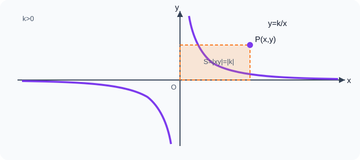

# 反比例函数

## 0. 一块面积不变的菜地

爷爷要用篱笆围出一块面积为 $24$ m² 的长方形菜地。若一边长是 $x$ m，另一边长就是 $y=\frac{24}{x}$ m。边长 $x$ 增大，$y$ 就减小；但无论长宽怎样变化，乘积 $xy$ 始终等于 $24$。

反比例函数像一架保持平衡的天平：一边变大，另一边按乘积不变的规则变化。它不是“差不多反着变”，而是有严格的数量关系 $xy=k$。



---

## 1. 知识地图

```text
乘积保持不变 xy=k
└─ 反比例函数 y=k/x（k≠0）
   ├─ 定义域：x≠0
   ├─ 图像：双曲线的两支
   ├─ k>0：第一、三象限；每一支上递减
   ├─ k<0：第二、四象限；每一支上递增
   ├─ 对称性：关于原点中心对称
   ├─ 待定系数：k=xy
   ├─ 面积模型：矩形 |k|，三角形 |k|/2
   └─ 实际应用：面积、路程、压力、效率
```

---

## 2. 定义与基本认识

### 2.1 定义

一般地，形如

$$y=\frac{k}{x}$$

的函数叫反比例函数，其中 $k$ 是常数，且 **$k\ne0$**。

它也可以写成 $xy=k$ 或 $y=kx^{-1}$，但不能写成 $y=kx$。

### 2.2 为什么必须有 $k\ne0$

若 $k=0$，则解析式写成 $y=\frac0x=0$（仍要求 $x\ne0$），图像只是缺少原点的 $x$ 轴，不具有反比例函数的双曲线特征。因此定义明确规定 $k\ne0$。

### 2.3 自变量和值域

因为分母不能为 $0$，所以定义域为

$$x\ne0.$$

又因为 $k\ne0$，$\frac{k}{x}$ 不可能等于 $0$，所以 $y\ne0$。图像与两坐标轴都没有交点。

> 图像可以无限接近坐标轴，但永远不会碰到坐标轴。

### 2.4 判断是否为反比例函数

要把式子化简后再判断。例如：

- $y=\frac{6}{x}$：是，$k=6$；
- $xy=-3$：是，可化为 $y=-\frac3x$；
- $y=\frac{2}{x+1}$：不是 $y$ 关于 $x$ 的基本反比例函数；
- $y=\frac{3x}{x^2}$：在 $x\ne0$ 时可化为 $y=\frac3x$，是；
- $y=\frac{k}{x}$：只有明确 $k\ne0$ 才能称为反比例函数。

---

## 3. 图像的画法

### 3.1 描点法

以 $y=\frac6x$ 为例：

1. 列表：选取 $x=\pm1,\pm2,\pm3,\pm6$；
2. 计算相应的 $y$；
3. 描点；
4. 用光滑曲线连接成两支；
5. 向两端延伸，但不与坐标轴相交。

取点时尽量让 $x$ 为 $k$ 的约数，便于得到整数坐标；正、负数都要取，不能只画一支。

### 3.2 图像为什么分成两支

定义域被 $x=0$ 分成 $x>0$ 与 $x<0$ 两部分，函数图像不能跨过 $y$ 轴连接，因此形成两条互不相连的曲线，统称双曲线。

---

## 4. 图像与性质

### 4.1 象限由 $k$ 的符号决定

由 $xy=k$：

- 当 $k>0$ 时，$x,y$ 同号，图像两支分别在第一、三象限；
- 当 $k<0$ 时，$x,y$ 异号，图像两支分别在第二、四象限。

### 4.2 增减性：必须说“在每一支上”

- 当 $k>0$ 时，在图像的**每一支上**，$y$ 随 $x$ 的增大而减小；
- 当 $k<0$ 时，在图像的**每一支上**，$y$ 随 $x$ 的增大而增大。

不能省略“每一支上”或“每个象限内”。

**证明：** 设 $x_1<x_2$，且 $x_1,x_2$ 在同一支上，即 $x_1x_2>0$。则

$$y_1-y_2=\frac{k}{x_1}-\frac{k}{x_2}=\frac{k(x_2-x_1)}{x_1x_2}.$$

因为 $x_2-x_1>0$ 且 $x_1x_2>0$，所以 $y_1-y_2$ 与 $k$ 同号。若 $k>0$，则 $y_1>y_2$；若 $k<0$，则 $y_1<y_2$。

若两点不在同一支，上述单调结论不能直接使用。例如在 $y=\frac1x$ 上，虽然 $-1<1$，却有 $f(-1)=-1<f(1)=1$，不能说函数值随 $x$ 增大一直减小，因为中间经过了没有定义的 $x=0$。

### 4.3 对称性

若点 $P(a,b)$ 在 $y=\frac{k}{x}$ 上，则 $ab=k$，点 $P'(-a,-b)$ 也满足 $(-a)(-b)=k$。所以图像关于原点中心对称。

此外，交换 $x,y$ 后方程 $xy=k$ 不变，所以图像关于直线 $y=x$ 对称。

**拓展：** 图像还关于直线 $y=-x$ 对称；坐标轴是它的渐近线。初中阶段可借助图像直观理解，不要求用极限证明。

### 4.4 $|k|$ 与图像位置

在同一象限、同一横坐标绝对值下，$|k|$ 越大，$|y|=\frac{|k|}{|x|}$ 越大，图像离坐标轴的“拐角区域”通常越远。比较时必须固定相同的 $x$，不能仅凭视觉判断。

---

## 5. 待定系数法

反比例函数只有一个待定系数 $k$。已知图像经过非坐标轴上的一点 $P(a,b)$，则

$$k=ab,$$

解析式为

$$y=\frac{ab}{x}.$$

步骤：

1. 设 $y=\frac{k}{x}$，注明 $k\ne0$；
2. 把点坐标代入；
3. 求 $k$；
4. 写解析式并检查。

若题目给出的点含参数，可利用“图像上每一点都满足 $xy=k$”列方程。

---

## 6. 面积模型

### 6.1 坐标轴矩形

点 $P(x,y)$ 在 $y=\frac{k}{x}$ 上，过 $P$ 分别作两坐标轴的垂线，与坐标轴围成矩形。其面积为

$$S_{\text{矩形}}=|x|\cdot|y|=|xy|=|k|.$$

无论点 $P$ 在同一双曲线上怎样移动，矩形面积不变。

### 6.2 坐标轴三角形

连接 $OP$，由 $P$ 向 $x$ 轴作垂线，得到直角三角形，其面积为

$$S_{\triangle}=\frac12|x|\cdot|y|=\frac{|k|}{2}.$$

### 6.3 面积模型的限制

- 面积一定非负，所以用 $|k|$；
- 面积只能先求出 $|k|$，$k$ 的正负还要根据点所在象限确定；
- 底和高必须分别对应 $|x|,|y|$，不要把斜边当高；
- 复杂图形常用割补法转化为若干个 $\frac{|k|}{2}$。

---

## 7. 与一次函数的联系

### 7.1 交点与方程

求 $y=ax+b$ 与 $y=\frac{k}{x}$ 的交点，可联立：

$$ax+b=\frac{k}{x}.$$

因为交点横坐标一定不为 $0$，两边乘 $x$ 得

$$ax^2+bx-k=0.$$

**拓展：** 该方程可能有两个、一个或没有实数解，对应两图像有两个、一个或没有交点。具体判断可结合一元二次方程知识。

### 7.2 比较函数值

在图像上，同一横坐标处位置更高的图像，函数值更大。由于反比例函数分两支，比较时要按交点和 $x=0$ 分区间讨论，不能把不连续的区间合并。

---

## 8. 实际应用模型

### 8.1 面积一定

长方形面积为 $S$，长 $x$ 与宽 $y$ 满足 $y=\frac Sx$，实际范围为 $x>0,y>0$，只使用第一象限分支。

### 8.2 路程一定

路程 $s$ 一定，速度 $v$ 与时间 $t$ 满足

$$t=\frac sv.$$

实际中 $v>0,t>0$。

### 8.3 工作总量一定

工作总量固定，效率 $p$ 与时间 $t$ 常满足 $pt=W$。多人合作时要先判断总效率是否为各自效率之和。

### 8.4 压力、压强模型

在压力 $F$ 一定时，压强 $p=\frac FS$，受力面积 $S$ 越大，压强越小。使用时注意单位统一。

---

## 9. 典型例题

### 例 1：定义与参数

函数 $y=(m-2)x^{m-3}$ 是反比例函数，求 $m$。

**解：** 反比例函数可写成 $y=kx^{-1}$，因此指数应满足

$$m-3=-1,$$

解得 $m=2$。但此时系数 $m-2=0$，不满足 $k\ne0$。

所以不存在符合条件的 $m$。

> 此题提醒：指数是 $-1$ 与系数非零必须同时满足。

### 例 2：待定系数与象限

反比例函数图像经过点 $A(-3,4)$。

（1）求解析式；（2）判断图像所在象限；（3）点 $B(6,-2)$ 是否在图像上？

**解：**

（1）$k=(-3)\times4=-12$，故

$$\boxed{y=-\frac{12}{x}}.$$

（2）因为 $k<0$，图像位于第二、四象限。

（3）$6\times(-2)=-12=k$，所以 $B$ 在图像上。

### 例 3：比较函数值

点 $A(-4,y_1),B(-2,y_2),C(3,y_3)$ 在 $y=\frac8x$ 上，比较 $y_1,y_2,y_3$。

**解：** $A,B$ 同在第三象限分支。因为 $k>0$，每一支上 $y$ 随 $x$ 增大而减小，且 $-4<-2$，所以 $y_1>y_2$。又 $y_3>0$，而 $y_1,y_2<0$。

因此

$$\boxed{y_3>y_1>y_2}.$$

也可直接算得 $y_1=-2,y_2=-4,y_3=\frac83$。

### 例 4：面积确定 $k$

点 $P$ 在反比例函数 $y=\frac{k}{x}$ 的第二象限分支上，过 $P$ 作两坐标轴的垂线，围成矩形面积为 $12$。求解析式。

**解：** 由面积模型得 $|k|=12$。点在第二象限，$x,y$ 异号，所以 $k<0$。

因此 $k=-12$，解析式为

$$\boxed{y=-\frac{12}{x}}.$$

### 例 5：三角形面积

点 $A(2,6)$ 在反比例函数图像上，过 $A$ 作 $AB\perp x$ 轴于 $B$，连接 $OA$。求函数解析式和 $\triangle AOB$ 的面积。

**解：** $k=2\times6=12$，故 $y=\frac{12}{x}$。

$$S_{\triangle AOB}=\frac12|2\times6|=6.$$

所以解析式为 $\boxed{y=\frac{12}{x}}$，面积为 $\boxed{6}$。

### 例 6：实际应用

一辆汽车要行驶 $240$ km。设平均速度为 $v$ km/h，所需时间为 $t$ h。

（1）写出 $t$ 关于 $v$ 的函数关系；（2）若要求不超过 $4$ h 到达，平均速度至少是多少？

**解：**

（1）由 $vt=240$ 得

$$t=\frac{240}{v},\qquad v>0.$$

（2）要求 $t\le4$，即 $\frac{240}{v}\le4$。因为 $v>0$，得 $240\le4v$，所以

$$\boxed{v\ge60}.$$

答：平均速度至少为 $60$ km/h。

### 例 7：一次函数与反比例函数综合

直线 $y=x+1$ 与双曲线 $y=\frac6x$ 相交，求交点坐标。

**解：** 联立得

$$x+1=\frac6x.$$

因 $x\ne0$，两边乘 $x$：

$$x^2+x-6=0.$$

因式分解得 $(x+3)(x-2)=0$，所以 $x=-3$ 或 $x=2$。

代入 $y=x+1$，得 $y=-2$ 或 $y=3$。

交点为

$$\boxed{(-3,-2),(2,3)}.$$

---

## 10. 易错点

1. **漏掉 $k\ne0$ 或 $x\ne0$。**
2. **把图像画成一条连续曲线。** 双曲线有两支，不能穿过坐标轴。
3. **写“$k>0$ 时在定义域上递减”。** 必须写“在每一支上”或分别在 $x<0,x>0$ 上。
4. **跨象限直接使用增减性。** 两点必须位于同一支。
5. **面积写成 $k$。** 面积是 $|k|$ 或 $\frac{|k|}{2}$。
6. **由面积直接确定 $k$ 的正负。** 还要看点或图像所在象限。
7. **认为图像与坐标轴相交。** 它只能无限接近坐标轴。
8. **实际问题照搬两支图像。** 长度、速度、时间通常只取正值。

---

## 11. 分层练习

### A 组：基础

1. 指出下列反比例函数的 $k$：$y=-\frac5x$，$xy=7$。
2. 反比例函数 $y=\frac{k}{x}$ 经过 $(2,-3)$，求 $k$。
3. $y=\frac{10}{x}$ 的图像位于哪些象限？在每一支上如何变化？
4. 点 $A(-2,6)$ 是否在 $y=-\frac{12}{x}$ 上？

### B 组：提高

5. 点 $A(1,y_1),B(4,y_2)$ 在 $y=-\frac8x$ 上，比较 $y_1,y_2$。
6. 双曲线上一点向两坐标轴作垂线，所得矩形面积为 $9$，且图像位于第一、三象限，求解析式。
7. 点 $P(-3,4)$ 向 $x$ 轴作垂线，垂足为 $H$，求 $\triangle POH$ 面积。
8. 已知 $y$ 与 $x$ 成反比例，且 $x=6$ 时 $y=-2$。求 $x=-4$ 时的 $y$。

### C 组：拓展

9. 求直线 $y=-x+5$ 与双曲线 $y=\frac6x$ 的交点。
10. 在第一象限双曲线 $y=\frac8x$ 上取点 $P(a,b)$，过 $P$ 作两轴垂线形成矩形。若矩形周长为 $12$，求 $P$ 的坐标。

### 答案

1. $-5$；$7$。
2. $k=-6$。
3. 第一、三象限；在每一支上 $y$ 随 $x$ 增大而减小。
4. 是，因为 $(-2)\times6=-12$。
5. 两点同在第四象限分支，函数在该支上递增，$1<4$，所以 $y_1<y_2$。
6. $|k|=9$ 且 $k>0$，所以 $y=\frac9x$。
7. $\frac12|xy|=\frac12\times12=6$。
8. $k=6\times(-2)=-12$，$y=\frac{-12}{-4}=3$。
9. 联立得 $-x+5=\frac6x$，即 $x^2-5x+6=0$，所以交点为 $(2,3),(3,2)$。
10. $ab=8$，且 $2(a+b)=12$，所以 $a+b=6$。解 $t^2-6t+8=0$ 得 $t=2$ 或 $4$，故 $P(2,4)$ 或 $P(4,2)$。

---

## 12. 总结

- 反比例函数的标准形式是 $y=\frac{k}{x}$，其中 $k\ne0,x\ne0$。
- $k$ 的符号决定象限；增减性必须限定在“每一支上”。
- 图像关于原点中心对称，不与坐标轴相交。
- 图像上一点满足 $xy=k$，这是待定系数与面积模型的共同核心。
- 坐标轴矩形面积为 $|k|$，相应直角三角形面积为 $\frac{|k|}{2}$。
- 实际应用中要根据意义限制定义域，通常只取第一象限的一段。

---

## 13. 参考资源

以下链接均为可公开访问的学习入口，页面内容和开放状态可能随平台调整。

### 网站

- [国家中小学智慧教育平台](https://basic.smartedu.cn/)：教育部主办，可在站内搜索“反比例函数”。
- [基础教育精品课](https://jpk.basic.smartedu.cn/)：可检索相关微课和学习任务单。
- [GeoGebra：描点法画反比例函数图像](https://www.geogebra.org/m/hpvds54j)：可交互观察描点过程。
- [教师之家：反比例函数图像和性质的应用](https://www.renjiaoshe.com/kewen/5019.html)：包含知识要点与教学资源索引。

### 视频

- [苏科版八下 11.1 反比例函数教学视频（教师之家）](https://www.renjiaoshe.com/sp/100612.html)。
- [苏科版八下 11.1 反比例函数优质课视频（教视网）](https://www.sp910.com/shipin/shuxue/8nj/123286.html)：页面同时列出 11.2 图像与性质、11.3 实际应用的相关课例。
