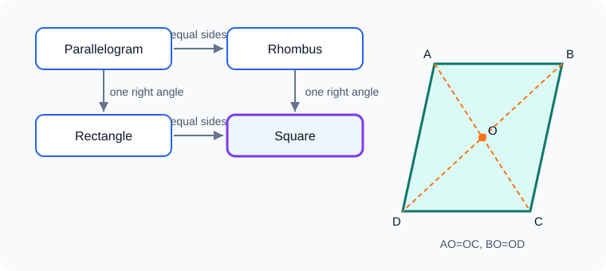

# 四边形

## 0. 从活动衣架说起

把四根木条首尾用螺钉连接，做成一个活动衣架。轻轻一推，四条边长度没有改变，形状却能从“斜斜的平行四边形”变成矩形；若再加一根对角撑杆，衣架便稳定下来。

这个小装置藏着四边形的两条主线：一条是“边与角怎样决定形状”，另一条是“对角线怎样锁定结构”。平行四边形、矩形、菱形、正方形，正是沿着这两条线逐步增加条件形成的特殊家族。



---

## 1. 知识地图

```text
多边形
├─ 内角和：(n-2)×180°
├─ 外角和：360°
└─ 四边形
   ├─ 任意四边形
   │  └─ 各边中点 → 中点四边形
   └─ 平行四边形
      ├─ 性质：对边、对角、对角线
      ├─ 判定：边、角、对角线
      ├─ 矩形：增加一个直角
      ├─ 菱形：增加一组邻边相等
      └─ 正方形：同时具有矩形、菱形特征
```

---

## 2. 多边形的内角与外角

### 2.1 基本概念

在平面内，由一些不在同一直线上的线段首尾顺次相接组成的封闭图形叫多边形。本章讨论简单多边形：相邻边只交于公共端点，非相邻边互不相交，从而排除“蝴蝶结”式自交折线。各线段叫边，相邻两边的公共端点叫顶点，相邻两边所成的角叫内角。

连接不相邻两个顶点的线段叫对角线。$n$ 边形从一个顶点可引出 $n-3$ 条对角线，共有

$$\frac{n(n-3)}2$$

条对角线。

### 2.2 内角和

凸 $n$ 边形内角和为

$$\boxed{(n-2)\times180^\circ}.$$

**证明：** 从一个顶点向所有不相邻顶点作对角线，可把凸 $n$ 边形分成 $n-2$ 个互不重叠的三角形。每个三角形内角和为 $180^\circ$，所以结论成立。

四边形内角和为 $360^\circ$。

### 2.3 外角和

在每个顶点取一个外角，并且绕多边形按同一方向行进，凸多边形外角和为

$$\boxed{360^\circ}.$$

**证明：** 每个内角与相邻外角互补，$n$ 个内外角总和为 $n\times180^\circ$。减去内角和：

$$n\times180^\circ-(n-2)\times180^\circ=360^\circ.$$

### 2.4 正多边形

各边相等、各角也相等的多边形叫正多边形。正 $n$ 边形每个内角为

$$\frac{(n-2)\times180^\circ}{n},$$

每个外角为

$$\frac{360^\circ}{n}.$$

仅“各边相等”或仅“各角相等”通常都不足以说明是正多边形。

---

## 3. 平行四边形

### 3.1 定义

两组对边分别平行的四边形叫平行四边形，记作“$\square ABCD$”。

定义本身也是一种判定：若 $AB\parallel CD$ 且 $AD\parallel BC$，则四边形 $ABCD$ 是平行四边形。

### 3.2 性质

平行四边形具有：

1. 两组对边分别平行且相等；
2. 两组对角分别相等；
3. 邻角互补；
4. 对角线互相平分。

**对边、对角性质证明：** 连接 $AC$。由 $AB\parallel CD,AD\parallel BC$ 得

$$\angle BAC=\angle DCA,\qquad \angle BCA=\angle DAC.$$

又 $AC$ 为公共边，所以 $\triangle ABC\cong\triangle CDA$（ASA）。由全等可得 $AB=CD,BC=AD,\angle B=\angle D$，再结合平行线可得 $\angle A=\angle C$。

**对角线互相平分证明：** 设 $AC,BD$ 交于 $O$。由 $AB\parallel CD$ 得 $\angle ABO=\angle CDO,\angle BAO=\angle DCO$，又 $AB=CD$，所以 $\triangle AOB\cong\triangle COD$（ASA），故

$$AO=CO,\qquad BO=DO.$$

### 3.3 判定

一个四边形是平行四边形，常用下列方法：

1. 两组对边分别平行；
2. 两组对边分别相等；
3. 一组对边平行且相等；
4. 两组对角分别相等；
5. 对角线互相平分。

**“两组对边分别相等”证明：** 四边形 $ABCD$ 中，若 $AB=CD,BC=AD$，连接 $AC$。因 $AC$ 公共，$\triangle ABC\cong\triangle CDA$（SSS），得到两组内错角相等，从而 $AB\parallel CD,BC\parallel AD$。

**“一组对边平行且相等”证明：** 若 $AB\parallel CD$ 且 $AB=CD$，连接 $AC$。由平行得到一组内错角相等，结合 $AC$ 公共，可证 $\triangle BAC\cong\triangle DCA$（SAS），进而得到另一组内错角相等，所以 $AD\parallel BC$。

### 3.4 面积

平行四边形面积为

$$S=底\times高.$$

同底等高的平行四边形面积相等；同底等高的三角形面积等于相应平行四边形面积的一半。

---

## 4. 矩形

### 4.1 定义

有一个角是直角的平行四边形叫矩形。

### 4.2 性质

矩形除具有平行四边形全部性质外，还有：

1. 四个角都是直角；
2. 对角线相等且互相平分。

**四角为直角证明：** 平行四边形邻角互补、对角相等。已有一个角为 $90^\circ$，其邻角也为 $90^\circ$，对角再由相等得到 $90^\circ$。

**对角线相等证明：** 在矩形 $ABCD$ 中，比较 $\triangle ABC$ 与 $\triangle BAD$：

$$AB=BA,\quad BC=AD,\quad \angle ABC=\angle BAD=90^\circ.$$

由 SAS 得两三角形全等，所以 $AC=BD$。

### 4.3 判定

1. 有一个角是直角的平行四边形是矩形；
2. 有三个角是直角的四边形是矩形；
3. 对角线相等的平行四边形是矩形；
4. 对角线相等且互相平分的四边形是矩形。

> 只说“对角线相等”不够，等腰梯形的对角线也可以相等。

**“对角线相等的平行四边形”证明：** 在平行四边形 $ABCD$ 中，若 $AC=BD$，又 $BC=AD,AB$ 公共，则 $\triangle ABC\cong\triangle BAD$（SSS），所以 $\angle ABC=\angle BAD$。两角又互补，故都为 $90^\circ$。

### 4.4 直角三角形斜边中线

矩形对角线互相平分且相等，可推出：直角三角形斜边中线等于斜边的一半。

**证明：** 将直角三角形补成矩形，斜边中点也是矩形两条对角线的交点，因此到三个顶点距离都等于斜边的一半。

反过来，若三角形一边上的中线等于该边的一半，则该三角形是直角三角形。

---

## 5. 菱形

### 5.1 定义

有一组邻边相等的平行四边形叫菱形。

### 5.2 性质

菱形除具有平行四边形全部性质外，还有：

1. 四条边都相等；
2. 两条对角线互相垂直；
3. 每条对角线平分一组对角。

**证明：** 在菱形 $ABCD$ 中，对角线交于 $O$。平行四边形对角线互相平分，所以 $BO=DO$。又 $AB=AD,AO$ 公共，因此 $\triangle AOB\cong\triangle AOD$（SSS）。故 $\angle BAO=\angle DAO$，且 $\angle AOB=\angle AOD$。后两角互补又相等，所以均为 $90^\circ$。另一条对角线平分另一组对角同理。

### 5.3 判定

1. 有一组邻边相等的平行四边形是菱形；
2. 四条边相等的四边形是菱形；
3. 对角线互相垂直的平行四边形是菱形；
4. 对角线互相垂直且互相平分的四边形是菱形。

> 只说“对角线垂直”不够，普通风筝形也可能满足。

**“对角线互相垂直的平行四边形”证明：** 设对角线交于 $O$，则 $BO=DO$ 且 $AO\perp BD$。在直角三角形 $AOB,AOD$ 中，$AO$ 公共、$BO=DO$，故全等，得到 $AB=AD$，所以该平行四边形为菱形。

### 5.4 面积

菱形既可用“底乘高”，也可用对角线：

$$S=\frac12d_1d_2.$$

因为两条对角线垂直且互相平分，把菱形分成四个直角三角形，面积相加即可证明。

---

## 6. 正方形

### 6.1 定义与关系

有一组邻边相等且有一个角是直角的平行四边形叫正方形。

正方形既是矩形，又是菱形，所以兼有二者全部性质：

- 四条边相等；
- 四个角都是直角；
- 对角线相等、互相垂直、互相平分；
- 每条对角线平分一组对角。

### 6.2 判定

常用路径：

1. 平行四边形 + 一个直角 + 一组邻边相等；
2. 矩形 + 一组邻边相等；
3. 矩形 + 对角线互相垂直；
4. 菱形 + 一个直角；
5. 菱形 + 对角线相等。

判定时最好写清“先判成什么，再加哪个条件”。例如：

$$对角线互相平分\Rightarrow平行四边形,$$

$$再有对角线相等\Rightarrow矩形,$$

$$再有对角线垂直\Rightarrow正方形.$$

---

## 7. 特殊四边形的从属与判定路线

```text
四边形
└─ 两组对边分别平行 → 平行四边形
   ├─ 一个角为直角 → 矩形
   ├─ 一组邻边相等 → 菱形
   └─ 同时满足上述两项 → 正方形
```

性质是从特殊推一般结论，判定是从条件推图形名称。不能把性质倒过来直接使用，除非该逆命题已被证明为判定定理。

### 对角线速查

| 图形 | 互相平分 | 相等 | 垂直 | 平分对角 |
| --- | --- | --- | --- | --- |
| 平行四边形 | 是 | 不一定 | 不一定 | 不一定 |
| 矩形 | 是 | 是 | 不一定 | 不一定 |
| 菱形 | 是 | 不一定 | 是 | 是 |
| 正方形 | 是 | 是 | 是 | 是 |

---

## 8. 中点四边形

### 8.1 基本模型

顺次连接任意四边形各边中点所得的四边形，叫原四边形的中点四边形。

设四边形 $ABCD$ 的边 $AB,BC,CD,DA$ 中点分别为 $E,F,G,H$。连接 $AC,BD$。

在 $\triangle ABC$ 中，由三角形中位线定理：

$$EF\parallel AC,\qquad EF=\frac12AC.$$

在 $\triangle CDA$ 中：

$$HG\parallel AC,\qquad HG=\frac12AC.$$

所以 $EF\parallel HG$ 且 $EF=HG$，故 $EFGH$ 是平行四边形。

这就是**中点四边形定理**：任意四边形的中点四边形都是平行四边形。

### 8.2 由原四边形对角线决定类型

中点四边形的两组邻边分别平行于原四边形的两条对角线，长度分别为原对角线的一半。因此：

- 原四边形对角线相等 $\Rightarrow$ 中点四边形是菱形；
- 原四边形对角线垂直 $\Rightarrow$ 中点四边形是矩形；
- 原四边形对角线相等且垂直 $\Rightarrow$ 中点四边形是正方形。

注意这组结论容易记反：**原对角线相等，对应中点四边形邻边相等，是菱形；原对角线垂直，对应中点四边形邻边垂直，是矩形。**

### 8.3 面积关系

**拓展：** 任意凸四边形的中点四边形面积等于原四边形面积的一半。可用对角线分割和同底等高三角形证明。若处理凹四边形，需要统一使用有向面积或另行分割。

---

## 9. 常用模型与辅助线

### 9.1 对角线模型

平行四边形中见到边、角关系，常连接对角线，把问题化成全等三角形；见到对角线交点，就优先使用“互相平分”。

### 9.2 倍长中线模型

三角形中出现中点，可把中线延长一倍，利用“对角线互相平分”构造平行四边形，从而转移线段和角。

### 9.3 补形模型

直角三角形可补成矩形；一组平行线间的线段可补成平行四边形。补形后利用对边相等、对角线性质。

### 9.4 四点共线中的平行四边形

若需要证明四边形是平行四边形，优先寻找：

- 一组对边平行且相等；
- 对角线交于同一点且被该点平分。

坐标题中，“两条对角线中点相同”尤其高效。

### 9.5 折叠与旋转

折叠产生轴对称，对应线段相等、对应角相等；旋转产生等长和等角。再结合平行四边形或特殊四边形判定。

---

## 10. 典型例题

### 例 1：多边形角度

一个正多边形的每个外角为 $24^\circ$，求边数和每个内角。

**解：** 正多边形外角和为 $360^\circ$，所以边数

$$n=\frac{360^\circ}{24^\circ}=15.$$

每个内角为

$$180^\circ-24^\circ=156^\circ.$$

答：这是正十五边形，每个内角为 $156^\circ$。

### 例 2：平行四边形判定

四边形 $ABCD$ 中，$AB\parallel CD$，且 $AB=CD$。证明四边形 $ABCD$ 是平行四边形。

**证明：** 连接 $AC$。因为 $AB\parallel CD$，所以 $\angle BAC=\angle DCA$。又 $AB=CD,AC=CA$，故 $\triangle BAC\cong\triangle DCA$（SAS）。所以 $\angle BCA=\angle DAC$，从而 $BC\parallel AD$。两组对边分别平行，因此 $ABCD$ 是平行四边形。

### 例 3：矩形折叠式计算

矩形 $ABCD$ 的对角线交于 $O$，$AC=10$，$\angle AOD=60^\circ$，求 $AD$。

**解：** 矩形对角线相等且互相平分，所以

$$OA=OD=\frac{10}{2}=5.$$

在 $\triangle AOD$ 中，$OA=OD$ 且夹角为 $60^\circ$，所以它是等边三角形。

因此

$$\boxed{AD=5}.$$

### 例 4：菱形面积

菱形两条对角线长分别为 $12$ 和 $16$，求周长和面积。

**解：** 对角线互相垂直平分，半对角线长为 $6,8$。由勾股定理，边长

$$a=\sqrt{6^2+8^2}=10.$$

周长为 $4a=40$，面积为

$$S=\frac12\times12\times16=96.$$

答：周长为 $\boxed{40}$，面积为 $\boxed{96}$。

### 例 5：判定正方形

四边形 $ABCD$ 的对角线 $AC,BD$ 相交于 $O$，且 $AO=CO,BO=DO,AC=BD,AC\perp BD$。证明 $ABCD$ 是正方形。

**证明：** 因为 $AO=CO,BO=DO$，即对角线互相平分，所以 $ABCD$ 是平行四边形。又 $AC=BD$，所以它是矩形；再由 $AC\perp BD$，所以它又是菱形。既是矩形又是菱形的四边形是正方形。

### 例 6：中点四边形

四边形 $ABCD$ 的对角线 $AC=10,BD=6$，且 $AC\perp BD$。顺次连接四边中点得到 $EFGH$。求 $EFGH$ 的周长并判断形状。

**解：** 中点四边形的边分别等于原四边形两条对角线的一半，所以

$$EF=GH=\frac12AC=5,$$

$$FG=HE=\frac12BD=3.$$

周长为 $2(5+3)=16$。又相邻边分别平行于 $AC,BD$，而 $AC\perp BD$，所以中点四边形有一个直角。它本来是平行四边形，因此是矩形。

答：周长为 $\boxed{16}$，形状为矩形。

### 例 7：坐标中的平行四边形

已知 $A(1,2),B(5,2),C(7,6)$，若以 $A,B,C,D$ 为顺序构成平行四边形，求 $D$。

**解：** 平行四边形对角线互相平分，所以 $AC$ 与 $BD$ 中点相同。设 $D(x,y)$，则

$$\left(\frac{1+7}{2},\frac{2+6}{2}\right)=\left(\frac{5+x}{2},\frac{2+y}{2}\right).$$

于是 $5+x=8,2+y=8$，得 $x=3,y=6$。

所以

$$\boxed{D(3,6)}.$$

---

## 11. 易错点

1. **把“四边形内角和”套到任意自交图形。** 本章讨论普通简单多边形。
2. **外角选取方向不一致。** 绕图形同向取每个顶点的一个外角，和才是 $360^\circ$。
3. **一组对边平行就判平行四边形。** 还需要另一组平行，或这一组同时相等。
4. **对角线相等就判矩形。** 还要先有平行四边形等条件。
5. **对角线垂直就判菱形。** 还要先有平行四边形等条件。
6. **性质与判定倒用。** 每次都要检查逆命题是不是已知判定定理。
7. **混淆中点四边形结论。** 原对角线相等对应菱形，垂直对应矩形。
8. **菱形面积忘记 $\frac12$。**
9. **正方形只证明成矩形。** 还须补足邻边相等或对角线垂直等条件。

---

## 12. 分层练习

### A 组：基础

1. 求十二边形的内角和。
2. 正九边形每个外角是多少？
3. 平行四边形中一个角为 $68^\circ$，求其余三个角。
4. 矩形对角线长为 $14$，求对角线交点到各顶点的距离。
5. 菱形两条对角线长为 $6,8$，求面积。

### B 组：提高

6. 四边形两组对边分别相等，证明它是平行四边形。
7. 平行四边形两条对角线相等，证明它是矩形。
8. 菱形边长为 $13$，一条对角线长为 $10$，求另一条对角线。
9. 任意四边形两条对角线长分别为 $a,b$，求其中点四边形周长。

### C 组：拓展

10. 四边形 $ABCD$ 各边中点依次为 $E,F,G,H$。若 $EFGH$ 是正方形，原四边形两条对角线具有什么关系？
11. 矩形 $ABCD$ 中，$AB=8,BC=6$，点 $E$ 为 $AB$ 中点，求 $\triangle CDE$ 的面积。
12. 已知 $A(0,0),B(4,0),C(6,3)$。求所有使 $A,B,C,D$ 四点能组成平行四边形的点 $D$（不限定顶点顺序）。

### 答案

1. $(12-2)\times180^\circ=1800^\circ$。
2. $40^\circ$。
3. $112^\circ,68^\circ,112^\circ$。
4. 都是 $7$。
5. $\frac12\times6\times8=24$。
6. 连接一条对角线，用 SSS 证两三角形全等，得到两组内错角相等，从而两组对边分别平行。
7. 比较以公共边为一边、两条对角线为对应边的两个三角形，用 SSS 证全等，得到一组相邻角相等；它们又互补，所以均为直角。
8. 半对角线为 $5$，另一条半对角线为 $\sqrt{13^2-5^2}=12$，故另一条对角线为 $24$。
9. 两组边长分别为 $\frac a2,\frac b2$，周长为 $a+b$。
10. 相等且互相垂直。
11. 以 $CD=8$ 为底，点 $E$ 到 $CD$ 的高为 $6$，面积为 $\frac12\times8\times6=24$。
12. 把三个已知点分别作为平行四边形两条邻边的公共顶点，可得 $D_1=B+C-A=(10,3)$，$D_2=A+C-B=(2,3)$，$D_3=A+B-C=(-2,-3)$。

---

## 13. 总结

- 凸 $n$ 边形内角和为 $(n-2)\times180^\circ$，外角和恒为 $360^\circ$。
- 平行四边形是核心母体：对边平行且相等、对角相等、对角线互相平分。
- 矩形突出“直角与对角线相等”，菱形突出“等边与对角线垂直”，正方形兼有二者性质。
- 判定题应采用“先判平行四边形，再增加条件”的清晰路线。
- 任意四边形的中点四边形都是平行四边形，其形状由原四边形两条对角线的相等、垂直关系决定。

---

## 14. 参考资源

以下链接均为可公开访问的学习入口，页面内容和开放状态可能随平台调整。

### 网站

- [国家中小学智慧教育平台](https://basic.smartedu.cn/)：教育部主办，可检索“平行四边形”“矩形、菱形、正方形”。
- [基础教育精品课](https://jpk.basic.smartedu.cn/)：提供公开微课、教学设计及学习任务单入口。
- [温州数字教育资源网：多边形的概念](https://tv.wzer.net/v-cplay1-12-158454.htm?flag_tab=video-card)：浙教版“多边形（一）”，用于补充多边形的基本概念；教材编排与苏科版不同。

### 视频

- [苏科版八下《正方形》教学视频（教师之家）](https://www.renjiaoshe.com/sp/100676.html)：含正方形定义、性质和判定。
- [哔哩哔哩检索：苏科版 平行四边形与特殊四边形](https://search.bilibili.com/all?keyword=%E8%8B%8F%E7%A7%91%E7%89%88%20%E5%B9%B3%E8%A1%8C%E5%9B%9B%E8%BE%B9%E5%BD%A2%20%E7%89%B9%E6%AE%8A%E5%9B%9B%E8%BE%B9%E5%BD%A2)：可按基础性质、判定和存在性问题筛选公开视频。
