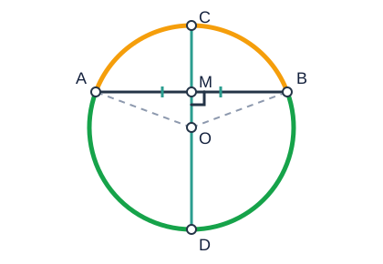
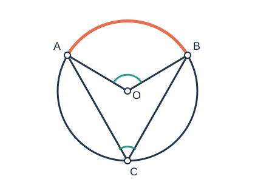

# 圆基础

> 一枚硬币沿直线滚动时，圆心始终保持同样的高度；车轮转过相同的圆心角，轮缘就走过相同的弧长。圆把“距离相等”“旋转对称”和“角度关系”统一在一张图里。本章从定义出发，建立苏科版初中阶段研究圆的基本工具。

## 1. 知识地图

```text
圆的定义
├─ 元素：圆心、半径、直径、弦、弧、半圆
├─ 对称性：轴对称、中心对称、旋转不变
├─ 圆心角—弧—弦
│  └─ 垂径定理：半弦—弦心距—半径
├─ 圆的确定
│  └─ 三角形外接圆与外心
├─ 圆周角
│  ├─ 同弧所对圆周角
│  ├─ 直径所对圆周角
│  └─ 圆内接四边形
└─ 与圆有关的计算
   ├─ 圆周长、圆面积
   ├─ 弧长、扇形面积
   └─ 圆锥侧面展开
```

本章中的“同圆”指同一个圆；“等圆”指半径相等的圆。圆与点、直线、圆的位置关系集中在[《圆的位置关系》](圆的位置关系.md)。

---

## 2. 圆及其基本元素

### 2.1 圆的定义

在同一平面内，到定点 $O$ 的距离等于定长 $r$ 的所有点组成的图形叫做圆，记作 $\odot O$。定点 $O$ 叫圆心，定长 $r$ 叫半径。

若点 $P$ 在 $\odot O$ 上，则

$$OP=r.$$

注意：圆是“一条封闭曲线”，不是曲线围成的圆面。

### 2.2 弦、直径、弧

- **弦**：连接圆上任意两点的线段。
- **直径**：经过圆心的弦。直径是最长的弦，长为 $2r$。
- **弧**：圆上任意两点之间的一段曲线。小于半圆的叫劣弧，大于半圆的叫优弧。
- **半圆**：直径两端点把圆分成的每一条弧。
- **等弧**：在同圆或等圆中，能够互相重合的弧。

“弦是直径”不一定成立；“直径是弦”一定成立。只说两条弧“长度相等”还不能直接称为等弧，因为它们可能来自半径不同的圆。

### 2.3 圆的对称性

圆是轴对称图形，任意一条直径所在直线都是对称轴；圆也是中心对称图形，圆心是对称中心。圆绕圆心旋转任意角度后都与自身重合。

这些对称性是“等圆心角、等弧、等弦”相互转化的根本原因。

---

## 3. 圆心角、弧与弦

顶点在圆心的角叫圆心角。

### 3.1 基本定理

在同圆或等圆中，下面三种条件可以互相推出：

1. 两个圆心角相等；
2. 两个圆心角所对的弧相等；
3. 两个圆心角所对的弦相等。

例如，在 $\odot O$ 中，

$$\angle AOB=\angle COD\Longleftrightarrow \widehat{AB}=\widehat{CD}\Longleftrightarrow AB=CD.$$

这里的 $\widehat{AB}$、$\widehat{CD}$ 必须是相应圆心角所对的弧。

### 3.2 证明思路

若 $\angle AOB=\angle COD$，则 $OA=OB=OC=OD$。由边角边可得

$$\triangle AOB\cong\triangle COD,$$

所以 $AB=CD$。圆绕圆心旋转时保持不变，相等的圆心角可把一段弧重合到另一段弧，故两弧相等。其余方向可由全等三角形或反证法得到。

### 3.3 弦到圆心距离

从圆心向弦作垂线，垂线段的长叫这条弦的弦心距。半径相同的圆中：

- 等弦的弦心距相等；
- 弦心距相等的弦相等；
- 离圆心越近，弦越长。

---

## 4. 垂径定理



### 4.1 定理及逆定理

**垂径定理：** 垂直于弦的直径平分这条弦，并且平分弦所对的两条弧。

在 $\odot O$ 中，若直径所在直线 $OM\perp AB$，则

$$AM=BM,\qquad \widehat{AC}=\widehat{BC},\qquad \widehat{AD}=\widehat{BD},$$

其中 $C,D$ 是该直径的两个端点。

**常用逆定理：** 平分弦（不是直径）的直径垂直于这条弦，并且平分弦所对的两条弧。

“不是直径”不能漏掉：若弦本身就是直径，另一条直径经过它的中点，却未必与它垂直。

### 4.2 证明

连接 $OA,OB$。在直角三角形 $\triangle OMA$ 与 $\triangle OMB$ 中，

$$OA=OB,\qquad OM=OM.$$

由斜边、直角边分别相等，得

$$\triangle OMA\cong\triangle OMB,$$

所以 $AM=BM$，并有 $\angle AOM=\angle MOB$。设直径端点 $C$ 在射线 $OM$ 上，则相等圆心角所对的弧相等，故 $\widehat{AC}=\widehat{BC}$；另一端点 $D$ 在反向射线上，同理可得 $\widehat{AD}=\widehat{BD}$。因此直径同时平分弦及弦所对的两条弧。

### 4.3 核心计算模型

设圆半径为 $r$，弦长为 $a$，弦心距为 $d$。过圆心作弦的垂线后，由勾股定理：

$$r^2=d^2+\left(\frac a2\right)^2.$$

这是桥拱、水管、圆形容器液面等问题的统一模型。

**拱高模型：** 若弦长为 $a$，小弓形的高为 $h$，则弦心距为 $r-h$，于是

$$r^2=(r-h)^2+\left(\frac a2\right)^2,$$

整理得

$$r=\frac{a^2}{8h}+\frac h2.$$

---

## 5. 圆的确定与三角形外接圆

### 5.1 为什么三点能确定圆

- 一个点可以有无数个圆经过；
- 两个点也可以有无数个圆经过，圆心都在两点连线的垂直平分线上；
- **不在同一直线上的三个点确定一个圆。**

### 5.2 作法与证明

给定不共线的点 $A,B,C$：

1. 作线段 $AB$ 的垂直平分线；
2. 作线段 $AC$ 的垂直平分线；
3. 两线交于 $O$，以 $O$ 为圆心、$OA$ 为半径作圆。

因为垂直平分线上的点到线段两端距离相等，

$$OA=OB,\qquad OA=OC,$$

所以 $A,B,C$ 在同一个圆上。两条相交直线只有一个交点，因此这个圆唯一。

### 5.3 外接圆与外心

经过三角形三个顶点的圆叫三角形的外接圆，圆心叫外心。外心是三边垂直平分线的交点：

- 锐角三角形：外心在三角形内部；
- 直角三角形：外心是斜边中点；
- 钝角三角形：外心在三角形外部。

直角三角形斜边是外接圆直径，因此外接圆半径等于斜边的一半。

---

## 6. 圆周角定理



### 6.1 圆周角的定义

顶点在圆上，并且两边都与圆相交的角叫圆周角。两个条件缺一不可。

图中 $A,B,C$ 在同一圆上，$\angle ACB$ 的两边分别交圆于 $A,B$，所以它是弧 $\widehat{AB}$ 所对的圆周角。

### 6.2 定理及适用条件

**圆周角定理：** 一条弧所对的圆周角等于它所对圆心角的一半。

$$\angle ACB=\frac12\angle AOB.$$

适用时必须核对：

1. 圆周角顶点 $C$ 在圆上；
2. 圆周角两边分别经过弧的两个端点 $A,B$；
3. 所比较的圆心角和圆周角对应同一条弧。

由此得到：

- 同弧或等弧所对的圆周角相等；
- 直径所对的圆周角是直角；
- $90^\circ$ 的圆周角所对的弦是直径。

“同弦所对的圆周角相等”必须补充位置条件：两个顶点在弦的同一侧时，两角相等；在弦的两侧时，两角互补。更稳妥的表述是“同弧所对的圆周角相等”。

### 6.3 定理证明

连接 $OC$。当圆心 $O$ 在圆周角的一边上时，设 $\angle ACO=\alpha$。因为 $OA=OC$，

$$\angle OAC=\angle ACO=\alpha.$$

由三角形外角定理，

$$\angle AOB=2\alpha=2\angle ACB.$$

圆心在圆周角内部或外部时，可过 $C$ 作直径，把原角拆成两个上述基本情形，再分别相加或相减，仍得圆周角是同弧所对圆心角的一半。

### 6.4 圆内接四边形

四个顶点都在同一圆上的四边形叫圆内接四边形。它的对角互补：

$$\angle A+\angle C=180^\circ,\qquad \angle B+\angle D=180^\circ.$$

证明：$\angle A$ 与 $\angle C$ 分别对应两条合起来为整圆的弧，所以二者之和是 $360^\circ$ 的一半。

圆内接四边形的一个外角等于它的内对角。

---

## 7. 与圆有关的计算

### 7.1 圆周长和圆面积

半径为 $r$ 的圆：

$$C=2\pi r,\qquad S=\pi r^2.$$

### 7.2 弧长与扇形面积

半径为 $r$、圆心角为 $n^\circ$ 的弧长：

$$l=\frac{n\pi r}{180}.$$

对应扇形面积：

$$S_{\text{扇形}}=\frac{n\pi r^2}{360}=\frac12lr.$$

公式中的 $n$ 是圆心角的度数，不是圆周角的度数。

### 7.3 弓形面积

小弓形通常用“扇形减三角形”：

$$S_{\text{弓形}}=S_{\text{扇形 }AOB}-S_{\triangle AOB}.$$

大弓形则用圆面积减去小弓形面积。

### 7.4 圆锥侧面展开

圆锥侧面展开是扇形。若底面半径为 $r$，母线长为 $l$，则：

$$S_{\text{侧}}=\pi rl,$$

$$S_{\text{全}}=\pi rl+\pi r^2.$$

展开扇形的半径等于母线 $l$，弧长等于底面圆周长 $2\pi r$。若展开扇形圆心角为 $n^\circ$，则

$$\frac{n\pi l}{180}=2\pi r.$$

---

## 8. 常用模型与解法

### 8.1 半径—半弦—弦心距

看到弦长、半径、弦心距中的两个量，立即过圆心作弦的垂线，把问题化为直角三角形。

### 8.2 见直径，想直角

图中有直径和圆周上的第三点时，优先连接直径两端与该点，得到直角三角形。

### 8.3 见圆周角，追同弧

先在角的两边上找到弧端点，再寻找同一条弧对应的圆心角或其他圆周角。不要只凭图形看起来相等。

### 8.4 破镜重圆

圆弧残片上取三个不共线点，作两条弦的垂直平分线，交点就是原圆圆心。

### 8.5 固定弦上的面积最值【拓展】

弦 $BC$ 固定，点 $A$ 在某一段弧上运动：

$$S_{\triangle ABC}=\frac12BC\cdot h.$$

面积最大等价于点 $A$ 到直线 $BC$ 的距离最大，通常在相应弧的中点取得。此结论使用前要确认动点所在弧和允许的端点范围。

---

## 9. 代表例题

### 例 1：桥拱半径

一座圆弧形桥拱的弦长为 $24\text{ m}$，拱高为 $8\text{ m}$，求桥拱所在圆的半径。

**解：** 设圆心为 $O$，弦中点为 $M$，拱顶为 $N$，半径为 $r$。由垂径定理，

$$AM=12,\qquad OM=r-8.$$

在直角三角形 $\triangle OMA$ 中，

$$r^2=12^2+(r-8)^2.$$

展开并整理：

$$16r=208,$$

所以

$$r=13.$$

答：桥拱所在圆的半径为 $13\text{ m}$。

### 例 2：圆周角与弦长

在半径为 $4$ 的 $\odot O$ 中，点 $A,B,C$ 在圆上，点 $C$ 位于优弧 $\widehat{AB}$ 上，且 $\angle ACB=30^\circ$。求弦 $AB$ 的长。

**解：** $\angle ACB$ 与 $\angle AOB$ 对应同一条劣弧 $\widehat{AB}$，所以

$$\angle AOB=2\angle ACB=60^\circ.$$

又 $OA=OB=4$，故 $\triangle AOB$ 是等边三角形，于是

$$AB=4.$$

### 例 3：内接四边形

四边形 $ABCD$ 内接于圆，$\angle A=72^\circ$，$BC$ 延长到 $E$。求 $\angle DCE$。

**解：** 圆内接四边形对角互补，

$$\angle BCD=180^\circ-72^\circ=108^\circ.$$

$\angle DCE$ 与 $\angle BCD$ 是邻补角，所以

$$\angle DCE=180^\circ-108^\circ=72^\circ.$$

也可直接使用“内接四边形外角等于内对角”。

### 例 4：扇形与圆锥

用半径为 $12\text{ cm}$、圆心角为 $120^\circ$ 的扇形围成圆锥侧面，求圆锥底面半径。

**解：** 扇形弧长为

$$l=\frac{120\pi\cdot12}{180}=8\pi.$$

设圆锥底面半径为 $r$，由底面周长等于扇形弧长，

$$2\pi r=8\pi,$$

所以

$$r=4.$$

答：底面半径为 $4\text{ cm}$。

---

## 10. 易错辨析

1. **“过任意三点都能作圆。”** 错。三点必须不共线。
2. **“长度相等的弧就是等弧。”** 不严谨。等弧的比较限定在同圆或等圆中。
3. **“垂直于弦的线必平分弦。”** 错。该垂线还必须经过圆心。
4. **“平分弦的直径一定垂直弦。”** 当该弦也是直径时不成立；逆定理需排除直径。
5. **“同弦所对圆周角总相等。”** 错。顶点在弦两侧时两角互补；应核对是否对应同一条弧。
6. **“顶点在圆上的角就是圆周角。”** 错。角的两边还要与圆相交。
7. **“扇形圆心角是 $60^\circ$，就把 $60$ 当半径。”** 错。公式中的角度和半径是不同量。
8. **“圆锥侧面展开扇形的半径是圆锥底面半径。”** 错。展开扇形的半径是圆锥母线。

---

## 11. 分层练习

### A 组：基础

1. 半径为 $5$ 的圆中，最长弦长是多少？
2. 圆心到弦 $AB$ 的距离为 $3$，半径为 $5$，求弦 $AB$。
3. 同一圆中，圆周角 $\angle ACB=38^\circ$，且它与圆心角 $\angle AOB$ 对应同一条弧，求 $\angle AOB$。
4. 圆内接四边形中，$\angle A=105^\circ$，求 $\angle C$。

### B 组：提高

5. 一圆弦长为 $16$，弦心距为 $6$，求圆的半径。
6. 圆弧形隧道宽 $10\text{ m}$、拱高 $2\text{ m}$，求所在圆的半径。
7. 半径为 $6$ 的圆中，$120^\circ$ 圆心角所对弧长和扇形面积分别是多少？
8. 直角三角形两直角边为 $6,8$，求其外接圆半径。

### C 组：拓展

9. 弦 $AB=8$，点 $P$ 在弦所对优弧上运动。若圆半径为 $5$，求 $\triangle PAB$ 面积的最大值。
10. 一个圆锥底面半径为 $3$，母线长为 $5$，求侧面展开扇形的圆心角。

### 答案

1. $10$。
2. 由半弦模型，$AB=2\sqrt{5^2-3^2}=8$。
3. $76^\circ$。
4. $75^\circ$。
5. $r=\sqrt{8^2+6^2}=10$。
6. $r=\dfrac{10^2}{8\cdot2}+\dfrac22=\dfrac{29}{4}\text{ m}$。
7. $l=4\pi$，$S=12\pi$。
8. 斜边为 $10$，外接圆半径为 $5$。
9. 圆心到弦距离为 $\sqrt{5^2-4^2}=3$，优弧中点到弦的最大距离为 $5+3=8$，最大面积为 $\dfrac12\cdot8\cdot8=32$。
10. 由 $\dfrac{n\pi\cdot5}{180}=2\pi\cdot3$，得 $n=216^\circ$。

---

## 12. 本章小结

圆的题目看似变化很多，核心转换只有几条：

- 用半径相等制造等腰三角形；
- 用垂径定理把弦问题化成直角三角形；
- 用“同弧”在圆心角和圆周角之间转换；
- 用直径制造直角；
- 用垂直平分线确定圆心；
- 用“弧长等于底面周长”连接扇形与圆锥。

每次使用定理都应把条件写完整，尤其检查“同弧”“顶点在圆上”“过圆心”“弦不是直径”等限制。

---

## 13. 参考资料

### 本地资料提炼

- `初中数学.圆A级.第01讲.教师版.pdf`：第 1 页知识要求；第 2—6 页圆的概念、弧弦角；第 7—21 页垂径定理和桥拱、液面模型。
- `初中数学.圆A级.第02讲.教师版.pdf`：第 1—4 页圆周角；第 5—7 页点与圆；第 7—15 页外接圆及综合题；第 15—21 页圆内接四边形。
- `初中数学.圆A级.第05讲.教师版.pdf`：第 2—9 页弧长、扇形；第 10—18 页圆锥侧面展开。

以上资料仅用于核对知识结构和常见模型；本文例题、练习及图形均重新设计。

### 公开链接

- [教育部：义务教育课程方案和课程标准（2022 年版）](https://www.gov.cn/zhengce/zhengceku/2022-04/21/content_5686535.htm)
- [国家中小学智慧教育平台](https://basic.smartedu.cn/)
- [GeoGebra 几何工具](https://www.geogebra.org/geometry)
- [Desmos 图形计算器](https://www.desmos.com/calculator?lang=zh-CN)
- [维基百科：圆](https://zh.wikipedia.org/wiki/%E5%9C%86)
- [哔哩哔哩检索：苏科版 圆](https://search.bilibili.com/all?keyword=%E8%8B%8F%E7%A7%91%E7%89%88%20%E5%9C%86)
