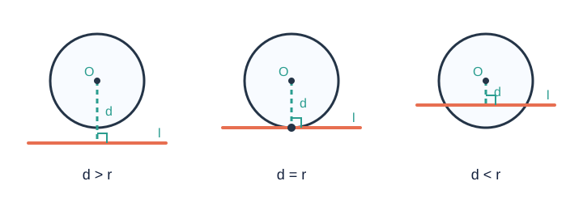
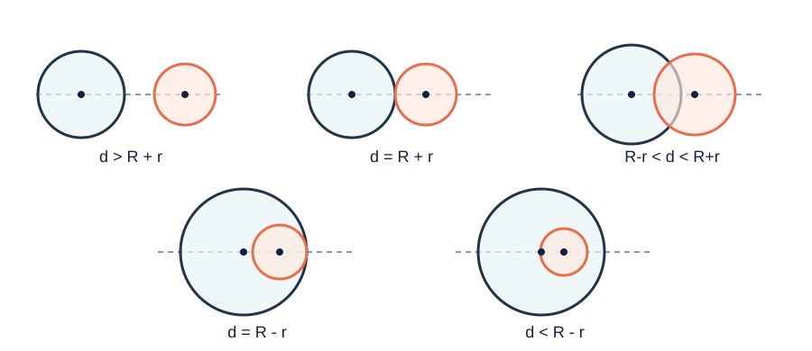

# 圆的位置关系

> 雷达屏幕上，一个目标是进入警戒区、恰好压线，还是仍在区域外，只需比较“目标到中心的距离”和“警戒半径”。把目标换成点、道路换成直线、警戒区换成另一个圆，圆的位置关系就都变成了距离比较。

## 1. 知识地图

```text
位置关系
├─ 点与圆：比较 OP 与 r
├─ 直线与圆：比较圆心距 d 与 r
│  ├─ 相离：d > r
│  ├─ 相切：d = r
│  └─ 相交：d < r
├─ 切线
│  ├─ 性质：切线 ⟂ 过切点半径
│  ├─ 判定：过半径外端且垂直半径
│  ├─ 切线长定理
│  └─ 三角形内切圆
└─ 圆与圆：比较 d、R+r、|R-r|
   ├─ 外离、外切
   ├─ 相交
   └─ 内切、内含
```

本章默认所有图形在同一平面内。圆的弧、弦、圆周角与垂径定理见[《圆基础》](圆基础.md)。

> **课程边界：** 点与圆、直线与圆、切线及三角形内切圆属于本章课内主干。两圆位置关系在不同版次教材中的编排有差异，且不是《义务教育数学课程标准（2022 年版）》的主要显性要求；本文保留它作为教材衔接与培优内容，学习时以学校正在使用的苏科版教材为准。

---

## 2. 点与圆的位置关系

设 $\odot O$ 的半径为 $r$，点 $P$ 到圆心的距离为 $d=OP$：

$$d<r\Longleftrightarrow P\text{ 在圆内},$$

$$d=r\Longleftrightarrow P\text{ 在圆上},$$

$$d>r\Longleftrightarrow P\text{ 在圆外}.$$

这里“圆内”指圆周内部，“圆上”指圆周本身。判断时必须比较点到**圆心**的距离，而不是点到圆上某点的距离。

---

## 3. 直线与圆的位置关系



设 $\odot O$ 的半径为 $r$，圆心 $O$ 到直线 $l$ 的距离为 $d$：

| 位置关系 | 公共点个数 | 数量关系 |
|---|---:|---|
| 相离 | 0 | $d>r$ |
| 相切 | 1 | $d=r$ |
| 相交 | 2 | $d<r$ |

相切时，直线叫圆的切线，唯一公共点叫切点；相交时，直线叫圆的割线。

### 3.1 为什么只比较垂线段

圆心到直线的距离是圆心到直线上各点的最短距离。

- 若最短距离大于半径，直线上所有点都在圆外；
- 若最短距离等于半径，只有垂足在圆上；
- 若最短距离小于半径，直线穿过圆，产生两个公共点。

因此，已知 $OP=5$ 且点 $P$ 在直线 $l$ 上，并不能说圆心到直线的距离是 $5$；只有 $OP\perp l$ 时才可以。

---

## 4. 切线的性质与判定

### 4.1 切线性质定理

**圆的切线垂直于经过切点的半径。**

若直线 $l$ 与 $\odot O$ 相切于点 $A$，则

$$OA\perp l.$$

**证明：** 假设 $OA$ 不垂直于 $l$，从 $O$ 向 $l$ 作垂线，垂足为 $H$。由垂线段最短，$OH<OA=r$，所以 $H$ 在圆内。直线经过圆内点时必与圆有两个公共点，这与 $l$ 是切线矛盾。因此 $OA\perp l$。

常用推论：

- 经过圆心且垂直于切线的直线经过切点；
- 经过切点且垂直于切线的直线经过圆心。

这些结论都依赖切点或圆心等条件，不能只看见一个直角就直接使用。

### 4.2 切线判定定理

**经过半径外端并且垂直于这条半径的直线是圆的切线。**

若 $A$ 在 $\odot O$ 上、$A\in l$，且

$$A\in\odot O,\qquad A\in l,\qquad OA\perp l,$$

则 $l$ 是 $\odot O$ 在点 $A$ 处的切线。

**证明：** 因为 $OA=r$ 且 $OA$ 是圆心到 $l$ 的距离，所以 $d=r$。由直线与圆位置关系可知 $l$ 与圆相切。

判定定理的两个条件缺一不可：

1. $A$ 是半径外端，且直线 $l$ 经过 $A$；
2. 直线垂直于半径 $OA$。

### 4.3 证明切线的两条路线

**路线一：有明确公共点。**

连接圆心与公共点，证明

$$OA\perp l.$$

**路线二：没有明确公共点。**

从圆心向直线作垂线，证明垂线段等于半径：

$$d=r.$$

不要把某条斜线段误当成圆心到直线的距离。

---

## 5. 切线长定理

从圆外一点 $P$ 引圆的切线，点 $P$ 与切点之间的线段长叫点 $P$ 到圆的切线长。

若 $PA,PB$ 分别切 $\odot O$ 于 $A,B$，则

$$PA=PB,$$

并且 $OP$ 平分 $\angle APB$：

$$\angle APO=\angle OPB.$$

**证明：** 连接 $OA,OB,OP$。由切线性质，

$$OA\perp PA,\qquad OB\perp PB.$$

在直角三角形 $\triangle OAP$ 和 $\triangle OBP$ 中，

$$OA=OB,\qquad OP=OP.$$

由斜边、直角边分别相等，两三角形全等，故 $PA=PB$，且 $\angle APO=\angle OPB$。

若 $OP=d$、圆半径为 $r$、切线长为 $t$，则

$$t=\sqrt{d^2-r^2}.$$

这个公式只适用于 $P$ 在圆外，即 $d>r$。

---

## 6. 三角形的内切圆

与三角形三边都相切的圆叫三角形的内切圆，圆心叫内心。

### 6.1 内心

内心是三条内角平分线的交点。角平分线上的点到角的两边距离相等，因此两条角平分线的交点到三边距离相等，以该距离为半径即可作出内切圆。

内心总在三角形内部。

### 6.2 切线段关系

若内切圆分别与 $AB,BC,CA$ 相切于 $F,D,E$，则由切线长定理：

$$AF=AE,\qquad BF=BD,\qquad CD=CE.$$

设三边 $a=BC,b=CA,c=AB$，半周长

$$s=\frac{a+b+c}{2},$$

则从顶点 $A$ 引出的切线长为

$$AF=AE=s-a.$$

### 6.3 面积与内切圆半径

设内切圆半径为 $r$，三角形面积为 $S$。连接内心与三个顶点，把三角形分成三个以 $r$ 为高的小三角形：

$$S=\frac12ar+\frac12br+\frac12cr=sr.$$

所以

$$r=\frac Ss.$$

若直角三角形两直角边为 $a,b$，斜边为 $c$，则

$$r=\frac{a+b-c}{2}.$$

---

## 7. 圆与圆的位置关系【教材衔接与培优】



设两圆半径分别为 $R,r$，圆心距为 $d$，并约定 $R\ge r>0$。

| 位置关系 | 公共点个数 | 数量关系 |
|---|---:|---|
| 外离 | 0 | $d>R+r$ |
| 外切 | 1 | $d=R+r$ |
| 相交 | 2 | $R-r<d<R+r$ |
| 内切 | 1 | $d=R-r$ |
| 内含 | 0 | $0\le d<R-r$ |

统一写相交条件时，可用

$$|R-r|<d<R+r.$$

相切条件为

$$d=R+r\quad\text{或}\quad d=|R-r|.$$

特殊情形：若 $R=r$ 且 $d=0$，两圆重合，有无数个公共点，不属于上述五种“两个不同圆”的位置关系。

### 7.1 判定原理

若两圆有公共点 $P$，则 $\triangle O_1PO_2$ 的三边为 $R,r,d$。三角形三边关系给出

$$|R-r|\le d\le R+r.$$

- 等于半径和时，三点共线且两圆外切；
- 等于半径差时，三点共线且两圆内切；
- 严格夹在二者之间时，能构成两个关于连心线对称的公共点，两圆相交。

### 7.2 连心线性质

- 两圆相切时，两个圆心和切点在同一直线上；
- 两圆相交于 $A,B$ 时，连心线垂直平分公共弦 $AB$。

证明第二条：因为

$$O_1A=O_1B,\qquad O_2A=O_2B,$$

所以 $O_1,O_2$ 都在 $AB$ 的垂直平分线上。

---

## 8. 常用模型与解法

### 8.1 “先求距离，再比较”

所有位置关系题都先找正确的距离：

- 点与圆：点到圆心；
- 直线与圆：圆心到直线的垂直距离；
- 两圆：两圆心距离。

再与半径或半径和、差比较。

### 8.2 切线题的辅助线

- 已知切点：连接切点与圆心；
- 已知圆外点的两条切线：连接圆外点与圆心；
- 需要证明切线但切点不明：作圆心到直线的垂线；
- 圆周角条件较多：有时过已知点作直径，用直角完成角度转换。

### 8.3 动圆相切要分类

“两圆相切”必须考虑外切和内切：

$$d=R+r,\qquad d=|R-r|.$$

动点或动半径问题还要把解代回运动范围，剔除负半径和越界时刻。

### 8.4 公切线模型【拓展】

两圆外离时，连接两圆心与两个切点，常可构造直角三角形：

- 外公切线段模型中的一条直角边是 $|R-r|$；
- 内公切线段模型中的一条直角边是 $R+r$。

若圆心距为 $d$，相应公切线段长分别为

$$\sqrt{d^2-(R-r)^2},\qquad \sqrt{d^2-(R+r)^2}.$$

这部分属于培优拓展，不作为苏科版课内基本要求。

---

## 9. 代表例题

### 例 1：直线与圆

在直角三角形 $\triangle ABC$ 中，$\angle C=90^\circ$，$AC=6$，$BC=8$。以 $C$ 为圆心、$\dfrac{12}{5}$ 为半径作圆。判断直线 $AB$ 与圆的位置关系。

**解：** 由勾股定理，

$$AB=\sqrt{6^2+8^2}=10.$$

设 $C$ 到 $AB$ 的距离为 $h$。由三角形面积的两种表示，

$$\frac12\cdot6\cdot8=\frac12\cdot10\cdot h,$$

所以

$$h=\frac{24}{5}.$$

圆半径为 $\dfrac{12}{5}$，且

$$h>\frac{12}{5},$$

因此直线 $AB$ 与圆相离。

### 例 2：证明切线

在等腰三角形 $\triangle ABC$ 中，$AB=AC$。以 $AB$ 为直径作 $\odot O$，圆与 $BC$ 的另一个交点为 $D$。过 $D$ 作 $DE\perp AC$。证明：$DE$ 是 $\odot O$ 的切线。

**证明：** 连接 $AD,OD$。因为 $AB$ 是直径，且 $D$ 在圆上，所以

$$\angle ADB=90^\circ,$$

即 $AD\perp BC$。等腰三角形底边上的高也是中线，因此

$$BD=DC.$$

又 $O$ 是 $AB$ 的中点。在 $\triangle ABC$ 中，连接两边中点的线段平行于第三边，所以

$$OD\parallel AC.$$

由 $DE\perp AC$ 得

$$DE\perp OD.$$

点 $D$ 是半径 $OD$ 的外端，因此 $DE$ 是 $\odot O$ 的切线。

### 例 3：切线长

点 $P$ 在半径为 $6$ 的圆外，$OP=10$。从 $P$ 引圆的切线 $PA,PB$。求 $PA$ 和 $\angle APB$ 的正弦值。

**解：** 连接 $OA$。由切线性质，$\angle OAP=90^\circ$。因此

$$PA=\sqrt{OP^2-OA^2}=\sqrt{10^2-6^2}=8.$$

$OP$ 平分 $\angle APB$，设 $\angle APO=\theta$，则 $\angle APB=2\theta$。在 $\triangle OAP$ 中，

$$\sin\theta=\frac35,\qquad \cos\theta=\frac45.$$

所以

$$\sin\angle APB=\sin2\theta=2\sin\theta\cos\theta=\frac{24}{25}.$$

其中二倍角公式属于拓展；若未学习，可通过作高构造相似三角形求得。

### 例 4：两圆位置关系

两圆半径分别是方程 $x^2-7x+10=0$ 的两个根，圆心距为 $3$。判断两圆位置关系。

**解：**

$$x^2-7x+10=(x-2)(x-5),$$

所以两圆半径为 $2,5$。半径差和半径和分别为

$$5-2=3,\qquad 5+2=7.$$

圆心距恰好等于半径差，因此两圆内切。

### 例 5：内切圆

直角三角形三边长为 $5,12,13$，求内切圆半径，并求斜边上被切点分成的两段长。

**解：** 面积与半周长为

$$S=\frac12\cdot5\cdot12=30,\qquad s=\frac{5+12+13}{2}=15.$$

所以

$$r=\frac Ss=2.$$

设斜边为 $AB=13$，另两边 $BC=5,CA=12$。斜边上靠近 $A$ 的切线段长为

$$s-a=15-5=10,$$

靠近 $B$ 的切线段长为

$$s-b=15-12=3.$$

两段长为 $10$ 和 $3$。

---

## 10. 易错辨析

1. **“圆心到直线上某点的距离大于半径，所以直线与圆相离。”** 错。必须使用圆心到直线的垂直距离。
2. **“直线与圆只有一个公共点，所以任何曲线意义下都是切线。”** 本章只讨论圆；对一般曲线，此定义不够。
3. **“经过圆上一点的直线是切线。”** 错。还必须垂直于该点与圆心的连线。
4. **“垂直于半径的直线是切线。”** 条件不全。垂足必须是半径的外端。
5. **“切线长就是切线的长度。”** 错。切线是直线，没有有限长度；切线长指圆外点到切点的线段长。
6. **“两圆没有公共点就是外离。”** 错。还可能内含。
7. **“两圆相切时圆心距等于半径和。”** 只适用于外切；内切时等于半径差的绝对值。
8. **“$d<|R-r|$ 包括两个同心等圆。”** 错。同心等圆满足 $d=0,R=r$，两圆重合。

---

## 11. 分层练习

### A 组：基础

1. $\odot O$ 半径为 $4$，点 $P$ 满足 $OP=4$。点 $P$ 在哪里？
2. 圆心到直线 $l$ 的距离为 $7$，半径为 $5$。判断 $l$ 与圆的位置关系。
3. 从圆外点 $P$ 引切线 $PA,PB$，若 $PA=9$，求 $PB$。
4. 两圆半径为 $3,8$，圆心距为 $11$。判断位置关系。

### B 组：提高

5. 半径为 $5$ 的圆中，点 $P$ 到圆心距离为 $13$，求点 $P$ 到圆的切线长。
6. 直角三角形两直角边为 $9,12$，以直角顶点为圆心作半径为 $7$ 的圆，判断斜边所在直线与圆的位置关系。
7. 两圆半径为 $4,7$。若两圆相交，写出圆心距 $d$ 的范围。
8. 三角形边长为 $13,14,15$，面积为 $84$，求内切圆半径。

### C 组：拓展

9. 两圆半径为 $3,5$，圆心距为 $10$，求外公切线在两切点之间的线段长。
10. 两圆半径分别为 $R,r$，圆心距为 $d$，且两圆相交。证明连心线垂直平分公共弦。

### 答案

1. 点 $P$ 在圆上。
2. 因为 $7>5$，相离。
3. $9$。
4. 因为 $11=3+8$，外切。
5. $\sqrt{13^2-5^2}=12$。
6. 斜边长为 $15$，直角顶点到斜边距离为 $\dfrac{9\cdot12}{15}=\dfrac{36}{5}<7$，所以相交。
7. $3<d<11$。
8. 半周长为 $21$，$r=\dfrac{84}{21}=4$。
9. $\sqrt{10^2-(5-3)^2}=4\sqrt6$。
10. 设公共点为 $A,B$。由 $O_1A=O_1B$、$O_2A=O_2B$，两圆心都在 $AB$ 的垂直平分线上，故连心线就是该垂直平分线。

---

## 12. 本章小结

圆的位置关系可以压缩成一句话：**找对距离，比较临界值。**

- 点与圆比较 $d$ 与 $r$；
- 直线与圆比较圆心到直线的距离 $d$ 与 $r$；
- 两圆比较圆心距 $d$ 与 $R+r$、$|R-r|$；
- 切线性质用于“已知切线求垂直”，切线判定用于“已知垂直证切线”；
- 相切问题要区分内切和外切，动圆问题还要检查取值范围。

---

## 13. 参考资料

### 本地资料提炼

- `初中数学.圆A级.第02讲.教师版.pdf`：第 5—7 页点与圆的位置关系。
- `初中数学.圆A级.第03讲.教师版.pdf`：第 2—12 页直线与圆；第 13—21 页切线性质、判定和综合模型。
- `初中数学.圆A级.第04讲.教师版.pdf`：第 2—7 页两圆五种位置关系；第 8—11 页动圆相切与连心线模型。

本文只提炼知识结构，例题、练习和 SVG 图均为重新设计；资料中涉及弦切角、公切线等超出苏科版课内基本要求的内容已删除或标为拓展。

### 公开链接

- [教育部：义务教育课程方案和课程标准（2022 年版）](https://www.gov.cn/zhengce/zhengceku/2022-04/21/content_5686535.htm)
- [国家中小学智慧教育平台](https://basic.smartedu.cn/)
- [GeoGebra 几何工具](https://www.geogebra.org/geometry)
- [维基百科：切线](https://zh.wikipedia.org/wiki/%E5%88%87%E7%BA%BF)
- [维基百科：内切圆](https://zh.wikipedia.org/wiki/%E5%86%85%E5%88%87%E5%9C%86)
- [哔哩哔哩检索：苏科版 直线与圆](https://search.bilibili.com/all?keyword=%E8%8B%8F%E7%A7%91%E7%89%88%20%E7%9B%B4%E7%BA%BF%E4%B8%8E%E5%9C%86)
