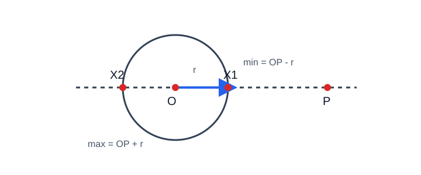
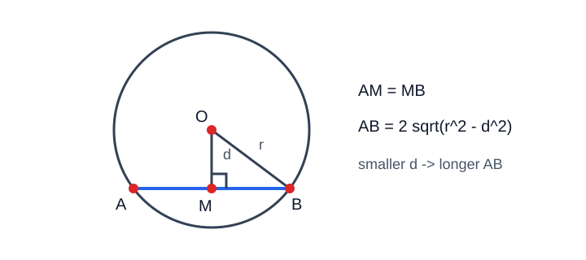

# 圆的最值问题

> 定位：苏科版初中数学“圆、勾股定理、三角形、相似”基础上的培优专题。文中把可直接使用的课内工具标为 **【课内】**，需要在本文中另行证明的技巧标为 **【拓展】**。不使用导数、向量、圆的解析方程等高中结论。

## 1. 从“救援路线”说起

湖心附近有一座圆形小岛。救援员从岸上点 $P$ 出发，到岛边哪个位置最近？若还要先到岛边一点 $X$，再去另一处 $Q$，怎样走最短？

这类题看似在“猜位置”，实质只有两步：

1. 把运动点限制看成一条轨迹（圆、弦或切线）；
2. 用不等式给长度找出不可突破的界，再说明等号何时成立。

最值解答必须同时写清“界”和“取到条件”。只有一句“显然最短”不构成证明。

## 2. 先修知识与工具边界

### 2.1 【课内】可直接使用

- 两点之间线段最短；
- 点到直线的所有线段中，垂线段最短；
- 三角形任意两边之和大于第三边，两边之差小于第三边；
- 半径相等，直径等于半径的 $2$ 倍；
- 垂径定理及其逆向识图；
- 圆的切线垂直于过切点的半径；
- 从圆外一点引圆的两条切线，切线长相等；
- 勾股定理、全等、相似、二次根式。

### 2.2 【拓展】本文推导后使用

**反向三角不等式：** 对任意三点 $A,B,X$，

$$|XA-XB|\le AB.$$

证明：由 $XA\le XB+AB$ 得 $XA-XB\le AB$；交换 $A,B$，得 $XB-XA\le AB$。两式合并即得结论。等号出现时，三点共线且较短线段位于较长线段上。

**圆上点到定点的距离范围：** 圆心为 $O$、半径为 $r$，定点为 $P$，圆上动点为 $X$，则

$$|OP-r|\le PX\le OP+r.$$

证明：在 $\triangle OPX$ 中，$OX=r$。三角不等式与反向三角不等式分别给出上、下界。直线 $OP$ 与圆的两个交点恰好使等号成立，因此界能取到。

> 注意：若 $P=O$，则每个圆上点都满足 $PX=r$，没有唯一最值点。

## 3. 方法地图

| 题面特征 | 转化目标 | 核心工具 | 等号位置 |
|---|---|---|---|
| 点到直线、弦所在直线 | 作垂线 | 垂线段最短 | 垂足可取时 |
| 折线 $AX+XB$ | 拉直折线 | 两点之间线段最短、轴对称 | $A,X,B$ 共线 |
| 圆上点到定点 $PX$ | 连圆心 $O$ | 三角不等式 | $P,O,X$ 共线 |
| 圆上点距离和/差 | 插入半径或反射 | 三角不等式 | 各段同向共线 |
| 弦长变化 | 作弦心距 $OM$ | 垂径定理、勾股定理 | 弦心距最小 |
| 切线长变化 | 连圆心与切点 | 切线垂直半径、勾股定理 | 圆心距最小 |

使用流程：**认轨迹—连圆心/作垂线—写不等式—查等号—答范围。**

## 4. 核心模型与严格推导

### 4.1 模型一：垂线段最短

点 $P$ 在直线 $l$ 外，$H$ 为垂足，$X$ 为 $l$ 上任一点。若 $X\ne H$，在直角三角形 $PHX$ 中，

$$PX^2=PH^2+HX^2>PH^2,$$

所以 $PX>PH$；当且仅当 $X=H$ 时取最小值 $PH$。

若动点只在线段 $AB$ 上，必须检查垂足 $H$ 是否落在 $AB$ 上；若不在，最短点是较近端点。

### 4.2 模型二：两点之间线段最短与反射

若 $X$ 在直线 $l$ 上，求 $AX+BX$ 的最小值。把 $A$ 关于 $l$ 对称到 $A'$，则 $AX=A'X$，从而

$$AX+BX=A'X+BX\ge A'B.$$

直线 $A'B$ 与 $l$ 的交点若在允许范围内，等号成立。若 $X$ 只在线段或射线上运动，还应检查交点是否合法，并比较边界点。

### 4.3 模型三：圆上点到定点

设 $OP=d$。由第 2.2 节，

$$PX_{\min}=|d-r|,\qquad PX_{\max}=d+r.$$

- $P$ 在圆外：近点位于从 $O$ 指向 $P$ 的射线上，远点在反向射线上；
- $P$ 在圆上：最小值为 $0$，最大值为直径 $2r$；
- $P$ 在圆内：近点在从 $P$ 指向远离 $O$ 的方向上，距离为 $r-d$。

### 4.4 模型四：圆上点的距离和

若圆心 $O$、半径 $r$，$X$ 在圆上，定点 $A$ 固定，则

$$AX+XO=AX+r.$$

因此只需研究 $AX$。若出现 $AX+BX$，通常没有一个只由 $AB,r$ 决定的统一答案；要看 $A,B,O$ 的位置。可尝试：

1. 某一段可替换为等长半径；
2. 某点关于直线或圆心作对称；
3. 先给下界，再验证是否存在圆上点使折线拉直。

### 4.5 模型五：弦长最值

半径为 $r$ 的圆中，弦 $AB$ 的中点为 $M$。由垂径定理，$OM\perp AB$，且

$$\left(\frac{AB}{2}\right)^2+OM^2=r^2.$$

故

$$AB=2\sqrt{r^2-OM^2}.$$

在 $0\le OM\le r$ 内，$OM$ 越小，$AB$ 越大；当 $OM=0$ 时，$AB$ 最大为 $2r$，此时弦为直径。这里没有使用函数单调性：比较两个弦心距的平方，再比较根号内数的大小即可。

### 4.6 模型六：平行弦中的垂距

若弦 $AB$ 被限制为与定直线 $l$ 平行，则弦心距等于圆心 $O$ 到弦所在直线的距离。移动弦所在直线时，先求允许直线到 $O$ 的最小距离，再代入弦长公式。

### 4.7 模型七：切线长最值

从圆外点 $P$ 向半径为 $r$ 的圆作切线，切点为 $T$。因为 $OT\perp PT$，

$$PT=\sqrt{OP^2-r^2}.$$

在 $OP>r$ 的前提下，$OP$ 越小，$PT$ 越小。若 $P$ 在某条直线上运动，先用垂线段最短求 $OP$ 的最小值；同时检查该最短位置仍在圆外，否则切线不存在。

## 5. 代表例题

### 例 1　圆上点到定点

圆 $O$ 的半径为 $5$，$OP=13$，点 $X$ 在圆上运动。求 $PX$ 的取值范围。

**解：** 在 $\triangle POX$ 中，$OX=5$，所以

$$|13-5|\le PX\le13+5.$$

直线 $PO$ 与圆的两个交点分别使下界、上界成立，故

$$8\le PX\le18.$$

### 例 2　弦上动点

圆中弦 $AB=16$，圆心 $O$ 到弦 $AB$ 的距离为 $6$。点 $X$ 在线段 $AB$ 上运动，求 $OX$ 的最小值与最大值。

**解：** 设 $M$ 为弦中点，则 $OM\perp AB$，$AM=8$。垂线段最短，所以 $X=M$ 时，

$$OX_{\min}=OM=6.$$

对任意 $X\in AB$，$MX\le8$，由勾股定理，

$$OX^2=OM^2+MX^2\le6^2+8^2=100.$$

当 $X=A$ 或 $B$ 时取等号，故 $OX_{\max}=10$。

### 例 3　圆上折线最短

圆 $O$ 半径为 $4$，点 $A$ 满足 $OA=10$。点 $X$ 在圆上，求 $AX+XO$ 的最小值。

**解：** 因为 $XO=4$，

$$AX+XO=AX+4.$$

由圆上点到定点模型，$AX_{\min}=OA-r=6$，故最小值为 $10$。当 $O,X,A$ 共线且 $X$ 在线段 $OA$ 上时取到。

### 例 4　动点切线

圆 $O$ 半径为 $3$，圆心到直线 $l$ 的距离为 $5$。点 $P$ 在 $l$ 上，从 $P$ 向圆作切线 $PT$。求 $PT$ 的最小值。

**解：** 设 $H$ 为 $O$ 到 $l$ 的垂足，则 $OP\ge OH=5>3$，每个位置都能作切线。又

$$PT^2=OP^2-OT^2=OP^2-9.$$

当 $P=H$ 时 $OP$ 最小，所以

$$PT_{\min}=\sqrt{5^2-3^2}=4.$$

### 例 5　分类讨论：垂足是否可取

点 $P$ 到直线 $AB$ 的垂足为 $H$，且 $AH=3$、$BH=7$、$PH=4$，$H$ 在射线 $AB$ 的反向延长线上。点 $X$ 在线段 $AB$ 上，求 $PX$ 的最小值。

**解：** 垂足 $H$ 不在线段 $AB$ 上，不能直接回答 $PH$。在线段 $AB$ 上，$HX$ 从 $HA=3$ 开始增大，故 $X=A$ 时最近。

$$PX_{\min}=PA=\sqrt{PH^2+AH^2}=\sqrt{4^2+3^2}=5.$$

### 例 6　定长弦的存在性

半径为 $5$ 的圆中，能否作一条长为 $8$ 且弦心距为 $3$ 的弦？这样的弦有几条？

**解：** 若弦长为 $8$，半弦为 $4$。由勾股定理，所需弦心距为

$$\sqrt{5^2-4^2}=3.$$

条件相容。若不限定弦的方向，弦的中点可在以圆心为中心、半径为 $3$ 的圆上连续移动，因此这样的弦有无数条。若另加“弦平行于某条定直线”，则距圆心为 $3$ 且平行于该定直线的直线有两条，对应两条弦。

## 6. 常见陷阱

1. **只写界，不写等号条件。** 最值可能只是下界，未必能在限制轨迹上取到。
2. **把“点到直线”偷换成“点到线段”。** 垂足在线段外时应比较端点。
3. **忘记切线存在条件。** 从圆外点 $P$ 引切线必须有 $OP>r$，此时有两条正长度切线段；$OP=r$ 时 $P$ 在圆上，只有经过 $P$ 的一条切线，公式给出的 $PT=0$ 只是退化长度；$OP<r$ 时不能作实切线。
4. **认为所有距离和都能直接拉直。** 拉直后的交点必须在圆或指定线段上。
5. **弦越靠近圆周越长。** 恰好相反：弦心距越小，弦越长。
6. **图形看起来共线就当作共线。** 等号位置必须由构造或条件推出。

## 7. 分层练习

### A 组　课内巩固

1. 圆 $O$ 半径为 $6$，$OP=10$，求圆上点 $X$ 到 $P$ 的距离范围。
2. 半径为 $13$ 的圆中，一条弦的弦心距为 $5$，求弦长。
3. 点 $P$ 到直线 $l$ 的距离为 $7$，$X\in l$，求 $PX$ 的最小值。
4. 圆外点 $P$ 满足 $OP=10$，圆半径为 $6$，求从 $P$ 引出的切线长。

### B 组　方法迁移

5. 圆 $O$ 半径为 $4$，$OA=9$，$X$ 在圆上，求 $AX+2XO$ 的最小值与最大值。
6. 半径为 $10$ 的圆中，弦长至少为 $16$，求弦心距 $d$ 的范围。
7. 圆心 $O$ 到线段 $AB$ 所在直线的垂足 $H$ 在线段外，$OH=6$、$HA=8$，且 $A$ 比 $B$ 靠近 $H$。求 $O$ 到线段 $AB$ 上点的最短距离。
8. 圆半径为 $5$，圆心到直线 $l$ 的距离为 $13$。$P\in l$，求切线长的最小值。

### C 组　培优拓展

9. 圆 $O$ 半径为 $3$，$OA=8$。证明对任意圆上点 $X$，都有 $5\le AX\le11$，并说明等号位置。
10. 半径为 $5$ 的圆中，平行弦 $AB,CD$ 的弦心距分别为 $3,4$，比较两弦长度。
11. 点 $A,B$ 在直线 $l$ 同侧，距离 $l$ 分别为 $2,5$，两垂足间距离为 $7$。点 $X\in l$，求 $AX+BX$ 的最小值。
12. 圆 $O$ 半径为 $4$，动点 $P$ 在距 $O$ 为 $6$ 的直线上。判断从 $P$ 引圆的切线长是否有最大值，并求最小值。

## 8. 答案与提示

1. $4\le PX\le16$。
2. $24$。
3. $7$。
4. $8$。
5. 因 $XO=4$，原式为 $AX+8$；最小值 $13$，最大值 $21$。
6. 由 $2\sqrt{100-d^2}\ge16$，得 $0\le d\le6$。
7. 垂足不可取，最近点为 $A$；最短距离为 $\sqrt{6^2+8^2}=10$。
8. $\sqrt{13^2-5^2}=12$。
9. 用 $|OA-OX|\le AX\le OA+OX$；近、远交点取等号。
10. $AB=8$，$CD=6$，故 $AB>CD$。
11. 将 $A$ 关于 $l$ 对称为 $A'$，最小值为 $A'B=\sqrt{7^2+7^2}=7\sqrt2$。
12. 最小圆心距为 $6$，切线长最小为 $\sqrt{36-16}=2\sqrt5$；直线无界，$OP$ 可任意大，所以无最大值。

## 9. 总结

- 最值不是“看出来”，而是“不等式界 + 等号条件”；
- 圆上点问题优先连圆心，把变量长度与定长半径放进三角形；
- 弦长看弦心距，切线长看圆心距；
- 轨迹若是线段、射线或圆弧，必须检查理想等号点是否属于轨迹；
- 培优的关键不是背模型，而是解释模型为什么成立。

## 10. 参考资料与视频

1. 江苏凤凰科学技术出版社，义务教育教科书《数学》九年级上册，“圆”相关章节。以当前学校使用版本为准。
2. 中华人民共和国教育部：《义务教育数学课程标准（2022年版）》，北京师范大学出版社，2022。
3. [国家中小学智慧教育平台](https://basic.smartedu.cn/)：免费公共平台，可检索“苏科版 九年级数学 圆”“垂径定理”“切线”。
4. [Khan Academy：Triangles and quadrilaterals](https://www.khanacademy.org/math/up-class-10-bridge/x6886ba59d07e59a6:triangles-and-quadrilaterals)：含三角不等式、勾股定理等公开视频与练习。
5. [Khan Academy：Triangle inequality using circle（YouTube）](https://www.youtube.com/watch?v=V_Dsl8d5pqE)：用圆的相交情形解释三角不等式。英文资源，可配字幕观看。

> 链接核验日期：2026-07-11。本文图示为本站原创 SVG，可自由用于本项目教学；未转载付费课程内容。
