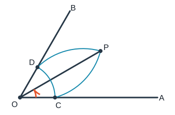
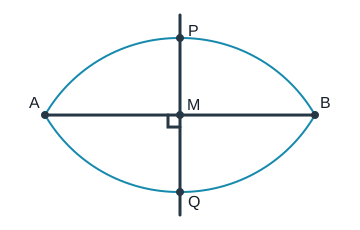

# 尺规作图

> 想象你只有一把没有刻度的直尺和一副圆规：直尺负责“连直”，圆规负责“复制距离”。这像只允许使用两条指令写程序；每一步都简单，但组合后能精确构造平分线、垂线和三角形。

## 0. 知识边界与地图

### 0.1 工具规则

- 无刻度直尺：过两个已知点作直线或线段，不能量长度；
- 圆规：以已知点为圆心、以两已知点间距离为半径作圆或圆弧；
- 交点可以作为下一步的新点；
- 作图痕迹应保留，不能只画最后结果。

### 0.2 边界说明

- **【苏科版课内】**作一条线段等于已知线段；作一个角等于已知角；作角平分线；作线段垂直平分线；过一点作已知直线的垂线；依据 SSS、SAS、ASA/AAS、HL 条件作三角形，并写作法、证明。
- **【培优拓展】**把几何条件转化为点的轨迹，利用轨迹交点构造；构造三角形中线、高、外心、内心；作平行线的尺规方案。
- “三等分任意角”“作任意圆的等积正方形”等一般不可尺规作图的问题只作边界提示，不当作课内任务。

### 0.3 知识地图

```text
两种原子操作
├─ 直尺：两点定一直线
└─ 圆规：圆心 + 半径
       ↓
五类基本作图
├─ 复制线段
├─ 复制角
├─ 角平分线
├─ 垂直平分线
└─ 过点作垂线
       ↓
按条件作三角形
       ↓
培优：轨迹交点与复合构造
```

## 1. 【苏科版课内】规范书写

完整解答通常含四部分：

1. **已知**：给出的点、线、角、长度关系；
2. **求作**：目标图形及必须满足的条件；
3. **作法**：按顺序编号，每一步说明圆心、半径、交点；
4. **证明**：说明所作图形为何满足条件；必要时补“存在性”和“交点选择”。

作图题不是测量题。“取 $M$ 为 $AB$ 的中点”不能直接写，必须先构造出中点。

## 2. 【苏科版课内】五类基本作图

### 2.1 作线段等于已知线段

已知线段 $AB$ 和射线 $OX$，求作 $OP=AB$。

**作法：** 以 $O$ 为圆心、$AB$ 长为半径作弧，交射线 $OX$ 于 $P$。

**证明：** $P$ 在以 $O$ 为圆心、$AB$ 为半径的圆上，所以 $OP=AB$。

### 2.2 作角等于已知角

已知 $\angle AOB$ 和射线 $PX$。

**作法：**

1. 以 $O$ 为圆心作弧，交 $OA,OB$ 于 $C,D$；
2. 以 $P$ 为圆心、相同半径作弧，交 $PX$ 于 $E$；
3. 以 $E$ 为圆心、$CD$ 为半径作弧，与前弧交于 $F$；
4. 作射线 $PF$。

**证明：** $OC=OD=PE=PF$，且 $CD=EF$，所以 $\triangle OCD\cong\triangle PEF$（SSS），故 $\angle EPF=\angle COD=\angle AOB$。

### 2.3 作角平分线



已知 $\angle AOB$，求作其平分线。

**作法：**

1. 以 $O$ 为圆心作弧，分别交 $OA,OB$ 于 $C,D$；
2. 分别以 $C,D$ 为圆心、取相同且足够大的半径作弧，两弧在角内交于 $P$；
3. 作射线 $OP$。

**证明：** $OC=OD,CP=DP,OP=OP$，由 SSS 得 $\triangle OCP\cong\triangle ODP$，所以

$$\angle COP=\angle POD.$$

因此 $OP$ 是 $\angle AOB$ 的平分线。

### 2.4 作线段的垂直平分线



已知线段 $AB$。

**作法：**

1. 分别以 $A,B$ 为圆心，取相同且大于 $\frac12AB$ 的半径作弧；
2. 两组弧交于 $P,Q$；
3. 作直线 $PQ$，交 $AB$ 于 $M$。

**证明：** 由作图得 $PA=PB,QA=QB$，所以 $P,Q$ 都到 $A,B$ 等距。到线段两端距离相等的点在线段的垂直平分线上；两点 $P,Q$ 确定的直线正是该垂直平分线。因此

$$PQ\perp AB,\qquad AM=BM.$$

“半径大于 $\frac12AB$”保证两圆有两个交点；若半径太小，两弧不会相交。

### 2.5 过一点作已知直线的垂线

**点 $P$ 在直线 $l$ 上：**

1. 以 $P$ 为圆心作弧，交 $l$ 于 $A,B$；
2. 以 $A,B$ 为圆心、相同且足够大的半径作弧，交于 $Q$；
3. 作 $PQ$。由 $PA=PB,QA=QB$，$PQ$ 是 $AB$ 的垂直平分线，故 $PQ\perp l$。

**点 $P$ 在直线 $l$ 外：**

1. 以 $P$ 为圆心作足够大的弧，交 $l$ 于 $A,B$；
2. 作 $AB$ 的垂直平分线。由于 $PA=PB$，该线经过 $P$，即为所求垂线。

### 2.6 作已知直线的平行线

过直线 $l$ 外一点 $P$ 作平行线，可先过 $P$ 作 $l$ 的垂线 $m$，再过 $P$ 作 $m$ 的垂线 $n$。同一平面内垂直于同一直线的两直线平行，所以 $n\parallel l$。

## 3. 【苏科版课内】按条件作三角形

核心原则：先选一条边作为“底座”，再把其他条件转化为圆、射线或垂线的交点。

### 3.1 已知三边（SSS）

已知 $a,b,c$，作 $\triangle ABC$，使 $BC=a,CA=b,AB=c$。

1. 作 $BC=a$；
2. 以 $B$ 为圆心、$c$ 为半径作弧；
3. 以 $C$ 为圆心、$b$ 为半径作弧，两弧交于 $A$；
4. 连接 $AB,AC$。

存在非退化三角形的条件是：

$$|b-c|<a<b+c.$$

### 3.2 已知两边及夹角（SAS）

先作给定角，再在两条边上分别截取给定长度，连接两个端点。证明直接使用 SAS。

### 3.3 已知两角及其夹边（ASA）

先作给定边，再在两端向同侧分别作给定角；两条射线交点为第三顶点。若两角之和不小于 $180^\circ$，不能构成非退化三角形。

### 3.4 已知两角及一边（AAS）

先由内角和求第三角，再转化为 ASA 作图。

### 3.5 已知斜边和一直角边（HL）

作给定直角边，在其一端作垂线；再以另一端为圆心、斜边长为半径作弧，与垂线相交得到第三顶点。斜边必须大于直角边。

## 4. 【培优拓展】轨迹模型

尺规作图的关键不是“试着画”，而是把每个条件翻译成点的轨迹：

- 到定点 $A$ 的距离为 $r$：以 $A$ 为圆心、$r$ 为半径的圆；
- 到两点 $A,B$ 距离相等：$AB$ 的垂直平分线；
- 到角两边距离相等且在角内：内角平分线；
- 到直线 $l$ 的距离为 $h$：与 $l$ 平行、距离为 $h$ 的两条直线。

目标点通常是两条轨迹的交点。交点可能有 $0,1,2$ 个，因此必须讨论是否存在以及是否有多个解。

### 4.1 构造外心

分别作三角形任意两边的垂直平分线，交点 $O$ 即外心。因为 $OA=OB$ 且 $OB=OC$，所以 $OA=OB=OC$。第三边的垂直平分线也经过 $O$。

### 4.2 构造内心

作任意两个内角的平分线，交点 $I$ 即内心。角平分线上的点到角两边距离相等，因此 $I$ 到三边距离相等。

### 4.3 “底边 + 中线 + 一边”模型

若已知底边 $BC$、中线 $AM$ 长和边 $AB$ 长：

1. 作 $BC$ 并作其中点 $M$；
2. 以 $M$ 为圆心、中线长为半径作圆；
3. 以 $B$ 为圆心、$AB$ 长为半径作圆；
4. 两圆交点为 $A$，连接 $AB,AC$。

## 5. 代表例题（完整解答）

### 例 1【课内】作三角形

已知线段 $a,b,c$ 且 $a<b+c,b<a+c,c<a+b$，求作三边分别为 $a,b,c$ 的三角形。

**作法：** 按 3.1 的 SSS 步骤作图。

**证明：** 由作图 $BC=a,CA=b,AB=c$，故所得三角形满足要求。三边关系保证两圆相交而不相切，三点不共线。

### 例 2【课内】作线段中点

已知 $AB$，求作其中点。

**作法：** 作 $AB$ 的垂直平分线，与 $AB$ 交于 $M$。

**证明：** 垂直平分线与线段的交点到两端距离相等，所以 $AM=BM$，故 $M$ 是中点。

### 例 3【培优】同时满足两个等距条件

在 $\triangle ABC$ 内求作点 $P$，使 $PA=PB$，且 $P$ 到 $AB,AC$ 的距离相等。

**分析：** $PA=PB$ 的轨迹是 $AB$ 的垂直平分线；在 $\angle BAC$ 内到两边等距的轨迹是内角平分线。

**作法：** 作 $AB$ 的垂直平分线，再作 $\angle BAC$ 的内角平分线，记两线交点为 $Q$。若 $Q$ 位于 $\triangle ABC$ 内，则取 $P=Q$；若 $Q$ 不在三角形内，则满足题意的内部点不存在。

**证明：** 若候选点 $Q$ 在三角形内，由两条轨迹的性质，它同时满足 $QA=QB$ 以及到 $AB,AC$ 的距离相等，因此 $P=Q$。反之，任何满足题意的点都必须同时位于这两条轨迹上，只能是交点 $Q$；所以当 $Q$ 不在三角形内时无解。

## 6. 易错辨析

1. **直尺可以量长度？** 不可以，无刻度直尺只能连线。
2. **作垂直平分线时圆规半径随意？** 两次半径必须相同，且大于半条线段。
3. **角平分线两弧半径必须等于第一次半径？** 不必；第二步从 $C,D$ 出发的两个半径彼此相同且能相交即可。
4. **画出“像中点”的点就完成？** 不行，要留下圆弧并证明等距。
5. **两条轨迹有交点就只有一个解？** 不一定；两个圆通常有两个交点。
6. **SSA 能唯一作三角形？** 一般不能，可能有两个、一个或没有解。

## 7. 分层练习

### A 组：课内基础

1. 写出作线段 $AB$ 中点的三步作法。
2. 作角平分线时，证明使用哪一种全等判定？
3. 为什么作垂直平分线时半径要大于 $\frac12AB$？
4. 已知三边 $3,4,8$，能否按 SSS 作出三角形？

### B 组：课内综合

5. 已知两边 $5,7$ 及夹角 $60^\circ$，说明作图顺序。
6. 已知斜边 $8$、一直角边 $5$，写出 HL 作图方案。
7. 只用尺规过直线外一点作平行线。

### C 组：培优拓展

8. 在已知角内作一点，使它到两边距离相等且到顶点距离为给定长度 $r$。
9. 已知 $\triangle ABC$，作其外接圆。
10. 解释为什么给定底边、底边上的高和腰长时，所求等腰三角形可能不存在。

## 8. 答案

1. 以 $A,B$ 为圆心取相同且足够大的半径作弧得 $P,Q$；作 $PQ$；令 $PQ$ 与 $AB$ 交于 $M$。
2. SSS。
3. 两圆心距为 $AB$；半径相同为 $r$ 时，要有 $2r>AB$ 才有两个交点。
4. 不能，$3+4<8$。
5. 先作 $60^\circ$ 角，在两边分别截取 $5,7$，连接端点。
6. 作长 $5$ 的直角边；一端作垂线；以另一端为圆心、$8$ 为半径作弧交垂线；连接。
7. 过该点先作已知直线的垂线，再作前一条垂线的垂线。
8. 作角平分线，再作以顶点为圆心、$r$ 为半径的圆，取角内交点。
9. 作任意两边的垂直平分线得交点 $O$，以 $O$ 为圆心、$OA$ 为半径作圆。
10. 先作底边的垂直平分线，再作与底边距离为给定高的两条平行线，交点给出两个候选顶点；只有候选顶点到底边端点的距离等于给定腰长时才有解，否则不存在。

## 9. 总结与自查

- 每一步只使用允许的直尺或圆规操作；
- 圆弧要写明圆心和半径来源；
- 作图之后用全等、等距轨迹或平行垂直定理证明；
- 检查交点是否存在、是否有多个、是否取在指定区域；
- 不把“量得相等”当几何证明。

## 10. 真实链接

- [教育部：义务教育课程方案和课程标准（2022 年版）](https://www.moe.gov.cn/srcsite/A26/s8001/202204/t20220420_619921.html)
- [GeoGebra Geometry（可模拟圆规与直尺步骤）](https://www.geogebra.org/geometry)

> 本文作图步骤、例题与 SVG 均为原创整理，不复制商业题库；GeoGebra 可用于检查猜想，但正式尺规作图仍应保留作图痕迹与证明。
- [哔哩哔哩检索：苏科版 尺规作图](https://search.bilibili.com/all?keyword=%E8%8B%8F%E7%A7%91%E7%89%88%20%E5%B0%BA%E8%A7%84%E4%BD%9C%E5%9B%BE)
