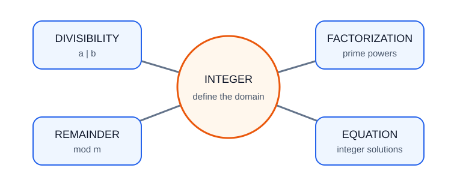

# 数论基础

> 定位：苏科版初中“有理数、整式、因式分解、方程”基础上的数论培优专题。**【课内】**表示可直接使用的教材知识；**【拓展】**表示竞赛启蒙工具，均在本文中从定义或初中结论推出。不使用未解释的费马小定理、中国剩余定理等结论。

## 1. 整数世界的“门禁规则”

一把密码锁只看输入数除以 $10$ 的余数，所以它只关心末位；排座位每 $6$ 人一组，只关心人数除以 $6$ 是否余 $0$。数可能很大，但“整除”和“余数”像门禁规则，把无限多整数分成有限类别。

数论的基本习惯是：

1. 先确认讨论对象是整数；
2. 把自然语言翻译成整除式、质因数分解或余数；
3. 每次除法都说明余数范围；
4. 结论若是拓展工具，先证明再用。

## 2. 先修知识与符号

### 2.1 【课内】可直接使用

- 整数、正数、负数、绝对值；
- 乘方及运算顺序；
- 整式运算与因式分解；
- 一元一次方程、二元一次方程组；
- 奇数写成 $2k+1$，偶数写成 $2k$，其中 $k$ 为整数。

### 2.2 【拓展】基本符号

若存在整数 $k$ 使 $b=ak$，称 $a$ 整除 $b$，记作

$$a\mid b.$$

若 $a$ 不整除 $b$，记作 $a\nmid b$。约定整除式中的除数 $a\ne0$。

对正整数 $m$，若 $m\mid(a-b)$，称 $a$ 与 $b$ 模 $m$ 同余，记作

$$a\equiv b\pmod m.$$

这只是“除以 $m$ 余数相同”的简写，不是分数等式。

## 3. 方法地图

| 题目关键词 | 首选工具 | 常见目标 |
|---|---|---|
| “倍数、整除” | 写成 $b=ak$ | 提取公因式 |
| “质数、因数个数” | 质因数分解 | 指数分类 |
| “最大分组、最小周期” | 最大公因数、最小公倍数 | 分解质因数 |
| “余数、末位” | 同余 | 把大数换成小余数 |
| “奇偶” | $2k$、$2k+1$ | 分类或反证 |
| “整数解” | 因式分解、整除条件 | 参数化或枚举因数 |

通用流程：**定整数—选模数/分解—化简—检查范围—回代。**

## 4. 整除

### 4.1 【拓展】整除的基本性质

若 $a\mid b$、$a\mid c$，设 $b=am$、$c=an$，则对任意整数 $x,y$，

$$a\mid(bx+cy).$$

证明：

$$bx+cy=a(mx+ny),$$

而 $mx+ny$ 仍为整数。

特别地，$a\mid b$ 且 $a\mid c$ 可推出 $a\mid(b-c)$。这个“作差消项”非常常用。

### 4.2 整除判定的课内化解释

- 被 $2$ 整除：末位为偶数；
- 被 $5$ 整除：末位为 $0$ 或 $5$；
- 被 $10$ 整除：末位为 $0$；
- 被 $3$ 或 $9$ 整除：各位数字和被 $3$ 或 $9$ 整除。

以三位数 $\overline{abc}=100a+10b+c$ 为例，因为

$$100a+10b+c=99a+9b+(a+b+c),$$

前两项均被 $9$ 整除，所以原数与数字和除以 $9$ 的余数相同。对更多位数可逐位作同样分拆。

## 5. 质数与唯一分解

### 5.1 定义

大于 $1$ 的整数中，只有 $1$ 和自身两个正因数的数叫质数；大于 $1$ 且不是质数的数叫合数。$1$ 既不是质数也不是合数。

### 5.2 【拓展】质因数分解

每个大于 $1$ 的整数都能写成质数的乘积；忽略质因数次序后，写法唯一。这称为算术基本定理。完整唯一性证明较长，本专题把它作为**明确标注的拓展基础结论**使用，不把它冒充苏科版课内定理。

例如：

$$360=2^3\cdot3^2\cdot5.$$

试除一个数 $n$ 是否为质数，只需检查不超过 $\sqrt n$ 的质数。理由：若 $n=ab$ 且 $1<a\le b<n$，那么

$$a^2\le ab=n,$$

所以 $a\le\sqrt n$。若有非平凡因数，较小的那个不会超过 $\sqrt n$。

### 5.3 因数个数

若

$$n=p_1^{a_1}p_2^{a_2}\cdots p_s^{a_s},$$

一个正因数可从每个质因数中分别选 $0,1,\ldots,a_i$ 个，因此正因数个数为

$$d(n)=(a_1+1)(a_2+1)\cdots(a_s+1).$$

这是【拓展】计数模型，依据是乘法原理。

## 6. 最大公因数与最小公倍数

### 6.1 质因数分解法

设

$$a=\prod p^{\alpha_p},\qquad b=\prod p^{\beta_p},$$

则最大公因数取每个质因数的较小指数，最小公倍数取较大指数：

$$\gcd(a,b)=\prod p^{\min(\alpha_p,\beta_p)},$$

$$\operatorname{lcm}(a,b)=\prod p^{\max(\alpha_p,\beta_p)}.$$

因为对每个质因数都有

$$\min(\alpha,\beta)+\max(\alpha,\beta)=\alpha+\beta,$$

所以对正整数 $a,b$，

$$\gcd(a,b)\operatorname{lcm}(a,b)=ab.$$

### 6.2 【拓展】辗转相除法

若 $a=bq+r$，则 $a,b$ 的公因数与 $b,r$ 的公因数完全相同：

- 公因数若整除 $a,b$，就整除 $a-bq=r$；
- 公因数若整除 $b,r$，就整除 $bq+r=a$。

因此

$$\gcd(a,b)=\gcd(b,r).$$

反复相除，最后一个非零余数就是最大公因数。

## 7. 同余基础

### 7.1 【拓展】加法与乘法规则

若 $a\equiv b\pmod m$、$c\equiv d\pmod m$，则

$$a+c\equiv b+d\pmod m,$$

$$ac\equiv bd\pmod m.$$

证明乘法规则：由 $m\mid(a-b)$、$m\mid(c-d)$，而

$$ac-bd=c(a-b)+b(c-d),$$

所以 $m\mid(ac-bd)$。

### 7.2 不能随意约分

由

$$2x\equiv2\pmod6$$

不能直接约去 $2$ 得 $x\equiv1\pmod6$。例如 $x=4$ 满足原式，却不满足后式。安全做法是回到整除定义，或先缩小模数：

$$6\mid2(x-1)\Longleftrightarrow3\mid(x-1),$$

所以正确结论是 $x\equiv1\pmod3$。

## 8. 奇偶、末位与周期

### 8.1 奇偶运算

设偶数为 $2m$，奇数为 $2n+1$，直接展开可证：

- 偶 $\pm$ 偶为偶；
- 奇 $\pm$ 奇为偶；
- 奇 $\pm$ 偶为奇；
- 只要一个因数为偶，乘积为偶；
- 奇数乘奇数仍为奇数。

例如奇数平方仍为奇数：

$$(2n+1)^2=2(2n^2+2n)+1.$$

### 8.2 末位

末位就是模 $10$ 的余数。幂的末位常呈周期。例如 $3$ 的正整数次幂末位依次为

$$3,9,7,1,3,9,7,1,\ldots$$

周期为 $4$。求 $3^{2026}$ 的末位，因为 $2026$ 除以 $4$ 余 $2$，所以末位为周期第 $2$ 个数 $9$。

周期必须由实际计算或同余乘法验证，不能凭印象套用；底数为 $0,1,5,6$ 时周期为 $1$。

## 9. 简单不定方程

不定方程要求整数解，普通方程的实数解法不够。

### 9.1 二元一次不定方程

考虑

$$ax+by=c.$$

若 $d=\gcd(a,b)$ 不整除 $c$，则无整数解，因为 $d$ 整除左边。若找到一个整数解 $(x_0,y_0)$，令

$$x=x_0+\frac{b}{d}t,\qquad y=y_0-\frac{a}{d}t,$$

其中 $t$ 为整数，就得到全部整数解。

**推导：** 两个解相减满足 $a(x-x_0)=-b(y-y_0)$。除去最大公因数后，$\frac ad$ 与 $\frac bd$ 互质，从整除关系可得 $\frac bd\mid(x-x_0)$，于是令 $x-x_0=\frac bd t$，再得到 $y-y_0=-\frac ad t$。

这段是【拓展】。若题目只求非负解，也可在有限范围内枚举并检验。

### 9.2 乘积型方程

若能整理为

$$(x-a)(y-b)=N,$$

则左边两个整数因数只能取 $N$ 的有限个因数对。列出正、负因数对后回代，是比盲目试数更完整的方法。

## 10. 代表例题完整解答

### 例 1　整除作差

证明：若 $7\mid(3a+2b)$ 且 $7\mid(5a+4b)$，则 $7\mid a$。

**证明：** 对两式作整系数组合：

$$2(3a+2b)-(5a+4b)=a.$$

因为 $7$ 整除括号内两式，所以整除它们的整系数组合，故 $7\mid a$。

### 例 2　质因数分解与因数个数

求 $756$ 的质因数分解及正因数个数。

**解：**

$$756=4\times189=2^2\times3^3\times7.$$

因此

$$d(756)=(2+1)(3+1)(1+1)=24.$$

### 例 3　最大公因数与最小公倍数

求 $252$ 与 $198$ 的最大公因数和最小公倍数。

**解：** 用辗转相除法：

$$252=198\times1+54,$$

$$198=54\times3+36,$$

$$54=36\times1+18,$$

$$36=18\times2.$$

所以 $\gcd(252,198)=18$。再用乘积关系：

$$\operatorname{lcm}(252,198)=\frac{252\times198}{18}=2772.$$

### 例 4　同余求余数

求 $2^{100}$ 除以 $7$ 的余数。

**解：**

$$2^1\equiv2,\quad2^2\equiv4,\quad2^3\equiv1\pmod7.$$

因此每乘三次回到余数 $1$。因为 $100=3\times33+1$，

$$2^{100}=(2^3)^{33}\cdot2\equiv1^{33}\cdot2\equiv2\pmod7.$$

余数为 $2$。

### 例 5　奇偶反证

证明：对任意整数 $k$，不存在整数 $x,y$ 使 $x^2+y^2=4k+3$。

**证明：** 整数平方按奇偶只有两种：

$$\text{偶数平方}\equiv0\pmod4,\qquad\text{奇数平方}\equiv1\pmod4.$$

所以两个平方和模 $4$ 只能余 $0,1,2$，不可能余 $3$，矛盾。

### 例 6　一次不定方程

求方程 $6x+9y=42$ 的全部整数解。

**解：** 两边除以 $3$：

$$2x+3y=14.$$

一组解是 $(x_0,y_0)=(1,4)$。因为 $\gcd(2,3)=1$，全部整数解为

$$x=1+3t,\qquad y=4-2t,\qquad t\in\mathbb Z.$$

代回可得 $2(1+3t)+3(4-2t)=14$。

若再要求非负整数解，则 $1+3t\ge0$ 且 $4-2t\ge0$，得 $t=0,1,2$。

### 例 7　因式分解求整数解

求正整数解：

$$xy-x-y=5.$$

**解：** 两边加 $1$ 并因式分解：

$$(x-1)(y-1)=6.$$

因 $x,y$ 为正整数，$x-1,y-1$ 为非负整数；乘积为 $6$，故因数对为

$$(1,6),(2,3),(3,2),(6,1).$$

于是

$$(x,y)=(2,7),(3,4),(4,3),(7,2).$$

## 11. 常见陷阱

1. **把 $1$ 当质数。** $1$ 只有一个正因数。
2. **整除方向写反。** $3\mid12$，不是 $12\mid3$。
3. **余数超范围。** 除以正整数 $m$ 的余数应在 $0$ 到 $m-1$ 之间。
4. **同余随意约分。** 公因子与模数不互质时尤其危险。
5. **只列正因数对。** 求整数解时可能还要列负因数对。
6. **把一组解当全部解。** 不定方程要参数化或说明有限枚举范围。
7. **末位周期错位。** 指数从 $1$ 开始对应周期第一项；余数为 $0$ 对应周期最后一项。
8. **引用拓展定理不说明。** 唯一分解、辗转相除法、同余规则均应标注来源层级。

## 12. 分层练习

### A 组　课内衔接

1. 判断 $2,39,97,121$ 中哪些是质数。
2. 分解质因数：$840$。
3. 求 $\gcd(72,120)$ 与 $\operatorname{lcm}(72,120)$。
4. 求 $7^{2026}$ 的末位。

### B 组　方法迁移

5. 判断命题“若 $5\mid(a+2b)$ 且 $5\mid(3a+b)$，则 $5\mid b$”是否成立；若不成立，请举反例。
6. 求 $2^{50}$ 除以 $7$ 的余数。
7. 求 $360$ 的正因数个数。
8. 求 $4x+6y=18$ 的全部整数解。

### C 组　培优拓展

9. 证明任意三个连续整数的乘积被 $6$ 整除。
10. 求正整数解 $xy+2x+3y=19$。
11. 证明形如 $4k+3$ 的整数不可能写成两个整数平方之和。
12. 一批物品每 $12$ 个装一箱余 $5$ 个，每 $18$ 个装一箱也余 $5$ 个。若总数在 $100$ 到 $200$ 之间，求可能的总数。

## 13. 答案与提示

1. $2,97$ 是质数；$39=3\times13$，$121=11^2$。
2. $840=2^3\cdot3\cdot5\cdot7$。
3. 最大公因数 $24$，最小公倍数 $360$。
4. $7$ 的幂末位周期为 $7,9,3,1$；$2026\equiv2\pmod4$，末位 $9$。
5. 命题不成立。由两个前提作整系数组合只能得到 $5\mid5b$，这对任意整数 $b$ 都成立，不能推出 $5\mid b$。反例：$a=1,b=2$ 时，$5\mid(a+2b)$ 且 $5\mid(3a+b)$，但 $5\nmid b$。
6. $2^3\equiv1\pmod7$，$50\equiv2\pmod3$，余数 $4$。
7. $360=2^3\cdot3^2\cdot5$，因数个数 $4\times3\times2=24$。
8. 化为 $2x+3y=9$；一组解 $(0,3)$，全部解为 $x=3t$、$y=3-2t$，$t\in\mathbb Z$。
9. 三数中必有一个偶数；按除以 $3$ 的余数分类，必有一个是 $3$ 的倍数。因 $2,3$ 互质，乘积被 $6$ 整除。
10. 配方得 $(x+3)(y+2)=25$；正整数解为 $(2,3)$。
11. 平方模 $4$ 只余 $0$ 或 $1$，两平方和不余 $3$。
12. 总数减 $5$ 是 $12,18$ 的公倍数；最小公倍数为 $36$，故总数为 $36k+5$。范围内有 $113,149,185$。

## 14. 总结

- 整除题常靠“写成倍数”和“整系数组合”；
- 质因数分解统一处理因数个数、最大公因数与最小公倍数；
- 同余是余数语言，能安全做加法、减法、乘法，但不能随意除法；
- 奇偶与末位都是选择合适模数后的分类；
- 不定方程先判断整除条件，再参数化或分解为因数对；
- 遇到看似正确的命题，先试小数寻找反例，再决定证明。

## 15. 参考资料与视频

1. 江苏凤凰科学技术出版社，义务教育教科书《数学》七至九年级相关册次：“有理数”“整式”“因式分解”“方程”等章节。
2. 中华人民共和国教育部：《义务教育数学课程标准（2022年版）》，北京师范大学出版社，2022。
3. G. H. Hardy、E. M. Wright：《数论导引》，人民邮电出版社。作为教师拓展参考，内容远超初中范围，学生无需通读。
4. [Khan Academy：Prime factorization](https://www.khanacademy.org/math/pre-algebra/pre-algebra-factors-multiples/pre-algebra-prime-factorization-prealg/v/prime-factorization)：质因数分解公开视频。
5. [Khan Academy：Greatest common factor explained（YouTube）](https://www.youtube.com/watch?v=jFd-6EPfnec)：最大公因数公开视频。
6. [国家中小学智慧教育平台](https://basic.smartedu.cn/)：可检索“因数与倍数”“质数和合数”“最大公因数”获取免费课程资源。

> 链接核验日期：2026-07-11。本文练习与 SVG 图示均为本站原创，未复制付费题库内容。
