# 相似三角形

## 1. 基础知识

### 1.1 相似三角形的判定

两个三角形相似，常用以下三种判定方法：

1. **两角分别相等（AA）**
   $$
   \angle A=\angle D,\quad \angle B=\angle E
   \Longrightarrow \triangle ABC\sim\triangle DEF.
   $$
2. **两边成比例且夹角相等（SAS）**
   $$
   \frac{AB}{DE}=\frac{AC}{DF},\quad \angle A=\angle D
   \Longrightarrow \triangle ABC\sim\triangle DEF.
   $$
3. **三边对应成比例（SSS）**
   $$
   \frac{AB}{DE}=\frac{BC}{EF}=\frac{AC}{DF}
   \Longrightarrow \triangle ABC\sim\triangle DEF.
   $$

写相似三角形时必须保证对应顶点顺序一致。

### 1.2 相似三角形的性质

若 $\triangle ABC\sim\triangle DEF$，相似比为

$$
k=\frac{AB}{DE}=\frac{BC}{EF}=\frac{AC}{DF},
$$

则：

- 对应角相等；
- 对应边、对应高、对应中线、对应角平分线之比都等于 $k$；
- 周长比等于 $k$；
- 面积比等于 $k^2$：
  $$
  \frac{S_{\triangle ABC}}{S_{\triangle DEF}}=k^2.
  $$

### 1.3 证明相似的基本思路

1. 先找公共角、对顶角、平行线产生的同位角或内错角；
2. 有两角相等时，优先使用 AA；
3. 已知比例或乘积式时，把乘积式改写成比例式，再考虑 SAS；
4. 图中出现平行线时，优先寻找“A 字型”或“8 字型”；
5. 图中出现旋转、垂直或等角时，优先使用“角的和差”寻找第二组等角。

---

## 2. 基本相似模型

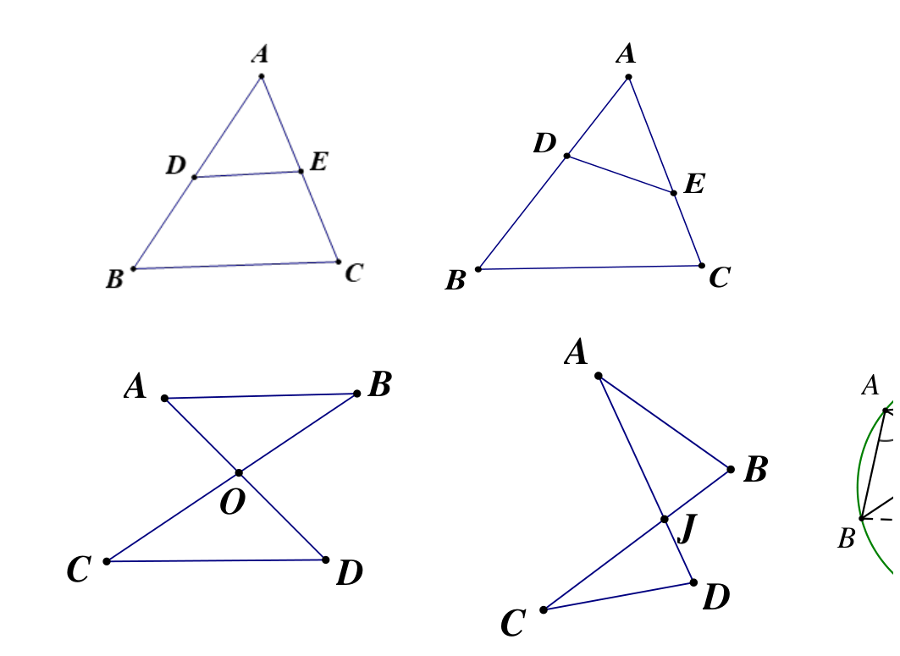

### 2.1 “A”字型与斜“A”字型

#### A 字型

在 $\triangle ABC$ 中，点 $D,E$ 分别在 $AB,AC$ 上。若

$$
DE\parallel BC,
$$

则

$$
\triangle ADE\sim\triangle ABC,
$$

从而

$$
\frac{AD}{AB}=\frac{AE}{AC}=\frac{DE}{BC},
\qquad
\frac{AD}{DB}=\frac{AE}{EC}.
$$

**证明：** 因为 $DE\parallel BC$，所以

$$
\angle ADE=\angle ABC,\qquad
\angle AED=\angle ACB.
$$

由 AA 得 $\triangle ADE\sim\triangle ABC$，对应边成比例，故

$$
\frac{AD}{AB}=\frac{AE}{AC}=\frac{DE}{BC}.
$$

再由比例的合比性质，

$$
\frac{AD}{AB-AD}=\frac{AE}{AC-AE},
$$

即 $\dfrac{AD}{DB}=\dfrac{AE}{EC}$。

#### 斜 A 字型

若 $D,E$ 的位置发生变化，但能得到

$$
\angle AED=\angle B,\qquad \angle A\text{ 为公共角},
$$

则仍可由 AA 得到相应三角形相似。

> 构造提示：遇到线段上的比例端点，可以过端点作平行线，主动构造 A 字型。

### 2.2 “8”字型与斜“8”字型

两条直线交于点 $O$，若

$$
AB\parallel CD,
$$

则由对顶角和平行线可得

$$
\triangle AOB\sim\triangle DOC,
$$

故

$$
\frac{AO}{DO}=\frac{BO}{CO}=\frac{AB}{DC}.
$$

**证明：** 由 $AB\parallel CD$ 得

$$
\angle ABO=\angle DCO,
$$

又因 $\angle AOB=\angle DOC$（对顶角），故

$$
\triangle AOB\sim\triangle DOC.
$$

对应边成比例即得结论。

斜 8 字型不一定有平行线。若交叉图形中已有一组对顶角相等，再给出另一组对应角相等，也可以用 AA 判定相似。

> 构造提示：遇到三角形或平行四边形边上的比例端点，可作平行线构造 8 字型。

### 2.3 倒数型相似

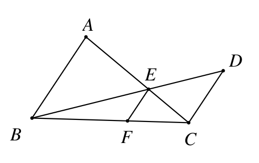

三条平行线截取同一组相交直线时，常出现“长度倒数相加”的结论。例如在对应的 A 字型、8 字型组合中，若三条平行线上的对应截线长为 $AB,EF,CD$，则可得到

$$
\frac{1}{EF}=\frac{1}{AB}+\frac{1}{CD}.
$$

同一结构也可转化为面积关系：

$$
\frac{1}{S_{\triangle BCF}}=\frac{1}{S_{\triangle ABC}}+\frac{1}{S_{\triangle BCD}}.
$$

使用时不要直接套公式，应先由相似写出比例，再通分整理。

**倒数式的推导：** 设交叉图形中 $BF+FC=BC$，由两组相似分别得到

$$
\frac{BF}{BC}=\frac{EF}{AB},\qquad
\frac{FC}{BC}=\frac{EF}{CD}.
$$

两式相加：

$$
1=\frac{BF+FC}{BC}
=EF\left(\frac1{AB}+\frac1{CD}\right),
$$

因此

$$
\frac{1}{EF}=\frac{1}{AB}+\frac{1}{CD}.
$$

### 2.4 母子型相似与射影定理

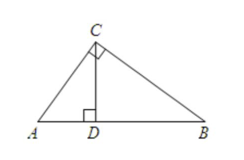

在直角三角形 $\triangle ABC$ 中，若

$$
\angle ACB=90^\circ,\qquad CD\perp AB,
$$

则

$$
\triangle ACD\sim\triangle ABC,\qquad
\triangle BCD\sim\triangle BAC,\qquad
\triangle ACD\sim\triangle CBD.
$$

由此得到射影定理：

$$
AC^2=AD\cdot AB,
$$

$$
BC^2=BD\cdot AB,
$$

$$
CD^2=AD\cdot BD.
$$

**证明：**

- $\angle ADC=\angle ACB=90^\circ$，且 $\angle A$ 为公共角，所以
  $\triangle ACD\sim\triangle ABC$。于是
  $$
  \frac{AC}{AB}=\frac{AD}{AC}
  \Longrightarrow AC^2=AD\cdot AB.
  $$
- 同理，$\triangle BCD\sim\triangle BAC$，所以
  $$
  \frac{BC}{AB}=\frac{BD}{BC}
  \Longrightarrow BC^2=BD\cdot AB.
  $$
- 由前两组相似可得 $\triangle ACD\sim\triangle CBD$，所以
  $$
  \frac{CD}{BD}=\frac{AD}{CD}
  \Longrightarrow CD^2=AD\cdot BD.
  $$

这类“大三角形包含两个小三角形”的结构称为母子型相似。正方形、矩形和圆中也经常出现这一模型。

更一般地，若在 $\triangle ABC$ 中，点 $D$ 在 $AB$ 上且

$$
\angle ACD=\angle B,
$$

则

$$
\triangle ACD\sim\triangle ABC,
$$

从而

$$
AC^2=AD\cdot AB.
$$

### 2.5 旋转型相似（手拉手模型）

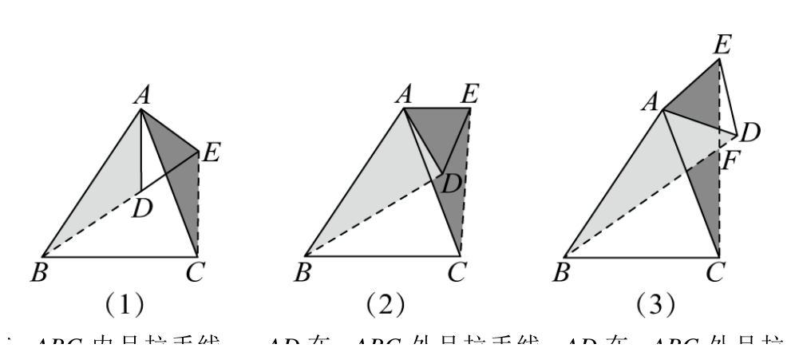

在 $\triangle ABC$ 中，点 $D,E$ 分别位于 $AB,AC$ 上，且

$$
\triangle ADE\sim\triangle ABC.
$$

将 $\triangle ADE$ 绕点 $A$ 旋转后，常有

$$
\angle BAD=\angle CAE,
$$

再结合

$$
\frac{AB}{AC}=\frac{AD}{AE},
$$

可由 SAS 得

$$
\triangle BAD\sim\triangle CAE.
$$

若拉手线 $BD,CE$ 相交于点 $F$，则常有

$$
\angle BFC=\angle BAC,
$$

进而 $A,B,C,F$ 四点共圆。

**结论②、③的证明：** 由

$$
\triangle BAD\sim\triangle CAE
$$

得

$$
\angle ABD=\angle ACE.
$$

因为 $F$ 在 $BD,CE$ 上，所以

$$
\angle FBC=\angle ABC-\angle ABD,
$$

$$
\angle FCB=\angle ACB-\angle ACE.
$$

两式相加并利用 $\angle ABD=\angle ACE$ 对应的角差关系，可得

$$
\angle BFC=180^\circ-\angle FBC-\angle FCB=\angle BAC.
$$

于是 $\angle BFC=\angle BAC$，两角同对弦 $BC$，所以 $A,B,C,F$ 四点共圆。

#### 直角手拉手

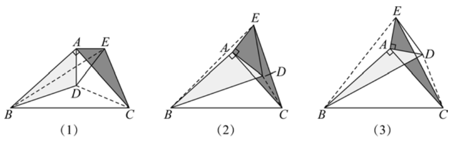

若

$$
\angle BAC=90^\circ,\qquad
\triangle ADE\sim\triangle ABC,
$$

旋转后常得到

$$
\triangle ADB\sim\triangle AEC,\qquad BD\perp CE.
$$

连接 $BE,CD$ 时，还可得到

$$
BE^2+CD^2=BC^2+DE^2.
$$

若 $BD,CE$ 相交，则四边形面积可写为

$$
S_{BCDE}=\frac12 BD\cdot CE.
$$

**证明要点：**

1. 由 $\triangle ADE\sim\triangle ABC$ 得
   $$
   \frac{AD}{AE}=\frac{AB}{AC}.
   $$
   再利用旋转产生的夹角相等，由 SAS 得
   $$
   \triangle ADB\sim\triangle AEC.
   $$
2. 相似三角形的对应角相等，再与 $\angle BAC=90^\circ$ 作角的和差，得到 $BD\perp CE$。
3. 在四边形各三角形中分别使用勾股定理并相加、消去公共边，可得
   $$
   BE^2+CD^2=BC^2+DE^2.
   $$
4. 因两条对角线 $BD,CE$ 垂直，四边形面积等于四个小直角三角形面积之和：
   $$
   S_{BCDE}=\frac12 BD\cdot CE.
   $$

### 2.6 一线三等角模型

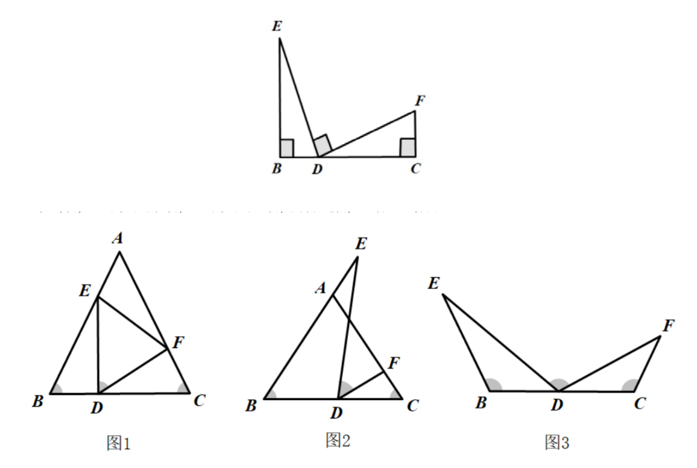

若两个等角的一边在同一直线上，另一边位于该直线同侧，并且图中出现第三个相等角，则通常可以构造一组相似三角形。

典型条件为

$$
\angle B=\angle EDF=\angle C,
$$

结论为

$$
\triangle BED\sim\triangle CDF,
$$

并有

$$
\frac{BE}{DC}=\frac{BD}{CF}=\frac{DE}{DF}.
$$

**证明：** 因为 $B,D,C$ 三点共线，且
$\angle B=\angle EDF=\angle C$，所以

$$
\angle BED=180^\circ-\angle B-\angle BDE.
$$

另一方面，平角 $\angle BDC=180^\circ$ 被 $DE,DF$ 分成三部分，因此

$$
\angle BDE+\angle EDF+\angle FDC=180^\circ.
$$

代入 $\angle EDF=\angle B$，得到

$$
\angle BED=\angle FDC.
$$

再结合 $\angle B=\angle C$，由 AA 得
$\triangle BED\sim\triangle CDF$，对应边成比例即得结论。

三个等角可以是锐角、直角或钝角。

#### 三垂直模型

一线三等角取 $90^\circ$ 时即为三垂直模型。证明时通常利用

$$
\angle 1+\angle 2=90^\circ,\qquad
\angle 3+\angle 2=90^\circ
$$

推出 $\angle1=\angle3$，再用 AA 判定相似。

---

## 3. 半角模型

### 3.1 正方形中的半角模型

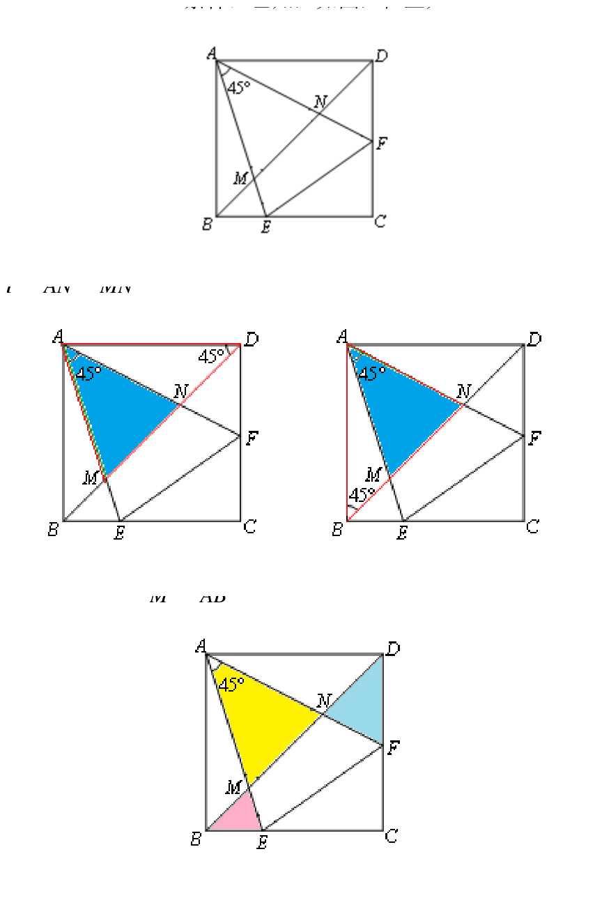

在正方形 $ABCD$ 中，若一个 $45^\circ$ 角的两边分别与正方形边相交，则这个角是直角的一半，常通过“角的和差”产生相似三角形。

若

$$
\angle EAF=45^\circ,
$$

并按原模型连接相应交点 $M,N$，则常见结论有

$$
\triangle AMN\sim\triangle AFE
$$

及

$$
\frac{AF}{AM}=\frac{AE}{AN}=\frac{EF}{MN}.
$$

连接正方形对角线后，还常出现

$$
\triangle AMB\sim\triangle AFC,\qquad
\triangle AND\sim\triangle AEC,
$$

因此

$$
\frac{AF}{AM}=\frac{AC}{AB}=\sqrt2.
$$

**基本结论的证明：** 由正方形的对边平行以及图中的交点关系，可得

$$
\angle ANM=\angle AEF.
$$

又因为 $\angle EAF=45^\circ$，将正方形顶角
$\angle DAB=90^\circ$ 按图中射线分割，作角的和差可得

$$
\angle AMN=\angle AFE.
$$

故由 AA 得

$$
\triangle AMN\sim\triangle AFE.
$$

连接 $AC$ 后，同理可证

$$
\triangle AMB\sim\triangle AFC.
$$

所以

$$
\frac{AF}{AM}=\frac{AC}{AB}.
$$

正方形对角线 $AC=\sqrt2\,AB$，故 $\dfrac{AF}{AM}=\sqrt2$。

解题时也常将一个小三角形旋转 $90^\circ$，把两段线段拼接起来，证明

$$
BP+DQ=PQ
$$

或构造直角三角形后使用勾股定理。

### 3.2 等腰直角三角形中的半角模型

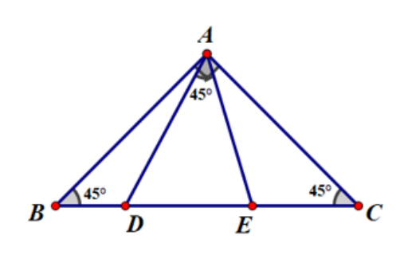

在等腰直角三角形中，若出现 $45^\circ$ 角，可重点寻找三角形链式相似。例如：

$$
\triangle ABE\sim\triangle DAE\sim\triangle DCA.
$$

相似关系常推出

$$
\frac{AB}{BE}=\frac{AD}{AE}=\frac{CD}{AC},
$$

以及乘积式

$$
AB\cdot AC=BE\cdot CD.
$$

**证明方法：** 先由 $\angle BAC=90^\circ$、$AB=AC$ 得
$\angle B=\angle C=45^\circ$。再把已知的 $45^\circ$ 角与顶角拆分，得到两组对应角相等，从而依次证明

$$
\triangle ABE\sim\triangle DAE,\qquad
\triangle DAE\sim\triangle DCA.
$$

写出对应边比例并交叉相乘，即得乘积式。

### 3.3 等边三角形中的半角模型

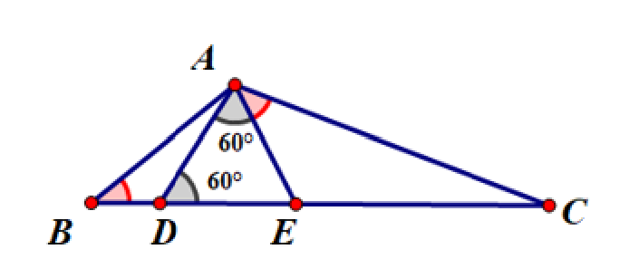

在等边三角形或含 $120^\circ$ 的图形中，若出现 $60^\circ$ 角，常得到

$$
\triangle ABD\sim\triangle CAE\sim\triangle CBA,
$$

从而

$$
\frac{AD}{BD}=\frac{CE}{AE}=\frac{AC}{AB},
$$

并可化为乘积式

$$
AD\cdot AE=BD\cdot CE.
$$

**证明方法：** 等边三角形的内角均为 $60^\circ$。把
$\angle BAC$ 与外部的 $120^\circ$ 角拆分，可得

$$
\angle BAD=\angle ACE,\qquad
\angle ABD=\angle CAE.
$$

于是由 AA 得 $\triangle ABD\sim\triangle CAE$。对应边成比例：

$$
\frac{AD}{BD}=\frac{CE}{AE},
$$

交叉相乘即得

$$
AD\cdot AE=BD\cdot CE.
$$

### 3.4 半角模型的通用处理

1. 写出“大角 = 两个小角之和”；
2. 利用半角条件消去相同的角；
3. 得到两组对应角相等；
4. 证明三角形相似；
5. 将比例关系转化为所需的线段和、乘积或平方关系。

---

## 4. 对角互补模型

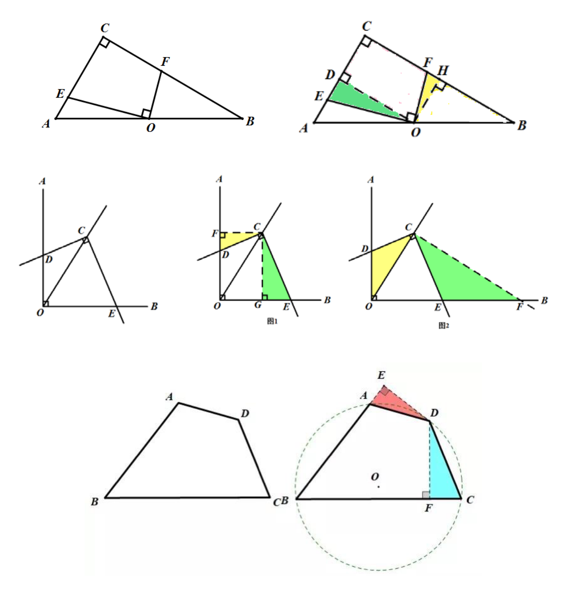

### 4.1 模型特征

四边形或组合图形中，若相对角互补，即

$$
\angle A+\angle C=180^\circ,
$$

常从某个顶点向两边作垂线，构造两个直角三角形，再证明它们相似。

### 4.2 直角三角形中的对角互补

在 $\mathrm{Rt}\triangle ABC$ 中，点 $O$ 为斜边 $AB$ 的中点，若

$$
\angle C=\angle EOF=90^\circ,
$$

过 $O$ 分别向 $AC,BC$ 作垂线 $OD,OH$，则常有

$$
\triangle ODE\sim\triangle OHF.
$$

利用斜边中点和矩形性质，可进一步得到

$$
\frac{OE}{OF}=\frac{BC}{AC}.
$$

**证明：** 因为 $OD\perp AC$、$OH\perp BC$，所以

$$
\angle ODE=\angle OHF=90^\circ.
$$

又因为 $\angle EOF=90^\circ$，两个锐角均可写成同一个角的余角，因此

$$
\angle DOE=\angle HOF.
$$

由 AA 得 $\triangle ODE\sim\triangle OHF$，从而

$$
\frac{OE}{OF}=\frac{OD}{OH}.
$$

再利用斜边中点与平行线构成的相似三角形，有

$$
\frac{OD}{OH}=\frac{BC}{AC},
$$

故结论成立。

### 4.3 一般角中的对角互补

若

$$
\angle AOB=\angle DCE=90^\circ,\qquad \angle BOC=\alpha,
$$

可从点 $C$ 向 $OA,OB$ 作垂线，或作一条垂直于 $OC$ 的辅助线。通过直角三角形相似可得到

$$
\frac{CE}{CD}=\tan\alpha.
$$

**证明：** 按图过 $C$ 作 $CF\perp OA$、$CG\perp OB$。由两个直角和同角的余角相等可证

$$
\triangle ECG\sim\triangle DCF.
$$

于是

$$
\frac{CE}{CD}=\frac{CG}{CF}.
$$

四边形 $OCFG$ 为矩形，故 $CF=OG$。在
$\mathrm{Rt}\triangle COG$ 中，

$$
\frac{CG}{OG}=\tan\alpha.
$$

所以 $\dfrac{CE}{CD}=\tan\alpha$。

### 4.4 四边形中的对角互补

若四边形 $ABCD$ 满足

$$
\angle B+\angle D=180^\circ,
$$

过点 $D$ 分别向 $BA,BC$ 作垂线 $DE,DF$，通常可证明

$$
\triangle DAE\sim\triangle DCF.
$$

同时，由对角互补可知 $A,B,C,D$ 四点共圆。

**证明：** 因 $DE\perp BA$、$DF\perp BC$，

$$
\angle DEA=\angle DFC=90^\circ.
$$

又由 $\angle B+\angle D=180^\circ$，将 $\angle D$ 按辅助线拆分，可得

$$
\angle DAE=\angle DCF.
$$

所以 $\triangle DAE\sim\triangle DCF$。另一方面，一组对角互补正是四点共圆的判定条件，因此 $A,B,C,D$ 四点共圆。

---

## 5. 十字架模型

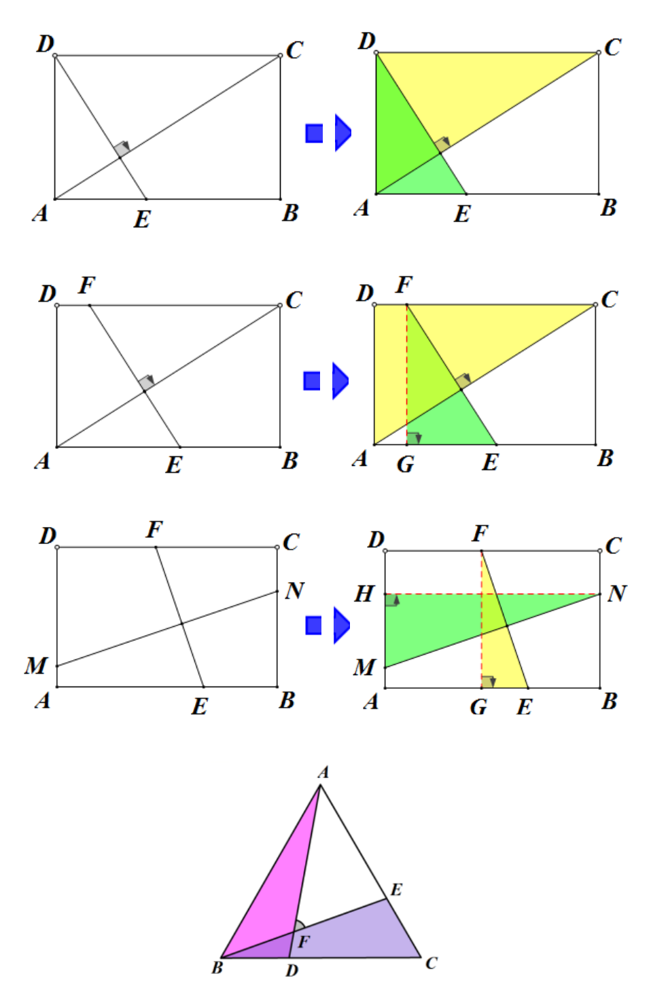

### 5.1 矩形中的十字架模型

在矩形 $ABCD$ 中，两条分别连接一组对边的线段互相垂直时，两线段之比等于矩形对应边之比。

若 $E,F$ 分别在一组对边上，且

$$
EF\perp AC,
$$

则

$$
\frac{EF}{AC}=\frac{BC}{AB}.
$$

更一般地，若 $E,F,M,N$ 分别在矩形四边上，且

$$
EF\perp MN,
$$

则

$$
\frac{EF}{MN}=\frac{BC}{AB}.
$$

#### 证明方法

以一般情形 $EF\perp MN$ 为例。分别平移 $EF,MN$，使其端点落到矩形顶点附近，并向矩形边作垂线，得到两个直角三角形。设它们对应的水平、竖直边分别等于矩形的 $AB,BC$。

因为 $EF\perp MN$，两锐角互余；矩形相邻边也互相垂直，所以两个直角三角形另有一组锐角相等。由 AA，两三角形相似，于是

$$
\frac{EF}{MN}=\frac{BC}{AB}.
$$

证明的关键不是图形的位置，而是“分别平移线段后，长度与夹角均不改变”。

### 5.2 等边三角形中的斜十字

在等边三角形 $ABC$ 中，若边上的点满足

$$
BD=CE
$$

（或 $CD=AE$），则常可证明

$$
AD=BE,
$$

且 $AD$ 与 $BE$ 的夹角为 $60^\circ$。

### 5.3 等腰直角三角形中的十字

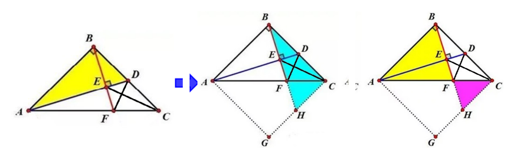

在 $\triangle ABC$ 中，若

$$
AB=BC,\qquad AB\perp BC,
$$

点 $D$ 为 $BC$ 中点，且 $BF\perp AD$，则全等与相似结合可推出一系列结论，例如

$$
AF:FC=2:1.
$$

此类模型中，线段比例、对应角、交点角和线段倍数通常可以“知二推其余”。

**比例结论的证明：** 因 $AB=BC$ 且 $\angle ABC=90^\circ$，以 $B$ 为中心旋转 $90^\circ$ 可将 $BA$ 与 $BC$ 重合。再利用 $D$ 为 $BC$ 中点以及 $BF\perp AD$，可构造一对全等三角形，将中点长度转移到 $AF$ 上。随后由交点处的直角和公共角证明两组三角形相似，得到

$$
\frac{AF}{FC}=2.
$$

### 5.4 一般直角三角形中的十字

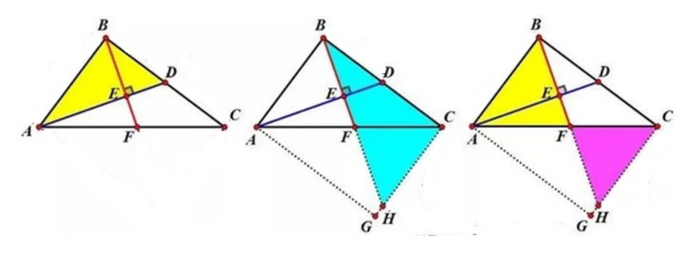

若

$$
BC=kAB,\qquad AB\perp BC,
$$

点 $D$ 为 $BC$ 中点，且 $BF\perp AD$，则

$$
AF:FC=2:k^2.
$$

**证明：** 建立直角坐标系，令

$$
B(0,0),\quad A(0,a),\quad C(ka,0),
$$

则 $D\left(\dfrac{ka}{2},0\right)$。直线 $AD$ 的斜率为
$-\dfrac2k$，所以与它垂直的 $BF$ 的斜率为 $\dfrac k2$。设
$F$ 在线段 $AC$ 上所对应的参数为 $t$，即

$$
F=A+t(C-A)=(tka,a(1-t)).
$$

又因为 $F$ 在 $BF$ 上，

$$
a(1-t)=\frac k2\cdot tka.
$$

解得

$$
t=\frac2{k^2+2}.
$$

因此

$$
\frac{AF}{FC}=\frac{2}{k^2},
$$

即 $AF:FC=2:k^2$。

---

## 6. 三角形内接矩形模型

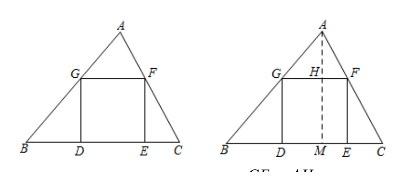

在 $\triangle ABC$ 中内接矩形 $EFGH$，其中 $EF$ 在 $BC$ 上，$G,H$ 分别在 $AB,AC$ 上。由于

$$
GH\parallel BC,
$$

所以

$$
\triangle AGH\sim\triangle ABC.
$$

若 $AM\perp GH$，$AD\perp BC$，则

$$
\frac{GH}{BC}=\frac{AM}{AD}.
$$

**证明：** 因为 $GH\parallel BC$，

$$
\angle AGH=\angle ABC,\qquad
\angle AHG=\angle ACB,
$$

所以 $\triangle AGH\sim\triangle ABC$。相似三角形的对应高之比等于相似比，故

$$
\frac{GH}{BC}=\frac{AM}{AD}.
$$

设三角形底边为 $b$，高为 $h$，内接矩形高为 $x$、宽为 $y$，则

$$
\frac{y}{b}=\frac{h-x}{h},
$$

即

$$
y=b\left(1-\frac{x}{h}\right).
$$

若另有矩形长宽比条件，就可以联立求解。

### 例

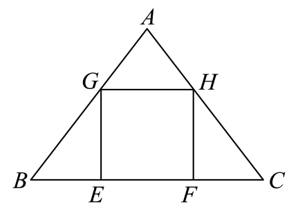

等腰三角形底边为 $12$，腰为 $10$。其底边上的高为

$$
\sqrt{10^2-6^2}=8.
$$

若内接正方形边长为 $x$，则

$$
\frac{x}{12}=\frac{8-x}{8}.
$$

解得

$$
x=4.8,
$$

所以正方形面积为

$$
x^2=23.04.
$$

---

## 7. 复合 A 字型与 8 字型

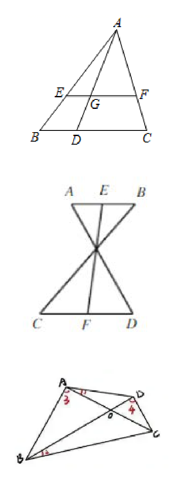

### 7.1 双 A 字模型

同一图形中有两组平行线时，可连续使用两次 A 字型。例如

$$
\triangle AEF\sim\triangle ABC,\qquad
\triangle AEG\sim\triangle ABD.
$$

把两组比例相除，可以消去公共边，得到新的线段比。

**证明：** 每一组平行线分别给出两组同位角相等，所以由 AA 得到两组相似。分别写出

$$
\frac{EG}{BD}=\frac{AG}{AD},\qquad
\frac{FG}{CD}=\frac{AG}{AD},
$$

因此

$$
\frac{EG}{BD}=\frac{FG}{CD}.
$$

### 7.2 平行双 8 字模型

若两组交叉线之间有

$$
AB\parallel CD,
$$

则常有

$$
\frac{AE}{DF}=\frac{BE}{CF}=\frac{AB}{CD}.
$$

**证明：** 利用 $AB\parallel CD$ 产生的内错角以及交点处的对顶角，可证明上下两组三角形相似。对应边成比例即得结论。

### 7.3 斜双 8 字模型

交叉图形中若一组角相等，可先证一对三角形相似，再利用所得对应角证第二对三角形相似。核心是：

$$
\triangle AOD\sim\triangle BOC
\Longleftrightarrow
\triangle AOB\sim\triangle DOC.
$$

**证明：** 两组三角形共用交点处的对顶角。先由已知等角证明
$\triangle AOD\sim\triangle BOC$，便得到一组新的对应角相等；将该角与对顶角组合，再由 AA 得
$\triangle AOB\sim\triangle DOC$。反向推理完全相同。

### 7.4 一 A 一 8 模型

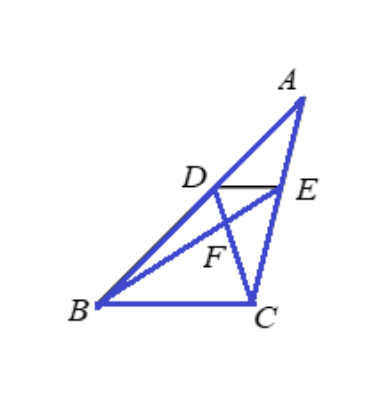

若

$$
DE\parallel BC,
$$

则一方面有

$$
\triangle ADE\sim\triangle ABC,
$$

另一方面，交叉线段中有

$$
\triangle DEF\sim\triangle CBF.
$$

因此

$$
\frac{AD}{AB}=\frac{AE}{AC}=\frac{DE}{BC}=\frac{DF}{FC}=\frac{EF}{BF}.
$$

**证明：** $DE\parallel BC$ 首先给出

$$
\triangle ADE\sim\triangle ABC.
$$

又因 $DE\parallel BC$ 且交点处有对顶角，

$$
\triangle DEF\sim\triangle CBF.
$$

把两组相似的对应边比例连接起来，便得到五个比相等。

### 7.5 两 A 一 8 模型

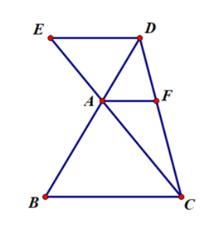

若

$$
DE\parallel AF\parallel BC,
$$

由多组三角形相似可推出

$$
\frac1{BC}+\frac1{DE}=\frac1{AF}.
$$

这就是倒数型相似的一种典型来源。

**证明：** 设 8 字交点把相应线段分成两部分。由左右两组 A 字型与中间 8 字型分别写出

$$
\frac{AF}{BC}=\frac{x}{x+y},\qquad
\frac{AF}{DE}=\frac{y}{x+y}.
$$

两式相加得

$$
\frac{AF}{BC}+\frac{AF}{DE}=1,
$$

两边同除以 $AF$，即得

$$
\frac1{BC}+\frac1{DE}=\frac1{AF}.
$$

### 7.6 四 A 一 8 模型

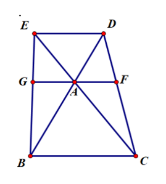

当图中出现更多组平行线时，应先把每一组 A 字型比例分别写出，再利用 8 字型连接各组比例。不要试图直接记忆复杂结论。

---

## 8. 燕尾模型与飞鱼模型

### 8.1 燕尾模型

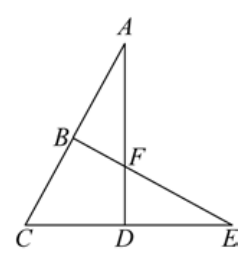

三角形中三条线段交于一点时，图形形似燕尾。典型条件可记为四组分点比：

$$
AB:BC=1:m,
$$

$$
DE:CD=1:n,
$$

$$
AF:DF=1:x,
$$

$$
EF:BF=1:y.
$$

四组关系中，通常已知任意两组即可通过作平行线、连续相似求出另外两组。

若已知

$$
\frac{AB}{BC}=\frac1m,\qquad
\frac{DE}{CD}=\frac1n,
$$

则可由相似比例推导其余分点比。重点不在死记结果，而在构造平行线后使用 A 字型或 8 字型。

其中一个重要结论是

$$
\frac{AF}{FD}=\frac{n+1}{m}.
$$

**证明：** 在 $\triangle ACE$ 中，$B$ 在 $AC$ 上，$D$ 在 $CE$ 上，$AD$ 与 $BE$ 交于 $F$。由

$$
\frac{AB}{BC}=\frac1m,\qquad
\frac{DE}{CD}=\frac1n
$$

可设与 $A,C,E$ 对应的权数分别为 $m,1,n$。点 $D$ 的权数为 $n+1$，因此在 $AD$ 上

$$
\frac{AF}{FD}=\frac{n+1}{m}.
$$

不用权数法时，也可过 $B$ 或 $D$ 作平行线，连续使用两次 A 字型得到同一结论。

### 8.2 常见辅助线

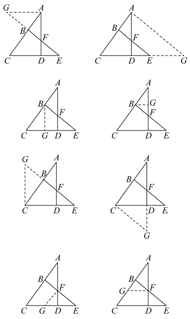

- 过顶点作平行于内部截线的直线；
- 过底边端点作平行于一条“燕尾”的直线；
- 延长中线，并在延长线上截取等长线段，构造平行四边形；
- 过中点作平行线，把中线条件转化为线段相等。

### 8.3 飞鱼模型

飞鱼模型本质上也是平行线与相似三角形的组合。例如在 $\triangle ABC$ 中，$AD$ 为中线，点 $E$ 在 $AD$ 上，直线 $CE$ 交 $AB$ 于 $F$。过 $D$ 作

$$
DM\parallel CF,
$$

可得到一组相似三角形，并利用中点条件把比例转移到 $AB$ 上。

### 例

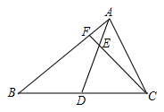

若

$$
AE:AD=1:3,\qquad AF=1.5,
$$

则由

$$
\triangle AFE\sim\triangle AMD
$$

可得

$$
\frac{AF}{AM}=\frac{AE}{AD}=\frac13.
$$

所以 $AM=4.5$。再结合中线和平行线产生的等长关系，可得

$$
AB=7.5.
$$

---

## 9. 常用构造方法

### 9.1 作平行线

适用信号：

- 已知中点、中线或线段比；
- 需要把不同直线上的比例联系起来；
- 图中已有 A 字型或 8 字型的局部结构。

作用：

- 构造相似三角形；
- 转移线段比例；
- 构造平行四边形，获得等长线段。

### 9.2 作垂线

适用信号：

- 对角互补；
- 两条线互相垂直；
- 需要使用三角函数、勾股定理或射影定理。

作用：

- 构造三垂直模型；
- 构造两个直角三角形并证明相似；
- 把斜线长度转化为水平、竖直方向的长度。

### 9.3 旋转

适用信号：

- 正方形、等边三角形、等腰直角三角形；
- 出现 $45^\circ,60^\circ,90^\circ,120^\circ$；
- 有两组相等线段或需要证明线段和。

作用：

- 把分散的相等线段拼接到一起；
- 构造全等三角形；
- 产生手拉手相似或一线三等角。

### 9.4 倍长中线

若 $AD$ 是 $\triangle ABC$ 的中线，可延长 $AD$ 至点 $E$，使

$$
AD=DE.
$$

此时常可构造平行四边形，把中点条件转化为平行和等长条件，再使用相似。

---

## 10. 典型题

### 例 1：由乘积式识别母子型相似

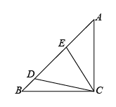

在等腰直角 $\triangle ABC$ 中，

$$
\angle ACB=90^\circ,\qquad AC=BC.
$$

点 $D,E$ 在 $AB$ 上，且

$$
CE^2=BE\cdot DE.
$$

求证：$\angle DCE=45^\circ$。

**证明：**

由乘积式可得

$$
\frac{CE}{BE}=\frac{DE}{CE}.
$$

又因为

$$
\angle CED=\angle BEC,
$$

所以由 SAS 得

$$
\triangle CED\sim\triangle BEC.
$$

故

$$
\angle DCE=\angle CBE.
$$

由于 $\triangle ABC$ 是等腰直角三角形，

$$
\angle CBE=\angle CBA=45^\circ.
$$

因此

$$
\boxed{\angle DCE=45^\circ}.
$$

### 例 2：对角互补与垂线构造

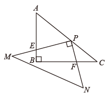

在 $\mathrm{Rt}\triangle ABC$ 中，

$$
\angle ABC=90^\circ,\quad AB=3,\quad BC=4.
$$

点 $P$ 在 $AC$ 上，过 $P$ 的两条互相垂直的直线分别交 $AB,BC$ 于点 $E,F$。若

$$
PE=2PF,
$$

求 $AP$。

**解：**

过 $P$ 分别作 $PQ\perp AB$、$PH\perp BC$。由三垂直模型可得

$$
\triangle PQE\sim\triangle PHF,
$$

所以

$$
\frac{PQ}{PH}=\frac{PE}{PF}=2.
$$

设 $BQ=x$，则矩形 $PQBH$ 中

$$
PH=BQ=x,\qquad PQ=2x.
$$

因为 $PQ\parallel BC$，

$$
\triangle AQP\sim\triangle ABC.
$$

于是

$$
\frac{AQ}{AB}=\frac{PQ}{BC}=\frac{AP}{AC}.
$$

又 $AC=5$，$AQ=3-x$，故

$$
\frac{3-x}{3}=\frac{2x}{4}.
$$

解得 $x=\frac65$，从而

$$
\frac{AP}{5}=\frac{2x}{4}=\frac35.
$$

所以

$$
\boxed{AP=3}.
$$

### 例 3：矩形十字架

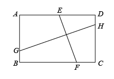

在矩形 $ABCD$ 中，$E,F,G,H$ 分别在四边上，且

$$
EF\perp GH.
$$

证明：

$$
\frac{EF}{GH}=\frac{AB}{BC}.
$$

**证明思路：**

过相应端点向矩形边作垂线，把 $EF,GH$ 分别作为两个直角三角形的斜边。由

$$
EF\perp GH
$$

以及矩形对边平行，可得两个锐角相等，故两个直角三角形相似。再用矩形对边相等替换对应直角边，即得

$$
\boxed{\frac{EF}{GH}=\frac{AB}{BC}}.
$$

### 例 4：双 A 字型

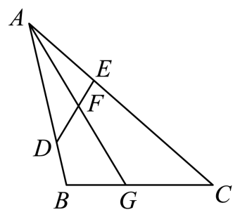

在 $\triangle ABC$ 中，点 $D,E$ 分别在 $AB,AC$ 上，

$$
AD=3,\quad DB=1,\quad AE=2,\quad EC=4.
$$

证明：$\angle ADE=\angle C$。

**证明：**

$$
AB=4,\qquad AC=6.
$$

于是

$$
\frac{AE}{AB}=\frac24=\frac12,
\qquad
\frac{AD}{AC}=\frac36=\frac12.
$$

又

$$
\angle DAE=\angle CAB.
$$

所以由 SAS 得

$$
\triangle DAE\sim\triangle CAB.
$$

因此

$$
\boxed{\angle ADE=\angle C}.
$$

若 $\angle BAC$ 的平分线交 $DE$ 于 $F$，交 $BC$ 于 $G$，还可求
$\dfrac{AF}{FG}$。由上面的相似关系，

$$
\frac{AD}{AC}=\frac36=\frac12.
$$

又因为

$$
\angle ADF=\angle ACG,\qquad
\angle DAF=\angle CAG,
$$

所以

$$
\triangle ADF\sim\triangle ACG.
$$

从而

$$
\frac{AF}{AG}=\frac{AD}{AC}=\frac12.
$$

因此 $AG=2AF$，而 $FG=AG-AF=AF$，故

$$
\boxed{\frac{AF}{FG}=1}.
$$

### 例 5：正方形半角模型

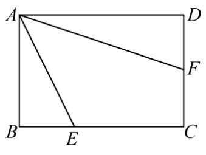

在矩形 $ABCD$ 中，

$$
AD=9,\qquad AB=6.
$$

点 $E,F$ 分别在 $BC,CD$ 上，$\angle EAF=45^\circ$，且
$AE=3\sqrt5$，求 $DF$。

**解：** 在 $AB$ 上取点 $G$，使 $BG=BE$；在 $AD$ 上取点
$H$，使 $DH=DF$。

在 $\mathrm{Rt}\triangle ABE$ 中，

$$
BE=\sqrt{AE^2-AB^2}
=\sqrt{45-36}=3.
$$

于是

$$
AG=AB-BG=3,\qquad GE=3\sqrt2.
$$

设 $DF=DH=x$，则

$$
AH=9-x,\qquad HF=x\sqrt2.
$$

由等腰直角三角形和 $\angle EAF=45^\circ$ 可得

$$
\angle AGE=\angle AHF=135^\circ,\qquad
\angle GAE=\angle AFH.
$$

所以

$$
\triangle AGE\sim\triangle AHF.
$$

对应边成比例：

$$
\frac{AG}{HF}=\frac{GE}{AH},
$$

即

$$
\frac3{x\sqrt2}=\frac{3\sqrt2}{9-x}.
$$

解得

$$
\boxed{DF=x=3}.
$$

### 例 6：折叠中的十字架模型

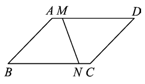

平行四边形 $ABCD$ 中，

$$
AB=2\sqrt2,\qquad BC=4,\qquad \angle B=45^\circ.
$$

将图形对折，使点 $B,D$ 重合，折痕为 $MN$，求 $MN$。

**解：** 连接 $BD$，设 $BD$ 与 $MN$ 交于 $G$，并补成矩形
$BFDE$。由 $AB=2\sqrt2$、$\angle B=45^\circ$，

$$
BE=DF=2,\qquad BF=BC+CF=4+2=6.
$$

所以

$$
BD=\sqrt{BF^2+DF^2}
=\sqrt{36+4}=2\sqrt{10}.
$$

折痕垂直平分 $BD$，故

$$
DG=\sqrt{10}.
$$

由互余角和直角可证

$$
\triangle BDF\sim\triangle DMG.
$$

于是

$$
\frac{DF}{BF}=\frac{MG}{DG},
$$

即

$$
\frac26=\frac{MG}{\sqrt{10}},
\qquad MG=\frac{\sqrt{10}}3.
$$

再由折叠图形的对称性，$MG=NG$，所以

$$
\boxed{MN=2MG=\frac{2\sqrt{10}}3}.
$$

---

## 11. 解题检查清单

1. 相似三角形的顶点顺序是否对应？
2. 使用 SAS 时，相等的角是否真的是两组比例边的夹角？
3. 比例式中是否把对应边写反？
4. 由相似得到面积比时，是否对相似比平方？
5. 乘积式能否先改写成比例式？
6. 图中是否存在公共角、对顶角、平行线角或互余角？
7. 有中点时，是否考虑中位线、倍长中线或斜边中线？
8. 有垂直时，是否考虑三垂直、射影定理或十字架模型？
9. 有特殊角时，是否考虑旋转或一线三等角？
10. 计算后是否排除了负长度、超出线段范围等不合题意的解？

---

## 12. 模型速查

| 图形信号 | 优先模型 | 核心方法 |
| --- | --- | --- |
| 三角形内有平行截线 | A 字型 | 平行线角 + AA |
| 两直线交叉且有平行线 | 8 字型 | 对顶角 + 平行线角 |
| 直角三角形斜边上有高 | 母子型 | 三组三角形相似、射影定理 |
| 等角围绕同一顶点旋转 | 手拉手 | 角的和差 + SAS |
| 一条直线上有三个等角 | 一线三等角 | AA |
| 两组垂直关系 | 三垂直 | 同角的余角相等 |
| 四边形对角互补 | 对角互补 | 向两边作垂线 |
| 矩形中两截线垂直 | 十字架 | 平移线段 + 相似 |
| 三角形中内接矩形 | 内接矩形 | 平行线构造 A 字型 |
| 多组平行线交叉 | 双 A、双 8、A8 | 连续相似、消去公共比 |
| 中线与多条交线 | 燕尾、飞鱼 | 作平行线或倍长中线 |

