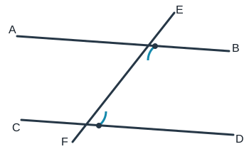
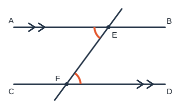

# 角与平行线

> 一条铁轨只要在很远处偏一点，最终就会错开很大距离。几何中的“平行”也是这样：它不是“看上去差不多”，而是由角的数量关系严格保证。本篇把判定与性质分成两个方向，像交通规则一样使用：**用角判平行，用平行得角**。

## 0. 知识边界与地图

### 0.1 边界说明

- **【苏科版课内】**直线、射线、线段，角及其表示，余角、补角、对顶角，垂线与点到直线的距离；同位角、内错角、同旁内角；平行线的三种判定和三种性质；平行公理及其推论；基本角度计算与说理。
- **【培优拓展】**多截线角度追踪、折线拐角公式、平移角、添加平行辅助线、含参数的平行条件。
- 本篇不把“目测平行”当结论，不使用尚未证明的相似、圆周角等后续知识。

### 0.2 知识地图

```text
基本对象
├─ 线段、射线、直线
├─ 角、余角、补角、对顶角
└─ 垂直、垂线段、点到直线的距离
        ↓ 两直线被第三条直线所截
三线八角
├─ 同位角相等 ┐
├─ 内错角相等 ├→ 判定两直线平行
└─ 同旁内角互补┘
        ↕ 方向必须分清
平行线
├─ 同位角相等
├─ 内错角相等
└─ 同旁内角互补
        ↓
课内说理 → 培优角度追踪与辅助线
```

## 1. 【苏科版课内】核心知识

### 1.1 角、余角、补角和对顶角

从点 $O$ 引出两条射线 $OA,OB$，组成 $\angle AOB$。当不引起混淆时也可记为 $\angle O$。

- 若两个角的和为 $90^\circ$，它们互为余角；
- 若两个角的和为 $180^\circ$，它们互为补角；
- 两条直线相交，位置相对的两个角叫对顶角。

**同角（或等角）的余角相等、补角相等。证明：** 若 $\alpha+\gamma=90^\circ,\beta+\gamma=90^\circ$，两式相减得 $\alpha=\beta$；补角情形把 $90^\circ$ 换成 $180^\circ$。

**对顶角相等。证明：** 设 $\angle 1,\angle 2$ 为对顶角，$\angle 3$ 与它们都相邻，则 $\angle1+\angle3=180^\circ$ 且 $\angle2+\angle3=180^\circ$，所以 $\angle1=\angle2$。

### 1.2 垂直与距离

两直线相交成直角，称它们互相垂直，记作 $a\perp b$。过一点有且只有一条直线与已知直线垂直。

点 $P$ 到直线 $l$ 的距离，是 $P$ 到 $l$ 的垂线段 $PH$ 的长度，而不是“任意一条连线”的长度。

**垂线段最短：** 对直线 $l$ 上异于垂足 $H$ 的任一点 $Q$，在直角三角形 $PHQ$ 中，斜边大于直角边，所以 $PQ>PH$。

### 1.3 三线八角

两条直线被第三条直线所截，会出现：

- **同位角**：在截线同侧、两条被截线的同一方位，形似“F”；
- **内错角**：在两条被截线之间、截线两侧，形似“Z”；
- **同旁内角**：在两条被截线之间、截线同侧，形似“U”。

这些名称只说明**位置关系**，并不自动说明角相等或互补。

### 1.4 平行线的判定



设直线 $AB,CD$ 被直线 $EF$ 所截。

1. 同位角相等，两直线平行；
2. 内错角相等，两直线平行；
3. 同旁内角互补，两直线平行。

写推理时要交代角的位置，例如：

$$\angle AEF=\angle EFD\quad\Longrightarrow\quad AB\parallel CD.$$

**为什么后两条成立？** 以内错角为例，内错角与相邻的一个同位角互为对顶角；对顶角相等，于是转化为“同位角相等”，从而平行。同旁内角情形可利用邻补角把“和为 $180^\circ$”转化为同位角相等。

### 1.5 平行线的性质



若 $AB\parallel CD$，则：

1. 同位角相等；
2. 内错角相等；
3. 同旁内角互补。

$$AB\parallel CD\quad\Longrightarrow\quad \angle AEF=\angle EFD.$$

**判定与性质不能倒写：**

- 已知“角”，目标是“平行”——用判定；
- 已知“平行”，目标是“角”——用性质。

### 1.6 平行公理与推论

- 经过直线外一点，有且只有一条直线与这条直线平行；
- 若 $a\parallel b$ 且 $b\parallel c$，则 $a\parallel c$；
- 若 $a\perp b$ 且 $c\perp b$，则 $a\parallel c$。

最后一条的证明：$a,c$ 与截线 $b$ 所成的一组同位角都为 $90^\circ$，同位角相等，所以 $a\parallel c$。

## 2. 【苏科版课内】基本模型与解题流程

### 2.1 单截线模型

先圈出已知角，再沿同一截线寻找目标角。常用链条是：

$$\text{已知角}\xrightarrow{\text{对顶角/邻补角}}\text{桥梁角}\xrightarrow{\text{平行线性质}}\text{目标角}.$$

### 2.2 垂直加平行

若 $a\parallel b$ 且 $c\perp a$，则 $c\perp b$。理由是 $c$ 与 $a,b$ 所成的同位角相等，其中一个为 $90^\circ$。

### 2.3 标准说理模板

1. 写“因为”，列出已知或已证事实；
2. 写清角的名称及其位置；
3. 写所用判定或性质；
4. 写“所以”，得到结论。

不能只写“Z 字型，所以相等”；字母对应和“已知平行”都不能省。

## 3. 【培优拓展】模型与辅助线

### 3.1 平移角：过拐点作平行线

折线 $A-P-B$ 夹在两条平行线 $l_1,l_2$ 之间时，过 $P$ 作 $m\parallel l_1$。由平行公理推论也有 $m\parallel l_2$，原来分散在两处的角便被“搬”到 $P$ 点相加或相减。

若两段折线位于辅助线两侧，常得到：

$$\angle(AP,l_1)+\angle(PB,l_2)=\angle APB.$$

角在辅助线同侧时应作差，不能死记加法。

### 3.2 多次拐弯

对折线连续作与基准线平行的辅助线，可把每一次转向转化为同位角或内错角。定向角方法可概括为“总转角等于起始方向与终止方向之差”，但初中书写仍应逐角说明。

### 3.3 含参数的平行判定

若一组内错角分别为 $(3x+10)^\circ$ 与 $(5x-30)^\circ$，要使两直线平行，应令它们相等；求出 $x$ 后还应检查角度在合理范围内。

## 4. 代表例题（完整解答）

### 例 1【课内】判定与性质串联

已知 $\angle AEF=65^\circ,\angle EFD=65^\circ$，且 $\angle DFG=40^\circ$；射线 $FD$ 位于 $\angle EFG$ 内部。求 $\angle EFG$。

**解：** $\angle AEF$ 与 $\angle EFD$ 是内错角且相等，所以 $AB\parallel CD$。由题设的射线位置，所求角由相邻的两部分组成，因此

$$\angle EFG=\angle EFD+\angle DFG=65^\circ+40^\circ=105^\circ.$$

### 例 2【课内】垂直和平行

已知 $a\perp c,b\perp c$，证明 $a\parallel b$。

**证明：** $a,c$ 和 $b,c$ 的交角都是 $90^\circ$。以 $c$ 为截线，一组同位角相等，所以 $a\parallel b$。

### 例 3【培优】折线角

已知 $l_1\parallel l_2$，点 $P$ 位于两线之间，射线 $PA$ 与 $l_1$ 的锐角为 $32^\circ$，射线 $PB$ 与 $l_2$ 的锐角为 $47^\circ$，且 $PA,PB$ 位于过 $P$ 的平行辅助线两侧。求 $\angle APB$。

**解：** 过 $P$ 作 $m\parallel l_1$，则 $m\parallel l_2$。由内错角相等，$PA$ 与 $m$ 的夹角为 $32^\circ$，$m$ 与 $PB$ 的夹角为 $47^\circ$。两角在 $m$ 两侧，所以

$$\angle APB=32^\circ+47^\circ=79^\circ.$$

## 5. 易错辨析

1. **“同位角相等”总成立？** 错。只有被截的两直线平行时才相等。
2. **两条线都垂直，所以它们平行？** 条件不完整。必须说明它们在同一平面内且垂直于同一条直线。
3. **点到直线的距离是一条线段？** 距离是垂线段的**长度**。
4. **$\angle A=\angle B$ 就能判平行？** 还要说明它们确实是同位角或内错角等规定位置。
5. **图上看着平行就可使用性质？** 不可，图形只帮助观察，结论必须来自题设或证明。

## 6. 分层练习

### A 组：课内基础

1. 一个角为 $38^\circ$，求它的余角和补角。
2. 两直线相交，一角为 $127^\circ$，求其余三个角。
3. 同旁内角分别为 $(2x+20)^\circ,(4x+10)^\circ$，当两直线平行时求 $x$。
4. 已知 $a\parallel b$，截线所得一个锐角为 $56^\circ$，求同旁内角中的另一个角。

### B 组：课内综合

5. 已知 $a\parallel b,b\parallel c$，证明 $a\parallel c$。
6. 已知 $a\parallel b$，直线 $c$ 与 $a$ 的夹角为 $68^\circ$，求 $c$ 与 $b$ 所成的锐角。
7. 两直线被截，一组内错角为 $(3x+15)^\circ$ 和 $(5x-25)^\circ$。求使两直线平行的 $x$。

### C 组：培优拓展

8. 两平行线间有折线 $A-P-Q-B$，三段依次转向 $25^\circ,40^\circ,15^\circ$，起始与终止方向相同。说明这些有向转角应满足什么关系。
9. 已知 $l_1\parallel l_2$，点 $P$ 在两线之间，$PA,PB$ 位于平行辅助线两侧，分别与 $l_1,l_2$ 成 $28^\circ,63^\circ$，求 $\angle APB$。

## 7. 答案

1. $52^\circ,142^\circ$。
2. $53^\circ,127^\circ,53^\circ$。
3. $(2x+20)+(4x+10)=180$，得 $x=25$。
4. $124^\circ$。
5. 过任一点看同一截线，$a,b$ 与 $b,c$ 的对应角分别相等，故 $a,c$ 的对应角相等，从而平行。
6. $68^\circ$。
7. $3x+15=5x-25$，得 $x=20$。
8. 取同一方向为正，三个有向转角的代数和为 $0^\circ$；正负号由实际左右转向确定。
9. $28^\circ+63^\circ=91^\circ$。

## 8. 总结与自查

- 先辨认角的位置，再决定用判定还是性质；
- 所有平行结论都要有题设或判定依据；
- 遇到折线角，过拐点作平行线，把角搬到同一点；
- 检查结果是否满足：锐角小于 $90^\circ$、邻补角和为 $180^\circ$、同旁内角在平行情形下互补。

## 9. 真实链接

- [教育部：义务教育课程方案和课程标准（2022 年版）](https://www.moe.gov.cn/srcsite/A26/s8001/202204/t20220420_619921.html)
- [GeoGebra Geometry（免费动态几何工具）](https://www.geogebra.org/geometry)

> 内容为依据公开课程标准与常见苏科版教学顺序编写的原创讲义；不同印次章节位置可能调整，请以学校使用的教材目录为准。
- [哔哩哔哩检索：苏科版 平行线](https://search.bilibili.com/all?keyword=%E8%8B%8F%E7%A7%91%E7%89%88%20%E5%B9%B3%E8%A1%8C%E7%BA%BF)
